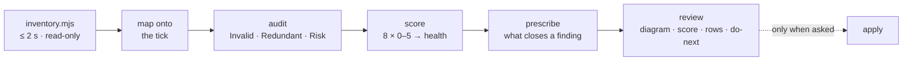
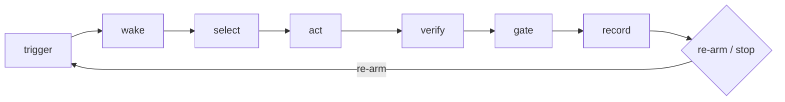

# busy-office ai-skills

Reusable [Claude Code](https://claude.com/claude-code) skills from Busy Office.
Each skill lives under `skills/<name>/` and is self-contained: a `SKILL.md`,
the scripts it needs, reference docs, and fixtures that double as regression
tests. MIT licensed.

## Install

This repo is a Claude Code **plugin** named `busy-office`. Installing it
gives you every skill, namespaced as `busy-office:<skill>` so nothing
collides with built-in or third-party skills of the same name.

```
/plugin marketplace add Busy-Office/ai-skills
/plugin install busy-office@busy-office-ai-skills
```

Claude Code picks a skill up by its description — you rarely need to name
it. `/busy-office:progress-dashboard` works when you want to be explicit.

**Developing a skill?** Clone and symlink instead, so edits are live:

```bash
git clone https://github.com/Busy-Office/ai-skills.git ~/Projects/ai-skills
ln -s ~/Projects/ai-skills/skills/progress-dashboard ~/.claude/skills/progress-dashboard
```

## Skills

| skill | what it does | trigger phrases |
|---|---|---|
| [progress-dashboard](#progress-dashboard) | One-page stakeholder progress dashboard for any git project | "how is this project going", "where are we", "what's blocked", "what's waiting on me", "status update" |
| [loop-doctor](#loop-doctor) | Explains, diagnoses and prescribes for a scheduled autonomous loop | "how does our loop work", "review the loop", "the loop is stuck / doesn't stop", "is LOOPS.md out of date" |

---

## progress-dashboard

**What it answers:** where the project is, what is waiting on a human, and
whether it has stalled — on one page, first screen, for a stakeholder who
needs the answer rather than the inventory.


*Sample on illustrative data. First screen: headline, "Waiting on humans",
phases. Decisions, in-flight PRs, momentum, capabilities and sources sit
collapsed beneath, one click away.*

### Usage

Ask in any session inside the project:

> how are we doing on this project?
> what's waiting on me?
> refresh the progress dashboard

Claude runs the collector, forms a judgement, and publishes an Artifact
(a private web page you can share). Re-running redeploys to the same URL.

Direct use of the collector:

```bash
node skills/progress-dashboard/scripts/collect.mjs <repo>            # full: local records + GitHub
node skills/progress-dashboard/scripts/collect.mjs <repo> --fast     # local files only, ~0.2 s
node skills/progress-dashboard/scripts/collect.mjs <repo> --profile  # timings to stderr
node skills/progress-dashboard/scripts/collect.mjs --self-test       # run the fixtures
```

### What it reads

No configuration needed. It detects the *shape* of what a project keeps,
not the filenames:

| axis | recognised shapes |
|---|---|
| decisions | prose ADRs with `## Status`; YAML-frontmatter decision notes; line-per-node design graphs (`ID TYPE \| title \| status`); typed markdown tables; decision-session YAML; a register table (`README.md`) that fills gaps |
| questions / gates | `OQ-` nodes; `## GATE-XX — title` + `Status: OPEN \| Owner:` blocks; gate tables; unchecked `MANUAL-ACTIONS.md` items; `BLOCKED ON OWNER` lines in generated status files |
| delivery | phase headings with `Exit:` criteria; milestone tables; generated requirement roadmaps (read as renderings, with their generation stamp); checkbox backlogs; open PRs with CI state; issues |
| momentum | git log; Keep-a-Changelog releases; per-file session notes; loop status lines |
| capabilities | `.claude/agents`, `.claude/skills`, `AGENTS.md` — only when a project opts in |

Statuses are normalised to a small canonical vocabulary
(`proposed · accepted · superseded · rejected · deferred`, `open · closed`,
`closed · current · next · planned`); anything unmapped is shown raw and
flagged on the page rather than guessed.

Per-project overrides go in `.claude/progress.json` in the target repo —
pin a source, opt into capabilities, set staleness thresholds, add
vocabulary, name a Notion page to mirror into. See
[`references/manifest.md`](skills/progress-dashboard/references/manifest.md).

### Performance and safety

The collector is **read-only and out-of-process**: it never touches the
target project's files, dependencies, build or git state. The one exception
is a `refresh` command the manifest explicitly declares (for generated
roadmaps), and `--fast` skips even that.

Measured on real repos (Apple Silicon, warm cache):

| repo | files scanned | `--fast` | local only (`--no-gh`) | full (with GitHub) |
|---|---|---|---|---|
| ERP monorepo (private) | 653 | 129 ms | 195 ms | 2.0 s |
| LINE-native app (private) | 3 411 | 170 ms | 501 ms | 1.5 s |

GitHub queries (`gh issue list`, `gh pr list`) are ~90% of full-mode time.
Use `--fast` for a mid-session "where are we?"; full mode for the page you
publish.

### Notion mirror (optional)

Add `"notion": "<page url>"` to the manifest, or ask for the status "in
Notion". After publishing the artifact, Claude rewrites that Notion page
with the first screen (headline, stamps, waiting-on-humans, phases) and a
link to the full page — replacing, not appending, so the page always reads
as the current state.

---

## loop-doctor

**What it answers:** how your scheduled autonomous loop actually works
today, what in its governing files is redundant, contradictory or plain
wrong, and what to change — for the loop that runs when nobody is
watching (cron, launchd, a `/loop` interval, a cloud routine, a driver
script, a tick counter).


*Review of the bundled `fixtures/script-loop` sample (gauntlet round 2):
the first screen is the tick, the files, and the score. The same skill
ran on three private Busy Office loops during design (round 1, PASS);
those reviews stay private.*

### Usage

Ask in any session inside the project:

> how does our loop work? I've lost track
> review the loop — is LOOPS.md out of date vs CLAUDE.md?
> the loop keeps running past MVP-COMPLETE, what's wrong?

Claude produces one review — **diagram first, score second, rows third**:
a tick diagram drawn from your real file names, an eight-dimension
scorecard with a health label (`fit · watch · treat · stop`), findings as
one-line rows (Invalid / Redundant / Risk, each with file:line and the
exact fix), ambiguous queue items rewritten, prescriptions that close
specific findings, and a ≤5-line do-next. Under 450 words of prose.

**Guard-rail: it costs the calling project nothing.** Read-only; writes
nothing into the repo (the review goes to your scratchpad or a page,
or to a path you name); runs none of the project's commands; samples
state files instead of reading them whole; no subagents; leaves a receipt
in the footer. It changes nothing unless you then ask it to apply fixes.

### How it works



Every loop is measured against one canonical tick:



…and against three questions that must each be answered in exactly one
place: **who owns "done"**, **where does state live between ticks**,
**do human gates block or log**.

### What it checks

| dimension | question | examples |
|---|---|---|
| Correctness | Does the loop do what its files say? | dead references, a stop sentinel with entries appended after it, thresholds that disagree between files, contracts "normative" but only simulated |
| Safety | What can go wrong unattended? | no overlap guard, no kill switch, actor can approve its own gate, budgets that aren't enforced, drivers that swallow setup errors |
| Reliability | Does it recover and conclude? | idempotence after a crash, green-or-reverted, no-progress / repeat-failure stops, steady state recognised |
| Performance / cost | What does each tick cost? | lines read at every wake and their growth, archive rule, agents-per-tick cap |
| Maintainability | Can a rule change in one place? | the same rule in three files, counts that disagree, retired designs still described |
| Understandability | Can a newcomer run it from the files? | one tick explainable end-to-end, every file has a role, resume separate from history |
| Observability | Can you tell it's stuck without transcripts? | closed outcome vocabulary, one record per tick written last, metrics actually recorded |
| Purpose | Is the loop anchored to why the project exists, and what does it do when the queue runs dry? | a statement of intent the loaded rules point at — wherever it lives (`intent.md`, `CONTEXT.md`, a charter, an `## Objective` section; not the roadmap, which is the *what*); the empty-queue ladder — steady state → re-plan from intent *as gated proposals* → bounded explore; a periodic objective review; the loop reads intent, never writes it |

Out of scope on purpose: the application code's own quality, and whether
the work the loop picks is worth doing.

No configuration needed. If detection guesses wrong, pin locations in
`.claude/loop-doctor.json` in the target repo:

```json
{ "intent": "CONTEXT.md", "queue": ["docs/BACKLOG.md"], "governing": ["docs/LOOPS.md"] }
```

### Measured

The skill's output is graded through a gauntlet — a fresh-context critic
that has not seen the build scores each review against
[`evals/gauntlet/BAR.md`](skills/loop-doctor/evals/gauntlet/BAR.md)
(diagram sufficiency, score defensibility, verifiable findings, word
budget, zero footprint on the target repo); rounds are logged in
`evals/gauntlet/ROUNDS.md`. Before the gauntlet, on three real (private) loops the
skill's reviews passed 30/30 objective checks vs 16/30 for free-form
reviews at similar token cost — its edge was consistency and the safety
checks a free-form review skips (kill switch, self-approval, block-vs-log
contradictions).

---

## Conventions for this repo

- A skill never depends on a project's filenames when it can detect the
  *shape* of a record instead. Per-project overrides go in
  `.claude/<skill>.json` in the target repo, documented under the skill's
  `references/`.
- Every parser has a fixture under `fixtures/` and a `--self-test` flag that
  runs them all. Add a fixture before adding a detector.
- Every skill gets a showcase entry above: a screenshot in `docs/showcase/`,
  what it answers, how to trigger it, and what it reads.

## License

[MIT](LICENSE) © 2026 Busy Office
