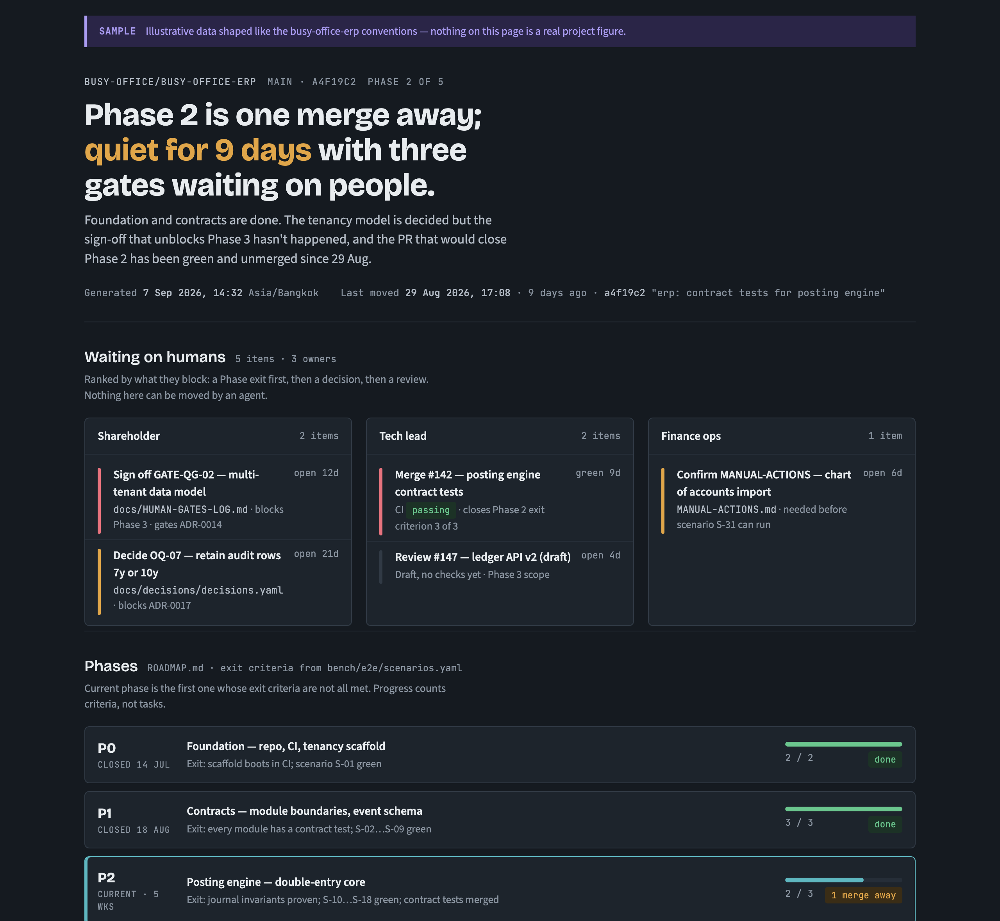
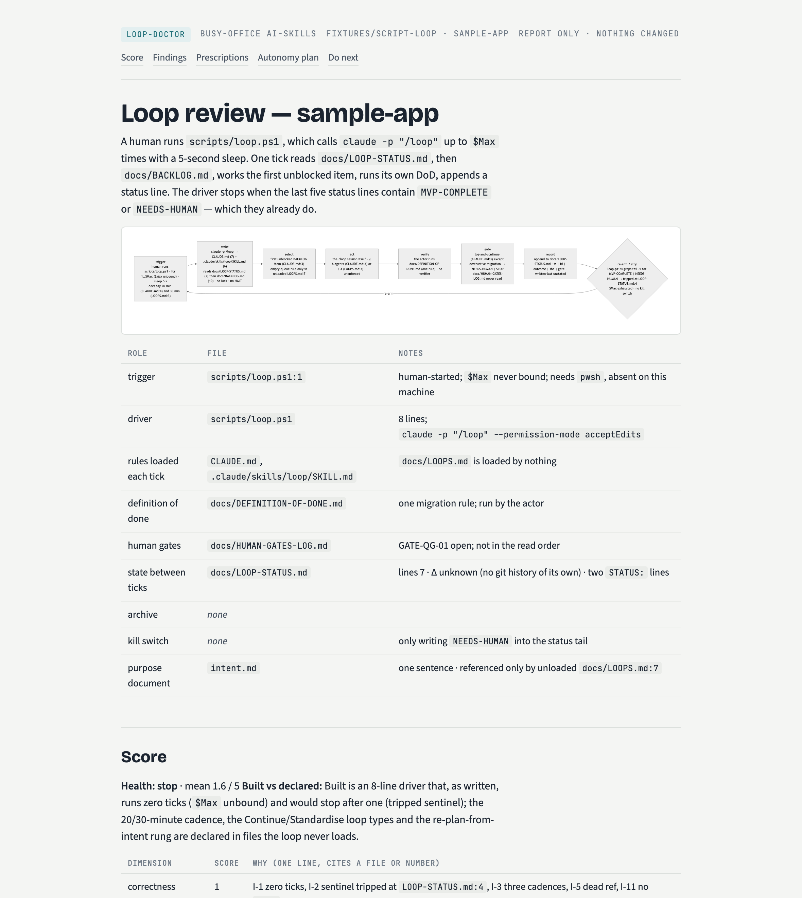
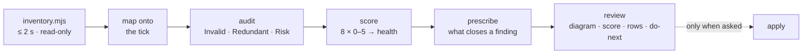
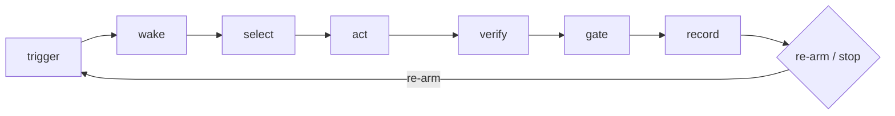
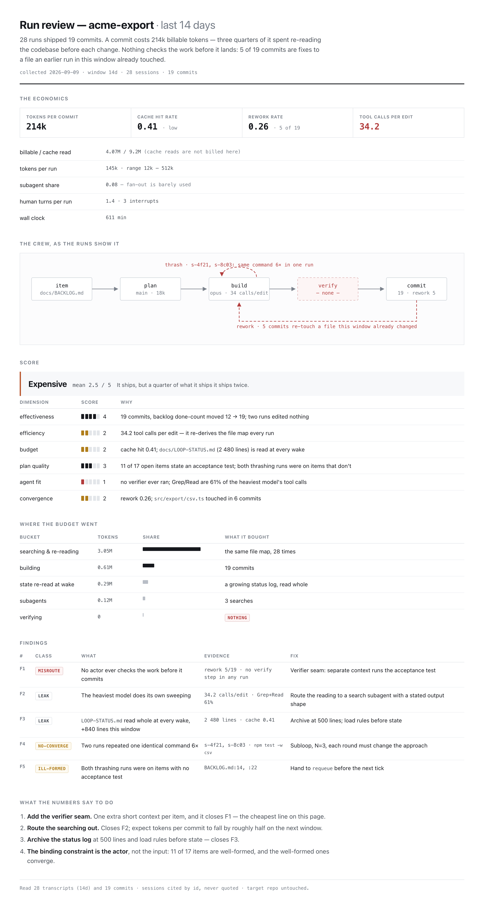
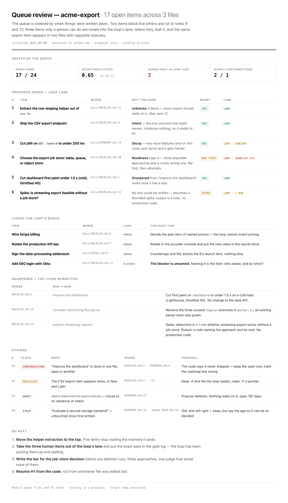
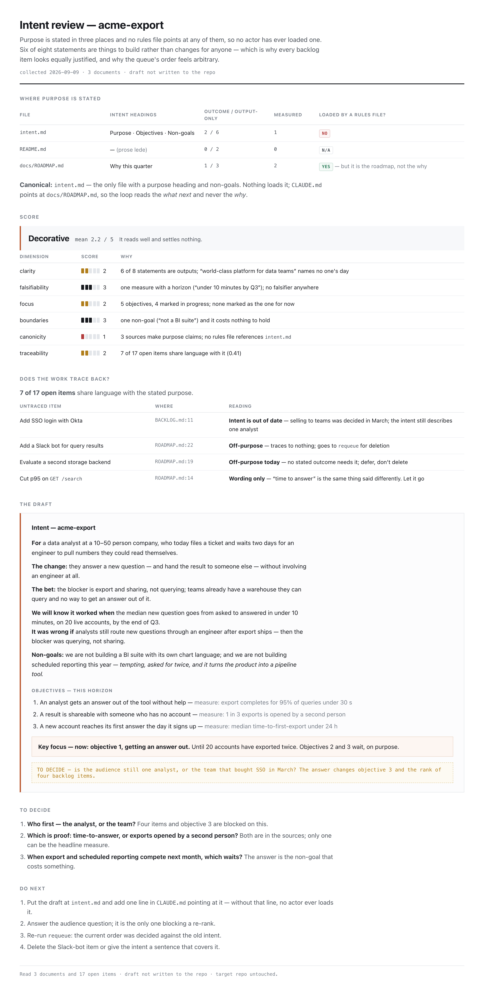
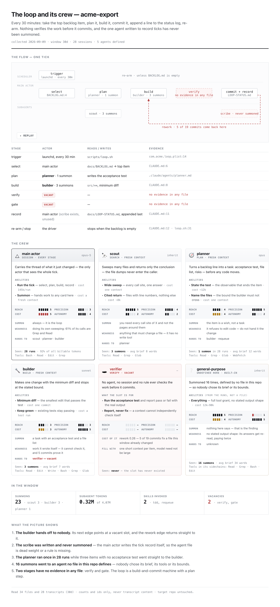
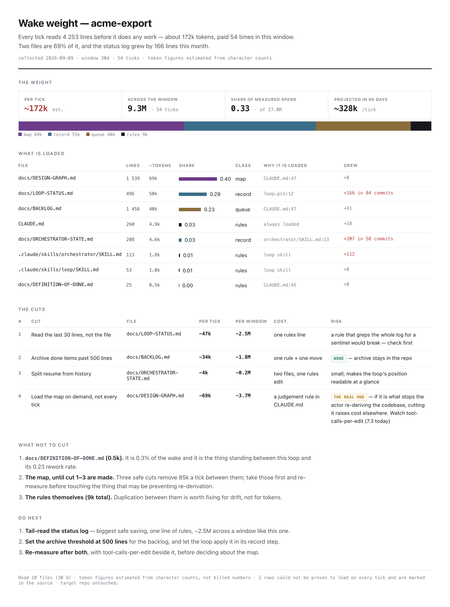
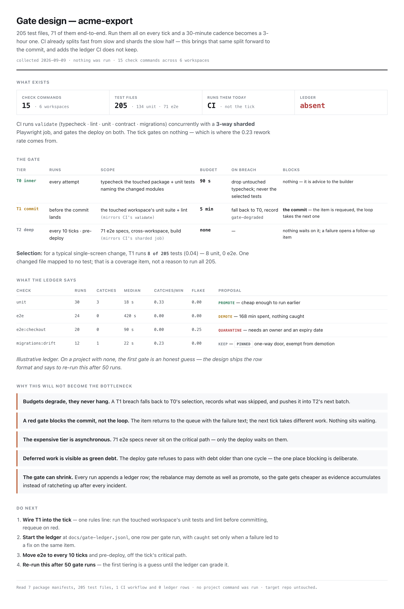

# busy-office ai-skills

Reusable [Claude Code](https://claude.com/claude-code) skills from Busy Office.
Each skill lives under `skills/<name>/` and is self-contained: a `SKILL.md`,
the scripts it needs, reference docs, and fixtures that double as regression
tests. MIT licensed.

## Install

This repo is a Claude Code **plugin** named `busy-office`. Installing it
gives you every skill, namespaced as `busy-office:<skill>` so nothing
collides with built-in or third-party skills of the same name.

```
/plugin marketplace add Busy-Office/ai-skills
/plugin install busy-office@busy-office-ai-skills
```

Claude Code picks a skill up by its description — you rarely need to name
it. `/busy-office:progress-dashboard` works when you want to be explicit.

**Updating:** the marketplace listing is cached, so refresh it before
updating the plugin:

```
/plugin marketplace update busy-office-ai-skills
/plugin update busy-office
```

**Developing a skill?** Clone and symlink instead, so edits are live:

```bash
git clone https://github.com/Busy-Office/ai-skills.git ~/Projects/ai-skills
ln -s ~/Projects/ai-skills/skills/progress-dashboard ~/.claude/skills/progress-dashboard
```

## Skills

| skill | what it does | trigger phrases |
|---|---|---|
| [progress-dashboard](#progress-dashboard) | One-page stakeholder progress dashboard for any git project | "how is this project going", "where are we", "what's blocked", "what's waiting on me", "status update" |
| [loop-doctor](#loop-doctor) | Explains, diagnoses and prescribes for a scheduled autonomous loop | "how does our loop work", "review the loop", "the loop is stuck / doesn't stop", "is LOOPS.md out of date" |
| [loop-economist](#loop-economist) | Measures what the loop's actual runs cost and produced | "what is the loop costing", "is it efficient", "why does it keep redoing work", "are we using the right agents" |
| [requeue](#requeue) | Reprioritises and sharpens the queue the loop is fed | "what should we work on next", "reprioritise the backlog", "the roadmap is stale" |
| [sharpen-intent](#sharpen-intent) | Makes the intent / objective / key-focus document steer | "what is this project really for", "sharpen the objectives", "what should we focus on now", "the goals are vague" |
| [loop-atlas](#loop-atlas) | The loop as one animated picture; the agents as a deck of cards | "show me how the whole loop works", "diagram our agent workflow", "which agent should I use", "roster of our agents" |
| [wake-weight](#wake-weight) | What every run pays before it does any work, and what to cut | "why is each run so expensive", "trim the context", "CLAUDE.md has got too big", "what loads at startup" |
| [green-gate](#green-gate) | Verification tiered so it never becomes the bottleneck | "nothing checks the work before it commits", "the tests are too slow", "the gate blocks everything", "flaky tests" |

### The loop family

Seven of these skills share a subject — an autonomous, multi-agent engineering
loop — and answer different questions about it. Claude picks by description, but
when you want to be explicit:

| ask | skill | what it reads |
|---|---|---|
| *How does this thing work? Is the design sound, safe, does it stop?* | **loop-doctor** | the loop's **documents** |
| *What is it costing, and is the right agent doing the work?* | **loop-economist** | the **runs** — transcripts and commits |
| *Show me the whole thing, and who is on the crew* | **loop-atlas** | definitions + observed summons |
| *What is every run paying before it starts?* | **wake-weight** | the files loaded at wake |
| *What checks the work before it lands — without stalling?* | **green-gate** | the checks, the suite, the CI, the gate ledger |
| *What should it work on next?* | **requeue** | the queue |
| *What is any of this for?* | **sharpen-intent** | the purpose document |

They hand off to each other rather than overlap: the economist names its binding
constraint (the actor → fix it there; the input → `requeue`; the design →
`loop-doctor`), `requeue` ranks against whatever `sharpen-intent` produced, and
`loop-atlas` only draws — its vacancies and gaps are the other two's input.

The two loops in the middle are the same loop seen from opposite sides: a loop
can score well on its documents and still ship the same file four times.

---

## progress-dashboard

**What it answers:** where the project is, what is waiting on a human, and
whether it has stalled — on one page, first screen, for a stakeholder who
needs the answer rather than the inventory.



*Sample on illustrative data. First screen: headline, "Waiting on humans",
phases. Decisions, in-flight PRs, momentum, capabilities and sources sit
collapsed beneath, one click away.*

### Usage

Ask in any session inside the project:

> how are we doing on this project?
> what's waiting on me?
> refresh the progress dashboard

Claude runs the collector, forms a judgement, and publishes an Artifact
(a private web page you can share). Re-running redeploys to the same URL.

Direct use of the collector:

```bash
node skills/progress-dashboard/scripts/collect.mjs <repo>            # full: local records + GitHub
node skills/progress-dashboard/scripts/collect.mjs <repo> --fast     # local files only, ~0.2 s
node skills/progress-dashboard/scripts/collect.mjs <repo> --profile  # timings to stderr
node skills/progress-dashboard/scripts/collect.mjs --self-test       # run the fixtures
```

### What it reads

No configuration needed. It detects the *shape* of what a project keeps,
not the filenames:

| axis | recognised shapes |
|---|---|
| decisions | prose ADRs with `## Status`; YAML-frontmatter decision notes; line-per-node design graphs (`ID TYPE \| title \| status`); typed markdown tables; decision-session YAML; a register table (`README.md`) that fills gaps |
| questions / gates | `OQ-` nodes; `## GATE-XX — title` + `Status: OPEN \| Owner:` blocks; gate tables; unchecked `MANUAL-ACTIONS.md` items; `BLOCKED ON OWNER` lines in generated status files |
| delivery | phase headings with `Exit:` criteria; milestone tables; generated requirement roadmaps (read as renderings, with their generation stamp); checkbox backlogs; open PRs with CI state; issues |
| momentum | git log; Keep-a-Changelog releases; per-file session notes; loop status lines |
| capabilities | `.claude/agents`, `.claude/skills`, `AGENTS.md` — only when a project opts in |

Statuses are normalised to a small canonical vocabulary
(`proposed · accepted · superseded · rejected · deferred`, `open · closed`,
`closed · current · next · planned`); anything unmapped is shown raw and
flagged on the page rather than guessed.

Per-project overrides go in `.claude/progress.json` in the target repo —
pin a source, opt into capabilities, set staleness thresholds, add
vocabulary, name a Notion page to mirror into. See
[`references/manifest.md`](skills/progress-dashboard/references/manifest.md).

### Performance and safety

The collector is **read-only and out-of-process**: it never touches the
target project's files, dependencies, build or git state. The one exception
is a `refresh` command the manifest explicitly declares (for generated
roadmaps), and `--fast` skips even that.

Measured on real repos (Apple Silicon, warm cache):

| repo | files scanned | `--fast` | local only (`--no-gh`) | full (with GitHub) |
|---|---|---|---|---|
| ERP monorepo (private) | 653 | 129 ms | 195 ms | 2.0 s |
| LINE-native app (private) | 3 411 | 170 ms | 501 ms | 1.5 s |

GitHub queries (`gh issue list`, `gh pr list`) are ~90% of full-mode time.
Use `--fast` for a mid-session "where are we?"; full mode for the page you
publish.

### Notion mirror (optional)

Add `"notion": "<page url>"` to the manifest, or ask for the status "in
Notion". After publishing the artifact, Claude rewrites that Notion page
with the first screen (headline, stamps, waiting-on-humans, phases) and a
link to the full page — replacing, not appending, so the page always reads
as the current state.

---

## loop-doctor

**What it answers:** how your scheduled autonomous loop actually works
today, what in its governing files is redundant, contradictory or plain
wrong, and what to change — for the loop that runs when nobody is
watching (cron, launchd, a `/loop` interval, a cloud routine, a driver
script, a tick counter).



*Review of the bundled `fixtures/script-loop` sample (gauntlet round 4, PASS):
the first screen is the tick, the files, and the score. The same skill
ran on three private Busy Office loops during design (round 1, PASS);
those reviews stay private.*

### Usage

Ask in any session inside the project:

> how does our loop work? I've lost track
> review the loop — is LOOPS.md out of date vs CLAUDE.md?
> the loop keeps running past MVP-COMPLETE, what's wrong?

Claude produces one review — **diagram first, score second, rows third**:
a tick diagram drawn from your real file names, an eight-dimension
scorecard with a health label (`fit · watch · treat · stop`), findings as
one-line rows (Invalid / Redundant / Risk, each with file:line and the
exact fix), ambiguous queue items rewritten, prescriptions that close
specific findings, an **autonomy plan**, and a ≤5-line do-next. Under
450 words of prose.

The autonomy plan is the target setup: every point where the loop needs
a person today and what removes it, the stages that differ from the
[blueprint](skills/loop-doctor/references/autonomy-blueprint.md), and a
paste-ready empty-queue rule worded for your files — finish the roadmap
with the human reading a log, and when the roadmap is done, draft the
next slice from intent as proposals and start on the reversible ones.
The human leaves the critical path, not the decision.

**Guard-rail: it costs the calling project nothing.** Read-only; writes
nothing into the repo (the review goes to your scratchpad or a page,
or to a path you name); runs none of the project's commands; samples
state files instead of reading them whole; no subagents; leaves a receipt
in the footer. It changes nothing unless you then ask it to apply fixes.

### How it works



Every loop is measured against one canonical tick:



…and against three questions that must each be answered in exactly one
place: **who owns "done"**, **where does state live between ticks**,
**do human gates block or log**.

### What it checks

| dimension | question | examples |
|---|---|---|
| Correctness | Does the loop do what its files say? | dead references, a stop sentinel with entries appended after it, thresholds that disagree between files, contracts "normative" but only simulated |
| Safety | What can go wrong unattended? | no overlap guard, no kill switch, actor can approve its own gate, budgets that aren't enforced, drivers that swallow setup errors |
| Reliability | Does it recover and conclude? | idempotence after a crash, green-or-reverted, no-progress / repeat-failure stops, steady state recognised |
| Performance / cost | What does each tick cost? | lines read at every wake and their growth, archive rule, agents-per-tick cap |
| Maintainability | Can a rule change in one place? | the same rule in three files, counts that disagree, retired designs still described |
| Understandability | Can a newcomer run it from the files? | one tick explainable end-to-end, every file has a role, resume separate from history |
| Observability | Can you tell it's stuck without transcripts? | closed outcome vocabulary, one record per tick written last, metrics actually recorded |
| Purpose | Is the loop anchored to why the project exists, and what does it do when the queue runs dry? | a statement of intent the loaded rules point at — wherever it lives (`intent.md`, `CONTEXT.md`, a charter, an `## Objective` section; not the roadmap, which is the *what*); the empty-queue ladder — steady state → re-plan from intent *as gated proposals* → bounded explore; a periodic objective review; the loop reads intent, never writes it |

Out of scope on purpose: the application code's own quality, and whether
the work the loop picks is worth doing.

No configuration needed. If detection guesses wrong, pin locations in
`.claude/loop-doctor.json` in the target repo:

```json
{ "intent": "CONTEXT.md", "queue": ["docs/BACKLOG.md"], "governing": ["docs/LOOPS.md"] }
```

### Measured

The skill's output is graded through a gauntlet — a fresh-context critic
that has not seen the build scores each review against
[`evals/gauntlet/BAR.md`](skills/loop-doctor/evals/gauntlet/BAR.md)
(diagram sufficiency, score defensibility, verifiable findings, word
budget, zero footprint on the target repo); rounds are logged in
`evals/gauntlet/ROUNDS.md`. Before the gauntlet, on three real (private) loops the
skill's reviews passed 30/30 objective checks vs 16/30 for free-form
reviews at similar token cost — its edge was consistency and the safety
checks a free-form review skips (kill switch, self-approval, block-vs-log
contradictions).

---

## loop-economist

**What it answers:** what a unit of shipped change actually cost, and
whether the right agent produced it. Where `loop-doctor` reads the loop's
documents, loop-economist reads its **runs** — every Claude Code session
transcript and every commit in a window.



*Sample on illustrative data. First screen: the unit cost, then the crew as the
runs show it — including the rework edge that returns to build.*

### Usage

> how efficient is our loop?
> what is the loop costing us in tokens?
> why does it keep redoing the same work?
> are we using the right agents for this?

```bash
node skills/loop-economist/scripts/runs.mjs <repo> --since 14d   # transcripts + git
node skills/loop-economist/scripts/runs.mjs --self-test
```

> **Measured:** the bar this skill's output is graded against is written
> ([`BAR.md`](skills/loop-economist/evals/gauntlet/BAR.md)) and the mechanical pre-check is
> self-tested, but **no gauntlet round has been run yet** — the rounds table is
> empty. Treat it as unproven where `loop-doctor` is proven.

### What it measures

| group | numbers |
|---|---|
| Budget | billable tokens, **tokens per commit**, cache hit rate, subagent share, thinking share, wall clock |
| Effectiveness | commits and diff size, queue movement, sessions that burned tokens and edited nothing |
| Convergence | rework commits, churn files, sessions that repeated one identical call, tool error rate, tool calls per edit |
| Autonomy load | human turns per run, interrupts |
| Plan quality | share of open items with an acceptance test, and whether the runs that thrashed were on the vague ones |
| Agent fit | model mix, subagent mix and tool mix against a routing table — over-powered, unrouted, or no verifier at all |

Six dimensions are scored 0–5 into a verdict (`compounding · productive ·
expensive · spinning`), and every prescription closes a named finding: a
verifier seam, routing the searching out to a search subagent, cache
discipline, a per-tick budget, a persona split, and for items one pass
cannot reach — a **bounded subloop** (try · verify · adjust, each round
must change the approach) or a **gauntlet** (k independent attempts, a bar
written first, a judge that wrote none of them).

It ends by naming the binding constraint: the actor (fix it here), the
input (hand off to `requeue`), or the design (hand off to `loop-doctor`).

Transcripts are never quoted — sessions are cited by id and by number.

---

## requeue

**What it answers:** what the loop should be fed next, and which items are
not tasks yet. Most loops that look broken are being handed wishes.



*Sample on illustrative data. The rank reason names the deciding factor; human-only
items leave the loop's lane entirely.*

### Usage

> what should we work on next?
> reprioritise the backlog
> which of these can the loop actually finish?

```bash
node skills/requeue/scripts/queue.mjs <repo>
node skills/requeue/scripts/queue.mjs --self-test
```

> **Measured:** the bar this skill's output is graded against is written
> ([`BAR.md`](skills/requeue/evals/gauntlet/BAR.md)) and the mechanical pre-check is
> self-tested, but **no gauntlet round has been run yet** — the rounds table is
> empty. Treat it as unproven where `loop-doctor` is proven.

### What it does

- **Hygiene first** — duplicates, contradictions (done in one file, open
  in another), ghosts that trace to no intent, stale items with their age.
- **Ranks** against the project's intent document by strict precedence:
  **unblocks › intent › readiness › decay › cost**, one reason per item.
- **Splits the lanes** — `loop`, `loop, subloop`, `loop, gauntlet`, and
  `human` (a credential, an account, a decision — it leaves the loop's
  queue and becomes a gate item with the exact ask).
- **Sharpens the top items** into *object · test · bound*; where no test
  can be written, it chooses honestly between a question for a person, a
  bounded spike, and deletion.

The output is a proposal. It writes to the repo only when asked, and never
reorders and deletes in the same commit.

---

## sharpen-intent

**What it answers:** what the project is actually for, stated so it can
settle an argument — and which of today's work does not trace back to it.
`requeue` ranks against this document; `loop-doctor` checks the loop is
anchored to it. Both are only as good as the sentence underneath.



*Sample on illustrative data. The draft is the deliverable; unanswered gaps stay
visible as `TO DECIDE` rather than being filled in.*

### Usage

> what is this project really for?
> sharpen our objectives
> what should we focus on now?

```bash
node skills/sharpen-intent/scripts/intent.mjs <repo>
node skills/sharpen-intent/scripts/intent.mjs --self-test
```

> **Measured:** the bar this skill's output is graded against is written
> ([`BAR.md`](skills/sharpen-intent/evals/gauntlet/BAR.md)) and the mechanical pre-check is
> self-tested, but **no gauntlet round has been run yet** — the rounds table is
> empty. Treat it as unproven where `loop-doctor` is proven.

### What it does

- **Finds every purpose claim** across `intent.md`, `CONTEXT.md`, charters,
  visions, PRDs, READMEs and `## Objective` headings inside rules files —
  each statement marked outcome vs output-only, measurable, names an
  audience, hedged.
- **Decides canonicity** by who *loads* it: an intent no `CLAUDE.md`,
  `LOOPS.md` or loop `SKILL.md` points at scores 0 and caps the verdict,
  however good the prose.
- **Traceability** — which open backlog items share language with the
  stated purpose and which share none, with each untraced item read as
  off-purpose, out-of-date intent, or wording only.
- **Scores** clarity, falsifiability, focus, boundaries, canonicity and
  traceability into `steering · usable · decorative · absent`.
- **Drafts the rewrite**: for whom · the change · the bet · the measure and
  horizon · the falsifier · non-goals, then ≤ 3 objectives and exactly one
  key focus. Gaps stay visible as `TO DECIDE — <question>`; it never
  invents a purpose, and never writes to the repo unasked.
- **Asks at most five questions**, with options, only what the files cannot
  answer.

---

## loop-atlas

**What it answers:** what actually happens on one run, and who is on the
team. Two views on one published page — the flow, and the crew.


*One item's journey through one tick. The static frame is complete: with motion
disabled the page renders the finished picture, gaps and all.*



*Sample on illustrative data. Deck ordered by observed summons; the vacancy and
the undefined agent get cards of their own.*

### Usage

> show me how the whole loop works
> diagram our agent workflow
> which agent should I use for this?

```bash
node skills/loop-atlas/scripts/atlas.mjs <repo> --since 30d
node skills/loop-atlas/scripts/atlas.mjs --self-test
```

> **Measured:** the bar this skill's output is graded against is written
> ([`BAR.md`](skills/loop-atlas/evals/gauntlet/BAR.md)) and the mechanical pre-check is
> self-tested, but **no gauntlet round has been run yet** — the rounds table is
> empty. Treat it as unproven where `loop-doctor` is proven.

### The flow

One tick, left to right — trigger · wake · select · act · verify · gate ·
record · re-arm/stop — laid out in **actor lanes**, with the real
`file:line` under every stage and every exit a tick can take. One item's
journey animates through it once (inline SVG + CSS, no library, theme-aware,
`prefers-reduced-motion` safe, replay by button — never an autoplay loop).

Stages nothing in the files supports are drawn as **labelled gaps**. A lane
that both builds and verifies its own work needs no caption: laid out
honestly, the finding draws itself.

### The crew

Every agent, subagent and skill gets a collectible-style card — the layout
is the gimmick, every value on it is evidence:

| field | derived from |
|---|---|
| class · model | frontmatter, and what the description *does* (scout · planner · builder · verifier · scribe) |
| good at | one plain line, no adjective that could describe any agent |
| abilities | the agent's own instructions — each with a **cost** |
| reach · precision · cost · autonomy | tool grant, own-context or not, observed sidechain tokens and brief length. Underivable prints `—`, never a guess |
| summon when · **weakness** · hands off to | the trigger, what it must never be handed, the next card |
| seen | summons in the window, avg brief, top tools — `never summoned` is a real and interesting value |

Three cards people forget, and this skill insists on: the **main actor**
(usually the most expensive on the page), **undefined but summoned** (a
subagent type the runs used that no file defines), and the **vacancy** —
`VERIFIER — vacant`, the most common and most expensive hole in a loop.
The deck is ordered by observed summons, not by what the files list first.

### A video of it

The page needs nothing installed. For a README hero or a talk, it offers a
handoff to [`animated-svg`](https://github.com/omkamal/animated-diagrams-skill)
(Apache-2.0 — semantic SVG + GSAP, rendered deterministically to MP4/GIF/
interactive HTML), passing the atlas's own semantic SVG plus the beat list
so the video and the page never drift. Offered in one line, never installed
as a side effect.

---

## wake-weight

**What it answers:** what a run pays *before it does any work* — and what to
cut. `loop-economist` tells you the bill; this itemises the preamble that is
charged again on every single tick.

> **Measured:** the bar is written ([`BAR.md`](skills/wake-weight/evals/gauntlet/BAR.md))
> and the mechanical pre-check is self-tested, but **no gauntlet round has been
> run yet**.



*Sample on illustrative data. Every row says **why** the file is loaded — the
file and line that pulls it in — because that is where the cut gets made.*

### Usage

> why is every run so expensive?
> what are we loading before the loop even starts?
> CLAUDE.md and the backlog have got huge — what can we cut?

```bash
node skills/wake-weight/scripts/weight.mjs <repo> --ticks 54 --since 30d
node skills/wake-weight/scripts/weight.mjs --self-test
```

### What it finds

It resolves what an actor is actually handed at wake: the rules given without
asking, the files those pull in via `@import`, whatever the rules name on a
line with a read verb (*"Read `DESIGN-GRAPH.md` + `BACKLOG.md`"* counts both),
and the loop's own skill and driver. Each with its size, share, class and
**growth in the window** — because a file that gains 166 lines a month is a
decision the project keeps re-making, more expensively each time.

Then cuts, in order of safety: **dead** (archive what is finished), **
elsewhere** (read the tail, split state from history, turn a duplicate into a
pointer), **on-demand** (the map, the playbook). Each with a saving per tick
*and* across the window, a cost, and a risk — plus the section people skip,
**what not to cut**: the definition of done, the intent, and anything whose
absence just turns into re-derivation.

---

## green-gate

**What it answers:** what should verify the work before it lands — and how to
keep that verification from becoming the slowest part of the day.

> **Measured:** the bar is written ([`BAR.md`](skills/green-gate/evals/gauntlet/BAR.md))
> and the mechanical pre-check is self-tested, but **no gauntlet round has been
> run yet**.



*Sample on illustrative data. The gate is three things with different budgets,
and only one of them ever blocks anything.*

### Usage

> nothing verifies our work before it commits
> the test suite is too slow to run in the loop
> some of these tests are flaky and people are ignoring red

```bash
node skills/green-gate/scripts/gate.mjs <repo> --changed "src/a.ts,src/b.ts"
node skills/green-gate/scripts/gate.mjs --self-test
```

### The one rule

> **The gate blocks the commit. It never blocks the loop.**

A red gate returns the item to the queue with the failure attached and the next
tick takes different work. A loop that sits waiting on a check has been turned
into a queue of one — which is how gates get switched off.

### How it stays proportionate

| tier | scope | budget | blocks |
|---|---|---|---|
| **T0 inner** | typecheck the touched package + the unit tests that name the changed modules | 90 s | nothing — advice to the builder |
| **T1 commit** | the touched workspace's unit suite + lint | 5 min | **the commit** |
| **T2 deep** | e2e, cross-workspace, build | none — asynchronous | only a deploy, via green debt |

Budgets **degrade rather than hang**: a breach runs the cheaper tier, records
what was skipped, and pushes it into the next deep batch. Selection is reported
as a fraction — *"T1 runs 8 of 205 for a typical change"* — because that is what
makes it proportionate, and unmapped changes are named as a coverage gap rather
than an excuse to run everything.

**It reads your CI first.** A project with CI has already drawn the fast/slow
line under real pressure — often with the slow suite sharded. The design mirrors
that rather than inventing a second, competing definition of green.

### How it gets cheaper over time

Every run appends a ledger row: duration, blocked minutes, tests selected of
total, result, and `caught` — set only when a failure led to a fix on the same
item, which is what separates a catch from a flake. From those: **catches per
minute**, flake rate, selection rate. Then promote / keep / demote / quarantine,
with three guard-rails — nothing demoted under 20 runs, nothing demoted that
guards a one-way door (money, deletion, migrations, auth), and every quarantine
carries an owner and an expiry so it cannot become a graveyard.

A gate that can only grow becomes the bottleneck by arithmetic. This one can
shrink, on evidence.

---

## Conventions for this repo

- A skill never depends on a project's filenames when it can detect the
  *shape* of a record instead. Per-project overrides go in
  `.claude/<skill>.json` in the target repo, documented under the skill's
  `references/`.
- Every parser has a fixture under `fixtures/` and a `--self-test` flag that
  runs them all. Add a fixture before adding a detector.
- Every skill that writes a report is graded by a **gauntlet**: a bar of
  measurable criteria (`skills/<skill>/evals/gauntlet/BAR.md`), a mechanical
  pre-check (`node evals/bar-check.mjs <skill> <artifact.md>`, self-tested
  against pass/fail fixtures), and one shared blind critic
  ([`evals/CRITIC.md`](evals/CRITIC.md)) run in a fresh context that has not
  seen how the artifact was made. Rounds are appended to each skill's
  `ROUNDS.md`, failures included. Three rounds is the budget; if it is not a
  pass by round 3, the gap gets recorded rather than the bar lowered. Fixes go
  into the skill, never into the artifact by hand — an artifact patched to
  pass teaches the skill nothing.
- Every skill gets a showcase entry above: a screenshot in `docs/showcase/`,
  what it answers, how to trigger it, and what it reads.
- Showcase images are generated, not hand-captured, and always from
  illustrative data — never a real project. The page source lives in
  `docs/showcase/pages/*.html`, and the shooter is a single
  [PEP 723](https://peps.python.org/pep-0723/) script that declares its own
  dependency — no repo-level install, no lockfile, nothing to keep in sync:

  ```bash
  uv run scripts/showcase.py                  # every page, full length, 2×
  uv run scripts/showcase.py loop-atlas       # one page
  uv run scripts/showcase.py --gif loop-atlas # animated GIF of the .flow element
  ```

  Stills are captured with `prefers-reduced-motion` on, so an animated page is
  shot on its finished frame. `--gif` pauses the page's own CSS animations and
  steps them through the Web Animations API, so the GIF is reproducible and
  timed exactly like the page rather than by however fast the screenshot loop
  ran (encoding needs ImageMagick).

## License

[MIT](LICENSE) © 2026 Busy Office
