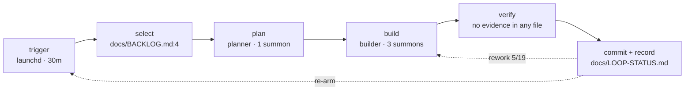

# The loop and its crew — sample-app

Every 30 minutes: take the top item, plan, build, commit, record, re-arm.
Nothing verifies before commit; the scribe agent has never been summoned.

## The flow — one tick

| stage | actor | reads / writes | evidence |
|---|---|---|---|
| trigger | launchd | `scripts/loop.sh` | `com.acme.loop.plist:14` |
| select | main actor | `docs/BACKLOG.md` | `CLAUDE.md:6` |
| verify | vacant | — | no evidence in any file |
| record | main actor | `docs/LOOP-STATUS.md` | `CLAUDE.md:11` |

## The crew

| card | class | summon when | weakness | seen |
|---|---|---|---|---|
| scout | search | you need every call site, not the pages | cannot write | 3 summons |
| builder | build | a task with an acceptance test | work it wrote itself | 3 summons |
| verifier | vacant | — | — | never |

## Do next

1. Fill the verifier slot.
2. Delete or wire up the scribe.

---
*Read 34 files and 28 transcripts · counts and ids only · target repo untouched.*
