# Graph Engineer

A linear agent is a graph already — the worst one: a single chain where
every step waits for the last, one context holds everything, and one stall
kills the run. Graph-engineering is redrawing it: cut the arrows that carry
no data, fan out what is independent, merge only where the whole set is
needed, put a verifier on the edge a wrong answer would cross, and let the
orchestration be code so it runs the same way every time.

This skill produces **one artifact** — a graph review: diagram first, the
node and edge tables, every barrier justified, the cost estimate, and the
script — and, when asked, the script itself in the place the user names. It
designs and reviews; it never launches a workflow on its own.

```mermaid
flowchart LR
  A["inventory<br/>every 'and then' · what crosses"] --> B["contracts<br/>node shape · edge shape"]
  B --> C["topology<br/>chain · fan-out · pipeline · diamond · route · cycle"]
  C --> D["confidence<br/>verifiers · isolation · convergence"]
  D --> E["tier + cost<br/>model per node · agents · critical path"]
  E --> F["script + lint<br/>graph-lint.mjs → rows"]
  F --> G["review<br/>diagram · tables · script · do-next"]
  G -. only when the user opts in .-> H["run<br/>Workflow tool"]
```



## The guard-rail

- **Write nothing into the target repo unasked.** The review and the script
  go to the scratchpad. If the user wants the script kept (`.claude/workflows/`
  is the usual home), they name the path and you write exactly that file.
- **Never launch the graph yourself.** The Workflow tool runs only on the
  user's explicit opt-in ("run it", "use a workflow", `ultracode`). Hand back
  the script and say how to run it; running is their call.
- **No subagents to design a graph.** One context, one pass. Designing a
  fan-out by fanning out is the joke the economist already told.
- **Read bounded.** The linear agent's prompt/script fully; anything it reads
  (a backlog, a log) by header and size only.
- **Every number is derived or labelled an estimate.** Agent counts come from
  the script; latency and tokens are estimates from the topology, stated as
  such, with the formula.
- **Leave a receipt** in the footer: what was read, lint rows found and
  closed, nothing written into the repo.

## Load only what the job needs

The references are ~9.5k tokens together; no job needs all of them. Read the
ones in the job's row, plus any a lint row points to — not the rest.

| job | read | skip |
|---|---|---|
| **quick question** — "parallel() or pipeline()?", "where does the verifier go?" | the one reference that answers it | the review; answer in chat in a few lines |
| **design from a chain** | `topologies`, `contracts`, `cost-model`, `report-template`; `verification` if a step checks work | `cycles`, `anti-patterns` |
| **review a script** | `anti-patterns`, `report-template` | the others until a row needs one: G6 → `topologies`, G7 → `contracts`, G8/G9 → `cycles` |
| **cycle of unknown size** | `cycles`, `verification`, `cost-model`, `report-template` | `contracts`, `anti-patterns` |

A quick question gets an answer, not a review: no artifact, no script, no
receipt — offer the full review in one line if the question hides a design
problem.

## Workflow

### 1. Inventory the chain

Take the thing as it is — a prompt with "then" in it, a script, a skill, a
Workflow script — and list every step in order. For each arrow between two
steps answer one question: **which variable crosses it?** Name the value that
leaves one step's output and enters the next step's input. If none does,
write `none`.

An arrow with `none` is not an edge; it is the order someone typed. Cut it.
What is left is usually two or three independent nodes feeding one that
needs all of them — the diamond, hiding inside the chain.

For an existing Workflow script, run the lint first:

```bash
node <skill-dir>/scripts/graph-lint.mjs <script.js> > <scratchpad>/graph-lint.json
```

It returns the shape (agent, parallel, pipeline, loop and phase counts, the
static fan-out widths) and one row per mechanical finding — `G` ids from
`references/anti-patterns.md`. Rows are evidence; the review adds the
judgement the lint cannot make.

### 2. Give every node and edge a contract

`references/contracts.md`. A node is one agent, one bounded job, explicit
input in, validated output out — a JSON schema on the `agent()` call, so the
next node consumes a shape rather than parses prose. An edge is the shape
that crosses it, named by its data, not its order.

Then the rule that saves the most tokens in any graph: **agents for
judgement, code for plumbing.** Flatten, dedupe, filter, group, count —
these are the edge, and the edge is plain JavaScript at zero tokens. An
`agent()` whose prompt begins "combine these" is paying rent on wiring.

### 3. Choose the topology

`references/topologies.md` — the six shapes, when each is right, what each
costs. Default to `pipeline()`: every item flows through every stage on its
own, no barrier. A barrier (`parallel()`, or awaiting a whole set before the
next stage) is earned only when a stage needs **every** prior result at once
— a cross-set dedupe, an early exit on the total, a prompt that compares one
finding against the others. "The stages feel separate" and "it's cleaner"
are not reasons; separate is not synchronised.

Routing is a schema-validated classification followed by an `if` in code.
The judgement is the agent's; the branch taken is the script's, and it takes
the same branch for the same classification every time.

### 4. Buy confidence where a wrong answer costs

`references/verification.md`. A verifier is a node whose only job is to kill
the finding before it crosses the edge: N skeptics prompted to refute
(adversarial), one lens each — correctness, security, does it reproduce
(perspective-diverse), or N attempts scored by judges (judge panel). Pick by
how a finding can be wrong. A verifier that produced the finding is not one.

`references/cycles.md` for discovery of unknown size: loop until K
consecutive rounds surface nothing new, and **dedupe against everything ever
seen, not against what was confirmed** — otherwise rejected findings return
every round and the loop never runs dry. Every cycle has a counter that can
reach zero and a budget guard.

Isolation: a thunk that throws inside `parallel()` resolves to `null` and the
others complete — that is failure containment, and `.filter(Boolean)` is the
seatbelt. `isolation: 'worktree'` is a different tool for a different
problem: agents **writing files in parallel** collide, and a worktree each
stops that. It costs setup and disk per agent; reach for it only for that
topology, never as a default.

### 5. Tier the nodes and estimate the bill

`references/cost-model.md`. Every subagent inherits the session model and
effort unless the call overrides it. Bounded, repetitive nodes (extract,
classify, one-file review) can run a tier down and at `effort: 'low'`; the
merge, the adjudication, the synthesis stay up. Tier by the judgement the
node carries, not by where it sits.

Then the three numbers, with their formulas: **agents** (static count ×
fan-out widths, plus the cycle's expected rounds), **critical path**
(pipeline: the slowest single-item chain; barrier: the slowest node of every
stage, summed), and the **caps** the run will meet — concurrency is
`min(16, CPUs − 2)` per workflow, not your core count; ≤ 4096 items per
`parallel()`/`pipeline()` call; ≤ 1000 agents per run.

### 6. Write the script, lint it, close every row

Plain JavaScript, `export const meta = {…}` first and a pure literal; the
body uses `agent() / parallel() / pipeline() / phase() / log()`; no
`Date.now()`, `Math.random()`, argless `new Date()`, no filesystem. Run the
lint on what you wrote; the review is not done while a row is open. If a
row is a false positive, say so in the review with the reason — the reader
sees the same lint.

### 7. Write the review

`references/report-template.md`, exactly: ≤ 60 words, the graph as a mermaid
diagram with node ids, the node table (job · in · out schema · model/effort
· verifier), the edge table (from · to · what crosses · code or agent), the
barrier table (each barrier and the cross-item need that earns it), the
cost block (agents · critical path · caps met · estimated tokens, all
labelled estimate), the lint rows and how each was closed, the script in
one code block, do-next (≤ 5), footer receipt. Prose outside tables, diagrams
and code ≤ 450 words. Then a terminal summary ≤ 8 lines: the shape in one
sentence, agents and critical path, the first thing to change, how to run it.

### 8. Run — only when the user opts in

Say how: paste the script into a Workflow call, or save it to
`.claude/workflows/<name>.js` and run it by name. If they say run, use the
Workflow tool with `scriptPath`. Read the journal before diagnosing an empty
result. Never run because the review is finished.

## Judgement calls

**An arrow with no variable is not an edge.** If nothing crosses, the wait is
waste. This one cut is where most of the speed-up lives.

**Separate is not synchronised.** A barrier costs the slowest node's time at
every stage. Write down the cross-item need that earns it or use a pipeline.

**Agents for judgement, code for plumbing.** A graph where every edge is an
agent pays tokens for its own wiring.

**Dedupe against seen.** Not against confirmed. This is the line almost every
first cycle gets wrong, and the loop that never converges is the result.

**Worktree is a seatbelt for one topology.** Parallel writers. Read-only
fan-outs get nothing from it but setup time.

**A context cannot verify itself.** The verifier is a different node with a
different prompt whose job is to refute; a "self-check" step is not a
verifier.

**Tier by judgement, not by position.** The cheapest node in the graph is
often the last one to be written and the first one people put the big model
on.

**The cap is not your core count.** `min(16, CPUs − 2)`. A hundred thunks
finish; a handful run at once. Plan the critical path from that.

**Phase is a label.** `phase()` groups the display and changes nothing about
execution; inside a stage callback use `opts.phase`, or the labels race.

**Explain before you judge.** If the chain was hard to inventory — steps
with no named output, a prompt that reads files nobody listed — say so once;
that difficulty is the first finding.

## Files

- `scripts/graph-lint.mjs` — shape summary + mechanical rows over a Workflow
  script; `--self-test`.
- `references/contracts.md` — node and edge contracts, schemas, plumbing as
  code.
- `references/topologies.md` — the six shapes, the barrier test, routing.
- `references/verification.md` — adversarial, perspective-diverse, judge
  panel; when each, what each costs.
- `references/cycles.md` — loop-until-dry, dedupe-against-seen, budget
  loops, convergence guards.
- `references/cost-model.md` — inheritance of model/effort, tiering, the
  caps, agent-count and critical-path formulas.
- `references/anti-patterns.md` — the smell catalogue; the lint's `G` ids
  with the why and the fix.
- `references/report-template.md` — the review, exactly.
- `evals/` — the prompts, and `gauntlet/BAR.md`, the bar this skill's
  reviews are graded against by a blind critic.

## Related

This skill is the shape of **one run's** work. The scheduled loop that
wakes, runs, and re-arms is a different subject with four skills of its own:
`loop-doctor` (is the tick's design sound), `loop-economist` (what the runs
cost and whether the right agent did the work — when its finding is *the
actor* and the fix is orchestration structure, it hands off here),
`loop-atlas` (the flow and the crew, drawn), `wake-weight` (what a tick pays
before it starts). `requeue` and `sharpen-intent` fix what the loop is fed
and what it is for. None of them draws the graph inside a run; none of this
skill judges the loop around it.
