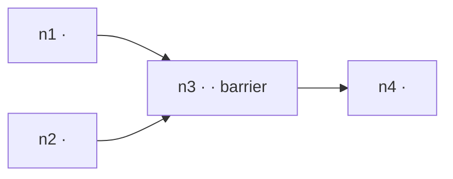
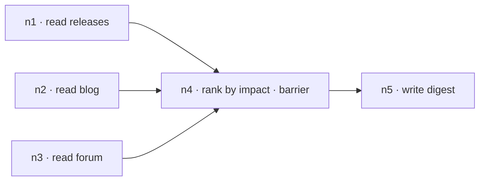

# Review — structure

Diagram first, then tables, then the script. Prose outside tables,
diagrams and code: **≤ 450 words for the whole review**. A reader who stops
after the first screen has the shape, the agent count, the critical path
and the first change.

```markdown
# Graph review — <name of the agent / workflow>

<≤ 60 words: what it does, the shape in one clause, agents and critical
path, the one thing to change first.>



## Nodes

| id | job (one line) | in | out (schema) | model · effort | verifier |
|---|---|---|---|---|---|
| n1 | | | | inherit | — |

## Edges

| from → to | what crosses | code or agent |
|---|---|---|
| n1 → n3 | | code |

## Barriers

| at | earned by (the cross-item need) | or: rewrite as |
|---|---|---|
| n3 | | |

## Cost (estimate)

| number | value | formula |
|---|---|---|
| agents | | Σ(width per site) + rounds × per-round |
| critical path | | pipeline: slowest item chain · barrier: Σ stage-slowest · waves = ceil(width / cap) |
| cap this run | min(16, CPUs − 2) = <n> | |
| tokens | ~<n>k | agents × (prompt + return) |

<One sentence: which stage dominates, and the change that moves it.>

## Lint

| id | line | what | closed by |
|---|---|---|---|
| G5 | 41 | | fixed · false positive: <reason> |

## Script

```js
export const meta = { … }
…
```

## Do next

1. <the change that moves the dominant number, or say why not>
2.
3.

---
<footer, one line:> reviewed <date> · read <n> files · lint <n> rows, <n> closed · target repo untouched · run not launched
```

Then the terminal summary, ≤ 8 lines: the shape in one sentence, agents and
critical path, the first change, how to run it (paste into a Workflow call,
or save to `.claude/workflows/<name>.js` and run by name).

---

## Rules while filling it in

- **Node ids appear in every table.** The diagram, the node table, the edge
  table and the barrier table use the same `n1…nK`; a reader goes from a
  box to its row without searching.
- **"What crosses" is a variable, not a concept.** `curated.items` passes;
  "the findings" does not. If nothing named crosses, the edge is cut and the
  row says so.
- **Every barrier has an earned-by or a rewrite.** Never both empty. "The
  synthesis needs all of it" earns a barrier only if the synthesis prompt
  compares items; say which line.
- **Every figure is labelled estimate with its formula**, and the cap is
  the number this machine gives, not 16.
- **Every lint row is closed.** Fixed in the script shown, or a false
  positive with the reason. An open row means the review is not finished.
- **The script in the review is the script that was linted.** Not an
  earlier draft.
- **Omit empty sections** — no cycle, no cycle row; no verifier, the column
  reads `—` and the review's do-next says whether that is a gap.
- **The footer is the receipt.** The reader sees the review cost the project
  nothing and launched nothing.

---

## Miniature — a 3-source research diamond

```markdown
# Graph review — release-digest

Three sources read at once, a code dedupe on url, one rank node that
compares items (earned), one synthesis. 5 agents, critical path ≈ 3
agent-times on a cap of 6. First change: schema on the source nodes —
they return prose.



## Nodes
| id | job | in | out | model · effort | verifier |
|---|---|---|---|---|---|
| n1–n3 | list items since <date> from one source | source url, `args.since` | `ITEMS {items:[{title,url,impact}]}` | inherit | — |
| n4 | rank by impact | `unique` (code-flattened, code-deduped on url) | `ITEMS` | inherit · high | — |
| n5 | write the digest | `curated.items` | text | inherit | — |

## Edges
| from → to | what crosses | code or agent |
|---|---|---|
| n1,n2,n3 → n4 | `unique = Map-dedupe on url of collected.flatMap(c => c.items)` | code |
| n4 → n5 | `curated.items` | code |

## Barriers
| at | earned by | or: rewrite as |
|---|---|---|
| n4 | rank compares items against each other (the dedupe is code, not a reason) | — |

## Cost (estimate)
| number | value | formula |
|---|---|---|
| agents | 5 | 3 + 1 + 1 |
| critical path | ~3 agent-times | ceil(3/6)=1 wave + n4 + n5 |
| cap this run | 6 | min(16, 8 − 2) |
| tokens | ~12k | 5 × (2k + 0.4k) |
n1–n3 dominate nothing; the graph is as short as its chain allows.

## Lint
| id | line | what | closed by |
|---|---|---|---|
| G5 | 14 | `collected.flatMap` without filter | fixed |
| G13 | — | no return | fixed: `return { digest, curated }` |

## Script
```js
export const meta = { name: 'release-digest', description: 'Digest three sources', phases: [{ title: 'Read' }, { title: 'Curate' }, { title: 'Write' }] }
const ITEMS = { type: 'object', additionalProperties: false, properties: { items: { type: 'array', items: { type: 'object', additionalProperties: false, properties: { title: { type: 'string' }, url: { type: 'string' }, impact: { type: 'string', enum: ['high', 'medium', 'low'] } }, required: ['title', 'url', 'impact'] } } }, required: ['items'] }
const SOURCES = [{ key: 'releases', url: args.releases }, { key: 'blog', url: args.blog }, { key: 'forum', url: args.forum }]
phase('Read')
const collected = (await parallel(SOURCES.map((s) => () => agent(`List items since ${args.since} from ${s.url}.`, { label: `read:${s.key}`, phase: 'Read', schema: ITEMS })))).filter(Boolean)
const flat = collected.flatMap((c) => c.items)
const unique = [...new Map(flat.map((i) => [i.url, i])).values()]
log(`read ${flat.length} items from ${collected.length} of ${SOURCES.length} sources; ${unique.length} unique by url`)
phase('Curate')
const curated = await agent(`Rank these by impact, highest first; keep every item:\n${JSON.stringify(unique)}`, { phase: 'Curate', effort: 'high', schema: ITEMS })
phase('Write')
const digest = await agent(`Write a short digest of these, highest impact first:\n${JSON.stringify(curated?.items ?? [])}`, { phase: 'Write' })
return { digest, curated }
```

## Do next
1. If a source is often empty, log it (`collected.length` already does) and drop the barrier only if n4 stops ranking.

---
reviewed 2026-09-14 · read 1 file · lint 2 rows, 2 closed · target repo untouched · run not launched
```
