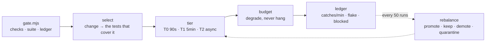

# Green Gate

A loop that commits unverified work pays for it in rework. A loop that runs
1,400 tests per tick pays for it in wall-clock, and someone quietly turns the
gate off. Both failures come from the same mistake: treating verification as
one thing that either runs or doesn't.

The gate is three things with different budgets, and one rule that keeps it
from ever becoming the bottleneck:

> **The gate blocks the commit. It never blocks the loop.**

A red gate sends the item back to the queue with the failure attached and the
next tick takes different work. Nothing waits.



## The guard-rail

- **Run nothing of the project's** by default. The collector discovers and
  maps; it does not execute the suite. Timing a tier is a separate, explicit
  step the person asks for — and it is how you turn a guessed budget into a
  measured one.
- **Write nothing into the target repo** unless asked; the gate design is a
  proposal until someone accepts it.
- **Never propose demoting a check that guards a one-way door** — money,
  deletion, migrations, auth — whatever its catch rate.
- **No subagents.** One context, one pass.
- **Leave a receipt**: manifests read, tests counted, ledger rows, nothing run.

## Workflow

### 1. Collect

```bash
node <skill-dir>/scripts/gate.mjs <repo-path> --changed "<files>" --since 30d > <scratchpad>/gate.json
```

Check commands per workspace, the suite's shape by kind and workspace, CI
workflows, what the loop's own rules say about verifying, the change → test
selection for a representative change, and the ledger if one exists.

No checks at all → say so in three lines. The answer is a first test, not a
gate, and that is `tdd`'s job rather than this one.

### 2. Size the honest cost

Before designing anything, state what "run everything" would cost **and the
cadence it would be paid at** — a wall-clock estimate per tick and per day, not
a file count. "205 test files" is an inventory; "the full CI set on a
30-minute cadence is N minutes a tick, M hours a day" is the finding that makes
the rest of the design necessary. Where no timing exists, say so and give the
shape (71 e2e specs, sharded 3 ways in CI, is already evidence about minutes).

### 2b. Read the CI first, and mirror it

If CI exists, it has already tiered these checks under real pressure — a fast
validate job, a sharded slow job, a deploy that waits on both. That split is
better evidence than anything derivable from the file tree, and the design
should adopt it rather than invent a rival definition of green. What the tick
usually needs is *CI's own tiering, brought forward*, plus the ledger CI does
not keep.

### 3. Tier

`references/tiers.md`. T0 inner (90 s, selected tests + touched typecheck), T1
commit (5 min, touched workspace), T2 deep (asynchronous, with a deadline
rather than a wait). **Every check the collector found goes in exactly one
tier, by name, with a reason** — including the ones that are easy to forget
(`test:contract`, a link checker, a per-workspace `build`). A check left
unplaced is a check nobody has decided about, and "mirrors CI's validate" is a
gesture, not a placement.

Every tier states a budget **and** what it degrades to — with a number. That
includes T0 and T2: "a per-shard ceiling" with no value cannot be enforced or
degraded against, and a tier whose degradation is unstated will simply hang the
first time it matters. An untimed budget is a target, and the report says so.

Two placement traps, both of which make a tier table look complete while a
check sits unrun: a **narrowing** of an already-placed check is not a second
placement, and a check **subsumed** by a broader one (a workspace `build` under
a root `pnpm -r build`) must say so by name. Sum your own per-tier counts
against the collector's list before writing them down.

Budgets **degrade rather than hang**: on breach, run the cheaper tier, record
`gate-degraded` with what was skipped, and push the skipped check into T2's
next batch.

### 4. Select, don't schedule

`references/selection.md`. Watch the workspace edge: "the touched workspace's
suite" silently covers nothing when that workspace has no suite of its own, or
when the change crosses several. Say which suite runs in that case.

Report the selection as a fraction **per tier and per kind** — the collector splits it, because a single number invites a design
to claim "8 of 205" for a tier whose own rules forbid the four e2e specs in
that 8. State T1's unit selection and where the mapped e2e specs go.

Unmapped changes are a coverage finding, not a reason to run everything.

### 5. Read the ledger

`references/ledger.md`. Per check: runs, real catches, median duration,
**catches per minute**, flake rate, blocked minutes. Then the proposals —
promote, keep, demote, quarantine — with the three guard-rails: nothing demoted
under 20 runs, nothing demoted that guards a one-way door, and every quarantine
carries an owner and an expiry.

No ledger → the first gate is an honest guess. Say so, give the ledger row to
start writing, and name when to re-run this (50 runs, or a month).

### 6. Say why it will not become the bottleneck

Four bullets, each a mechanism rather than a promise: what degrades on a budget
breach, what is asynchronous, what happens to the item when a gate goes red,
and how deferred work stays visible as green debt.

### 7. Write it up

`references/report-template.md`, then a terminal summary of ≤ 8 lines.

### 8. Apply — only when asked

The gate as a command per tier, the rules edit that makes the loop run T1
before it commits, the ledger file, and the CI workflow if there is none. One
commit per piece, diff first. Never wire T2 into the synchronous path, however
tempting.

## Judgement calls

**A gate nobody can skip is worse than no gate, if it is slow.** People route
around slow gates, and then the gate is measuring nothing while still costing
everything. Proportionate and trusted beats thorough and bypassed.

**`caught` is the field the whole system turns on.** A red gate is not a
catch; a red gate followed by a fix on the same item is. A red gate followed
by a passing rerun is a flake. Guess this and every decision downstream is
corrupted — leave it `null` rather than assume.

**Zero catches is evidence about the check, not proof it is useless.** It may
be guarding something that has not broken *because* it is guarded. That is why
one-way doors are pinned and exempt: the cost of the miss is not counted in
minutes.

**Flakes are urgent.** A 0.25 flake rate destroys the gate's authority faster
than a missing test does, because it teaches everyone that red means "run it
again".

**Quarantine expires or it is a graveyard.** Owner and date, or it does not go
in.

**Don't build the ratchet.** Every incident wants to add a check. The
rebalance exists so things can also leave; a gate that only grows becomes the
bottleneck by arithmetic alone.

## Files

- `scripts/gate.mjs` — checks, suite shape, selection, ledger stats and
  rebalance proposals; `--self-test`.
- `references/tiers.md` — the three tiers, budgets, degradation, green debt,
  and the failure modes each mechanism prevents.
- `references/selection.md` — change → tests, escalation rules, and reporting
  the selection rate.
- `references/ledger.md` — the row format, what `caught` means, the numbers,
  and the rebalance with its guard-rails.
- `references/report-template.md` — the report, exactly.
- `evals/` — the prompts, and `gauntlet/BAR.md`, the bar this skill's designs
  are graded against by a blind critic.

## Related

`loop-economist` measures the rework a missing gate causes, and hands off here;
`wake-weight` is the other half of a tick's fixed cost; `requeue` takes the
items a red gate sends back.
