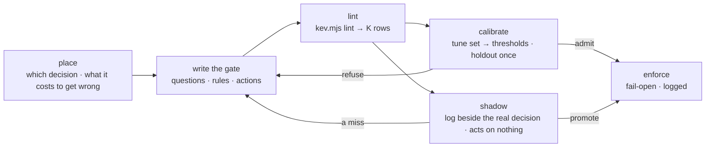

# KEV Gate

A loop spends most of its tokens deciding things that did not need deciding
by the biggest model in the room: is there anything to do, how hard should
this change be looked at, can this item skip triage. KEV answers that kind
of question in half a second on a CPU, as probabilities over options you
wrote, not as prose. That is worth having — and it is a 0.5B model that is
confidently wrong in ways a reader would never be, so it is worth having
only behind a gate that has been measured.

A gate is three things kept apart: **questions** the model answers, **rules**
in code that turn the answers into an action, and a **calibration record**
that says how often that was right on cases the thresholds never saw.



## The guard-rail

- **A gate picks who looks next. It never approves.** Every action a gate
  can emit is reversible: a review depth, a lane, a skipped tick. Merge, tag,
  deploy, delete and push are not gate actions at any confidence; the lint
  refuses them (K5).
- **Fail open.** KEV down, slow, over its state limit, or answering in an
  unexpected shape → the gate's highest-rank action. The loop behaves as it
  did before the gate existed. An outage must never lower the bar (K6).
- **Misses and over-escalations are never added together.** A miss (the gate
  chose a lower rank than the label) is the defect. An over-escalation is
  the price. A gate is admitted at zero misses — and refused if it escalates
  more than half of what could have stayed low, because then it saves
  nothing and is one more moving part.
- **The holdout is run once.** Thresholds come from the tune set. If the
  holdout refuses, the gate goes back to design; the holdout is not tuned
  against, and a new holdout is written if the questions change.
- **Shadow needs only a clean lint; enforce needs both records.** A gate in
  shadow acts on nothing, so it may start logging the day it lints — that is
  how a project with no labelled cases gets some. `enforce` needs an
  admitted calibration *and* a promoting shadow report; neither one alone.
  "Switch it on" means enforce. A new gate logs what it would have done beside
  what actually happened. `mode` is flipped to `enforce` by the owner, never
  by the skill on its own, and never because calibration passed.
- **Write nothing into the target repo unasked.** Gate drafts, cases and
  reports go to the scratchpad until the user names a path.
- **Run KEV only against the endpoint the user named.** State leaves the
  machine if `KEV_URL` is not local — say so before the first hosted call.
  The log stores a hash of the state, never the state.

## Load only what the job needs

| job | read |
|---|---|
| "can KEV do X?" / "how do I call it?" | `references/placement.md`; answer in chat |
| write or review a gate | `references/gate-design.md` |
| calibrate, or promote from shadow | `references/calibration.md` |
| wire a gate into a driver, a hook or a graph | `references/placement.md` |

## Workflow

### 1. Place the gate

Find the decision first. It is a candidate only if all three hold:

- **Code cannot decide it.** An exit code, a glob on changed paths, a count —
  that is tier 0 and costs nothing. KEV called `src/cart/total.ts` a docs
  change; a glob would not have. Put the globs *in front of* the gate.
- **It recurs.** A gate needs cases to calibrate on; a decision made twice a
  month never earns one.
- **Every outcome is reversible, and the wrong one is cheap in a known
  direction.** "Looked at harder than needed" is cheap. Name the expensive
  direction; that is what calibration will count as a miss.

Then, before writing a single question, **check that the label can be
predicted at all**:

```bash
node <skill-dir>/scripts/harvest.mjs <repo> --fit            # seconds, no model calls
```

It prints the label's base rate, the rate per area of the repo, and how well
a zero-cost path prior ranks the cases. AUC ≥ 0.70: the paths carry it —
write a glob, not a gate. AUC < 0.60: nothing cheap predicts this label and
a 0.5B model will not either; the label is probably noise *for this repo*.
Stop, or find a better label — a recorded outcome (`--labels`: a review that
found something, a verification pass that refuted a slice) beats the
fix-blame proxy whenever the project keeps one. This check would have
refused both real-repo gates below in seconds; they took two design rounds
to refuse without it.

`references/placement.md` has the tier ladder and the five placements that
have earned their keep (wake gate, review depth, failure triage, verifier
pre-filter, model router), with the driver-script shape for each.

**KEV saves money only when it runs before or instead of a model turn.** A
Claude turn that calls KEV as a tool has already paid more than the answer
is worth. The gate belongs in the driver script, a hook, or the code between
graph nodes. The Kev repo's MCP server (`kev_decide`, `kev_models`,
`kev_check_permutations`, with the `kev-decision` skill) is the right tool
for a different job — an advisory second opinion inside a session, and
trying a question out while designing a gate — and the wrong one for this:
it is advisory by its own rules, and a loop that reaches it has already
woken.

### 2. Write the gate

`references/gate-design.md` — the file format and the K rows. The rules
that matter most, each learned from a measured failure:

- **Ask for a fact, never a verdict.** The two-way choice "Should this change
  merge automatically or get a deeper review?" (`auto` / `review`) over the
  state `Diff: adds a DROP COLUMN migration on users table. CI green.`
  answered `auto` at 0.86 — and `auto` at 0.84 for a payment-webhook retry
  count going from 3 to 30. "Which area does this change touch?", with data
  deletion and money as options, caught both.
- **Prefer one exhaustive `choice` to several `noul`s, and read the summed
  mass, not the top choice.** On the merge cases the top choice was wrong 4
  times in 20 while the summed probability of the four risky areas separated
  every case. That is what the `sum` condition is for.
- **The wording of the way out matters.** KEV was trained with a "None of
  the above" option; offered `other: None of these` it put up to 0.98 of
  the mass there and the cases stopped separating. `unknown: not enough
  evidence to tell` took 0.04–0.53 and kept the ranking but shrank the
  margin from 0.06 to 0.01. Exhaustive options (`"exhaustive": true`) kept
  it widest. Measure the way out you choose.
- **Feed it the summary the loop already has.** Subject plus file stat, not
  the raw patch: on real 2.5k-character patches the probabilities went
  diffuse and latency went from 0.5 s to 2.4 s. The kit's README gives the
  cause — the checkpoint was trained on states of about 384 tokens (roughly
  1,500 characters); serving accepts more, the training never saw it. Keep
  `max_state_chars` near that.
- **It does not compare two texts.** "Does the history show this already
  shipped?" scored 0.04–0.26 on three of four shipped items. Leave
  comparison to git or to the next tier.

Start from `gates/merge-risk.json` for the *shape* — its four risk areas
(data deletion, auth, money, breaking interface) describe a service with
data and money, and are true of almost nothing in a UI library or a
pre-build repo; choose areas from what `--fit` shows gets blamed *here*.
**A copied gate brings
its questions, not its evidence**: the calibration record in that file is
for the skill's own hand-written fixtures, and that holdout is spent. With
no labelled cases of the project's own, the honest state is "linted, in
shadow, collecting outcomes" — say so rather than quoting the fixture
counts as the user's. Then lint:

```bash
node <skill-dir>/scripts/kev.mjs lint <gate.json>
```

### 3. Calibrate

`references/calibration.md`. Two files of labelled cases, `tune.jsonl` and
`holdout.jsonl`, at least 20 and 12 lines, with at least 5 labelled above
the lowest rank — zero misses of a risk the gate was never shown proves
nothing. Labels come from the project's own history wherever they can
(reverted commits, fix-ups within days, items that were rewritten before
they were built); the reference has the git recipes.

```bash
node <skill-dir>/scripts/kev.mjs calibrate <gate.json> tune.jsonl
node <skill-dir>/scripts/kev.mjs calibrate <gate.json> holdout.jsonl --min-cases 12
```

The report gives `missed`, `over` and `misroute` with each case's facts, the
over-escalation rate, latency, and a **sweep** — the same facts re-decided
with every threshold moved ±0.1 and ±0.2, no new model calls — which shows
how close to the edge the gate sits. Misses can appear in either direction
(a risk screen breaks when thresholds rise, a fast-path gate when they
fall). A gate whose first miss is one step away is admitted and fragile;
say so, with the direction.

Set thresholds from the tune report. Run the holdout once. Record model,
date, counts and how the threshold was derived in the gate's `calibration`
block.

### 4. Shadow, then promote

Wire the gate in with `"mode": "shadow"`: the driver calls `ask --log`,
ignores the action (`enforce` is `false`), and later records what the real
decision turned out to be.

```bash
node <skill-dir>/scripts/kev.mjs ask <gate.json> --state - --log <loop-state>/kev.jsonl
node <skill-dir>/scripts/kev.mjs outcome <loop-state>/kev.jsonl <id> <actual-action>
node <skill-dir>/scripts/kev.mjs shadow <gate.json> <loop-state>/kev.jsonl
```

`shadow` joins the two and applies the same bar as calibration, on the
project's real traffic. `promote` means the owner may flip `mode` to
`enforce`; `stay-shadow` names why not. Keep logging after promotion — a
model swap or a change in how the loop writes its summaries silently
invalidates the calibration, and the shadow report is how that shows up.

### 5. Report

In chat, ≤ 40 lines including one table: the decision gated and its expensive direction, the
gate's questions in one line, tune and holdout counts (missed / over /
misroute, never a single accuracy figure), the sweep's nearest miss,
latency, the verdict, and what stays with the higher tier. A refused gate
is a finished result — report it as one, with what was tried, and state as
the present position (not as one option among several) what stays with the
higher tier. When the job was a gate review, give the lint rows with their
level — say which are warnings. The 40 lines bind any reply this skill
produces, a review included. Any number
quoted from an ad-hoc probe comes with its saved state and question file:
the log keeps only a hash, so an unsaved probe cannot be checked.

## Judgement calls

**Calibration beats intuition in both directions.** The structured yes/no
questions that read best to a person scored an AUC of 0.54 on the merge
cases; a blunt ten-way category choice scored 1.00. Do not predict which
formulation works — measure two or three on the tune set.

**A gate that passes the set it was tuned on has told you nothing yet.**
`fixtures/queue-triage/` is kept as the example: 18 of 20 on tune with no
misses, then 7 of 12 on holdout with one miss and four needless
escalations. The question that failed was its `kind` choice (specific task
/ vague goal / owner decision) — the already-shipped question had been
dropped before that gate was calibrated, so this refusal says nothing about
comparing texts. It was refused and not retuned.

**High confidence is not evidence.** Permuting the option order
(`/v1/systemone/permute`) left a wrong answer at 0.94–0.96 in every order:
a four-way routing choice that sent the queue item "Improve performance",
reverted three ticks running, to `skip`. The check finds position bias; it
does not find wrong.

**Read `probabilities`, not `confidence`.** A choice's `confidence` is the
top probability rescaled against uniform — `(p − 1/n) / (1 − 1/n)` — so a
correct two-way answer at 0.51 carries 0.03. It is not accuracy, and
`kev-decision` says the same: no universal cutoff has been validated.
Thresholds here are set per gate, on the distribution, from the tune set.

**The state is the author's account of the change.** A commit subject
written by the agent that made the change can leave the risk out. Path
globs for protected areas run before the gate and do not depend on anyone's
wording.

**A gate does not travel between repos.** `merge-risk` passed its fixtures
32 for 32, then missed 35 of 40 changes that needed a follow-up fix in a
real UI library — its risk areas (data, auth, money, interface) were true of
almost nothing there, so it called nearly everything light. The questions
encode what is risky *in one codebase*. Harvest that repo's history
(`scripts/harvest.mjs`) and design from it; never enforce a gate on the
evidence of another project's cases.

**A refused gate is cheaper than a wrong one.** If two design rounds do not
produce an admitted gate, the decision stays with the higher tier. Say that
and stop.

## Files

- `scripts/kev.mjs` — `ask` (fail-open, logged), `lint` (K rows),
  `calibrate` (missed / over / misroute, sweep), `outcome` + `shadow`
  (promotion from real traffic); `--self-test` runs without KEV.
- `scripts/harvest.mjs` — `--fit`: can this label be predicted at all (base
  rate, rate per area, path-prior AUC; run it first). Otherwise writes
  labelled cases from a repo's own history — the fix-blame proxy, or the
  project's recorded outcomes via `--labels`. Read-only; `--self-test`.
- `gates/merge-risk.json` — review depth for a finished change. Admitted on
  its fixtures (tune 20/20, holdout 12/12, kev-0.5b, 2026-09-20); ships in
  `shadow` mode because those fixtures are not your history.
- `fixtures/bad-gate/` — a gate to review.
- `fixtures/merge-risk/`, `fixtures/queue-triage/` — labelled tune and
  holdout cases; the second holds the refused gate. The measured record
  is the last table in `references/calibration.md`.
- `references/gate-design.md` — gate file format, rule language, K rows,
  formulation findings.
- `references/calibration.md` — case files, labels from history, reading
  the report, shadow and promotion, re-calibration triggers.
- `references/placement.md` — the tier ladder, the five placements, calling
  KEV from a driver script, a hook, a graph and the TypeSafe SDK.

## Related

`kev-decision` (from `Busy-Office/kev-agent-kit`, `skills/kev-decision`,
installed globally with the `kev` MCP server) is the interactive
counterpart: Kev as an advisory second opinion inside a session, never an
authorisation to act. The kit says of itself that coding-risk and CI
questions are "experiments, not validated gates" and to "keep it advisory
unless your own evaluation supports a specific bounded use" — a calibrated,
shadowed gate is that evaluation, for one bounded use at a time. Same endpoint, same
three question types, opposite position — it is consulted by a model that is
already running; a gate runs so that the model need not. Use its tools to
try questions while designing a gate; use this skill to decide whether the
gate may act.

`graph-engineer` tiers the nodes inside one run and treats a classification
followed by an `if` as routing; a KEV gate is that node at near-zero cost,
and its two out-edges (act / escalate) are edges the graph review should
show. `wake-weight` measures what a tick pays before it works — the wake
gate is how a tick avoids paying it at all. `loop-doctor` audits gates the
actor can approve itself; a KEV gate in `enforce` with no calibration record
is one. `solo-flow` keeps its independent review at every depth — this skill
chooses the depth, never whether.
