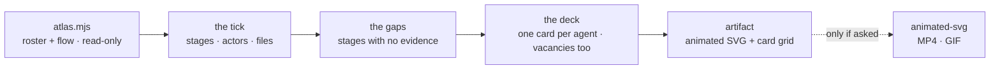

# Loop Atlas

Two questions people ask about a multi-agent loop, and neither is
answered by reading its files: **what actually happens on one run**, and
**who is on this team and what is each of them for**.

Loop-atlas answers both on one page: the flow, animated once through a
single tick, and the crew as a deck of cards where every number on every
card comes from the agent's own definition or from the runs.



## The guard-rail

- **Nothing on a card is invented.** Every ability, stat and weakness
  traces to the agent's own file, its tool grant, or its observed runs. A
  stat that cannot be derived prints `—`. People will route real work by
  this deck.
- **Draw the gaps.** A stage with no evidence and a class with no agent
  are rendered as labelled holes, not omitted.
- **Write nothing into the target repo.** The page is an artifact; files
  go to the scratchpad unless a path is asked for.
- **Never quote a transcript.** Counts and ids only.
- **Install nothing.** The page animates itself; `animated-svg` is an
  offer, never a side effect.
- **Leave a receipt** in the footer.

## Workflow

### 1. Collect

```bash
node <skill-dir>/scripts/atlas.mjs <repo-path> --since 30d > <scratchpad>/atlas.json
```

The roster (project and user agent definitions with frontmatter, tools,
model, inferred class), the skills available, observed summons by
subagent type with average brief length, skills invoked, main vs
subagent tokens, the tools used inside sidechains, and the flow evidence:
lines in the project's own files that fire, select, act, verify, gate,
record and stop — plus `emptyStages`, the stages nothing in the files
supports.

No transcripts → the deck still draws from definitions; every `Seen:`
line reads `not observed in this window`. Say that once on the page
rather than on every card.

### 2. Build the tick

`references/flow-spec.md`. One tick, left to right, actor lanes, the
re-arm edge returning underneath, and **every exit** a tick can take —
done, gate, budget, error, stop sentinel. Put the real file name on every
stage. Where `emptyStages` names a stage, draw it dashed and labelled
*no evidence*.

If the loop's design is what they are actually asking about — is it
safe, does it stop, is it contradictory — that is `loop-doctor`, and this
picture is the wrong tool. Say so and hand off.

### 3. Deal the cards

`references/card-spec.md`. One card per agent: class (from what the
description does, not from the name), model, "good at" in one plain line,
2–4 abilities each with a cost, four stats derived from the tool grant
and the runs, summon-when, **weakness**, hands-off-to, and the observed
`Seen:` line.

Three cards people forget and this skill must not:

- **the main actor** — usually the most expensive agent on the page,
- **undefined but summoned** — a subagent type the runs used that no file
  defines,
- **the vacancy** — a class with no agent, drawn as an empty slot.
  `VERIFIER — vacant` is the most common and the most expensive.

Order the deck by observed summons, not by the order the files list them.

### 4. Publish

`references/page-spec.md`: flow first with its evidence table under it,
deck second with the window counts, then ≤ 5 bullets that each name
something *visible* in the picture. Self-contained inline SVG animated
with CSS, theme-aware, reduced-motion safe, replay by button and never on
autoplay loop.

### 5. Offer the render — only if they want a video

`references/animated-handoff.md`. The page is enough for understanding
and sharing. For a README hero or a talk, offer the `animated-svg` skill
in one line; if it is not installed, link it and stop. When it is, hand
over the atlas's own semantic SVG plus the beat list, so the video and
the page never drift.

## Judgement calls

**The picture is a claim, and claims cite.** Every stage carries a
`file:line`. A diagram with no file names is a drawing of what someone
hoped they had built.

**A lane that builds and verifies its own work needs no caption.** Draw
the lanes honestly and the finding draws itself. That is the whole reason
to lay the flow out by actor.

**Card stats route work, so they are load-bearing.** `cost: 5` must mean
this one is expensive, consistently, or the deck quietly teaches the
wrong routing. Print `—` sooner than a plausible number.

**Weakness is the useful field.** A deck of strengths tells nobody
anything; "never hand it work it wrote itself" is what stops a bad
summon.

**Never-summoned is interesting.** An agent defined months ago and never
used is either a gap in the loop's rules or dead weight — print the fact
and let the reader decide.

**Card-shaped, not cartoon.** Flavour lives in the layout and the class
names. No lore, no levels, no evolution chains, no battle stats.

**Animation is sequence, not information.** The static frame must carry
everything; motion only says what happens in what order.

## Files

- `scripts/atlas.mjs` — roster + flow collector; `--self-test`.
- `references/flow-spec.md` — what the flow must show, layout, animation
  rules, the self-contained SVG/CSS technique.
- `references/card-spec.md` — the card grammar and how every field is
  derived.
- `references/page-spec.md` — the published page, exactly.
- `references/animated-handoff.md` — optional MP4/GIF via `animated-svg`.
- `evals/` — the prompts, and `gauntlet/BAR.md`, the bar this skill's
  pages are graded against by a blind critic.

## Related

`loop-doctor` judges whether the design is sound; `loop-economist` what
the runs cost and whether the right agent did the work — this skill only
shows what is there. The deck's vacancies and the flow's gaps are the
natural input to both.
