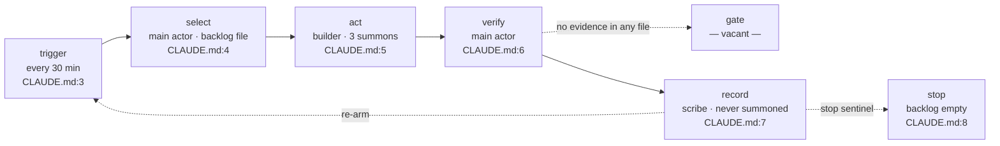

# crew — the loop and its crew

Every 30 minutes the loop wakes, picks the top backlog item, builds it, runs
the tests, records one status line, and re-arms — with no gate before that
record lands.

## The flow

| stage | actor | reads / writes | evidence |
|---|---|---|---|
| trigger | main actor | — | `CLAUDE.md:3` |
| select | main actor | the backlog file the rule names (not created in this fixture) | `CLAUDE.md:4` |
| act | builder | working tree | `.claude/agents/builder.md:7`, `CLAUDE.md:5` |
| verify | main actor | test suite | `CLAUDE.md:6` |
| gate | — vacant — | — | no evidence in any file |
| record | scribe (file only, never summoned) | the status file the rule names (not created in this fixture) | `.claude/agents/scribe.md:3`, `CLAUDE.md:7` |
| stop | main actor | — | `CLAUDE.md:8` |

## The crew

| card | class | model | summon when | weakness | seen |
|---|---|---|---|---|---|
| main actor | main actor | claude-opus-5 | every tick, by default | moves verify straight to record — no gate file exists | mainTokens 5850 (session) |
| scout | search | — (not stated) | you need every call site, not the pages | cannot write, cannot fan out past its own summon | 3 summons |
| builder | build | sonnet | a bounded task with a stated diff limit | refuses to widen scope — do not hand it an item with no bound | 3 summons |
| planner | plan | opus | a backlog item needs an acceptance test before code | refuses to edit — do not hand it a task and expect a diff back | 1 summon |
| verifier | verify | sonnet | a staged diff needs review against repo standards | reports only — do not hand it something that needs fixing | 1 summon |
| scribe | record | haiku | after the work has landed, to append the tick | never summoned in this window — the record stage runs unverified as written | never |

## What the picture shows

1. The verify stage's own file evidence (`CLAUDE.md:6`) never names the
   verifier agent, even though the verifier was summoned once in the window.
2. Gate has no evidence in any file — the tick moves from verify straight to
   record with nothing between them.
3. Scribe is defined and wired into `record` by `CLAUDE.md:7`, but was never
   summoned in this window — the append step ran, if it ran, unwritten by the
   agent the file names for it.
4. The main actor spent 5850 tokens (`observed.mainTokens`) against 2925 for
   every subagent combined (`observed.sidechainTokens`) — most of the tick's
   own tokens are spent by the session itself, not the crew.
5. Builder and scout are the most-used cards (3 summons each); planner and
   verifier each fired once.

---
*Read 6 files and 1 transcript · counts and ids only · target repo untouched.*
