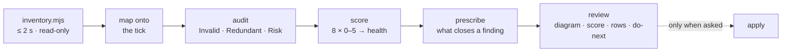

# Loop Doctor

A scheduled loop runs when nobody is looking, and its design is never in
one file: scheduler → driver → skill → rules in `CLAUDE.md` → a
definition-of-done → a gate log → a state file. Each was written at a
different time, and they drift. The loop keeps running on whichever copy
it happens to read.

Loop-doctor produces one artifact — a review that is **diagram first,
score second, rows third** — and costs the project nothing. It diagnoses;
it treats only when asked afterwards.



## The guard-rail: no overhead on the project

The person calling loop-doctor is asking a question, not adopting a tool.
So:

- **Write nothing into the target repo.** The review goes to the
  scratchpad (and to a published page if that's how they read things). If
  they want it in the repo, they name the path and you write exactly that
  one file.
- **Run nothing of the project's.** No install, no build, no tests, no
  `refresh` command. Only `git log`/`git show`/`git status` and the
  inventory script.
- **Read bounded.** Governing files fully; state files by header, first
  screen and last screen — the inventory gives their line counts, and
  the count *is* the finding. Never read a queue or log end to end.
- **No subagents by default.** One context, one pass. The inventory
  already did the mechanical work.
- **Leave a receipt.** The review's footer says how many files were read,
  that no state file was read whole, and that the target repo is
  untouched — so the reader can see the cost.

## Workflow

### 1. Inventory

```bash
node <skill-dir>/scripts/inventory.mjs <repo-path> > <scratchpad>/loop-inventory.json
```

Triggers (cron, launchd, workflow `schedule:`, `/loop Nm`, cloud-routine
mentions), drivers, governing docs, loop skills/commands, agents, state
files with size and growth, the intent document and who references it,
queue sharpness, and the cheap checks: repeated sentences across files,
dangling references (dead vs moved), numbers that disagree for the same
phrase, terminal sentinels with entries after them, swallowed errors,
single-OS drivers. Read all of it. It is evidence, not conclusions.

No trigger, no driver, no loop docs → this project has no scheduled
loop. Say so in three lines and stop.

### 2. Map onto the tick

`references/tick-model.md`. Fill the eight nodes — trigger, wake, select,
act, verify, gate, record, re-arm/stop — with the project's real file
names and numbers. A node with two answers is a finding; a node with none
is usually the worse one. Answer the three questions once each: who owns
"done", where does state live between ticks, do human gates block or log.
Climb the empty-queue ladder (steady state → re-plan from intent as
proposals → bounded explore) and note which rungs exist.

State **built vs declared** in one sentence: what runs today, what the
documents describe in the present tense that is only planned, simulated
or dormant. In every real loop reviewed so far this was the sentence the
reader needed most.

### 3. Audit

`references/checklist.md` — every item says why it matters unattended and
how a miss is classified:

- **Invalid** — the loop does not do what its files say, or cannot.
- **Redundant** — the same rule in more than one place; name the copy the
  loop actually loads.
- **Risk** — nothing wrong yet; the design lets it go wrong silently.

One row per finding: id · what · where (file:line) · exact fix.
"Consider consolidating" is not a row.

If the loop has a queue, list the **ambiguous items** — acceptance
unstated, or judgement-worded (*improve, look at, consider, clean up*) —
and rewrite the top three so each names its object and its test.

### 4. Score

`references/scorecard.md`. Eight dimensions, 0–5 by the anchors, one-line
reason each citing a file or a number; mean → health label (`fit · watch
· treat · stop`; a 0 in safety caps at *treat*). The score summarises the
rows; a reader must be able to go from a score line to the rows behind it.

Score last, and score from the reason: write the one-line reason first,
count the Invalid ids in it, and apply the ceiling (one → ≤ 2, two or more
→ ≤ 1) before writing the number. Both gauntlet rounds so far drifted one
point high on exactly the dimensions whose reasons cited two Invalids.

### 5. Prescribe

`references/patterns.md`. Recommend only what closes a finding or a gap
from step 2, with its cost. Three habits kept beat twelve written down.

### 6. Write the review

`references/report-template.md`, exactly: ≤ 60 words, the tick diagram
with real file names, files-by-role, the score block, the finding tables,
sharpened items, prescriptions, do-next (≤ 5), footer receipt. Prose
outside tables/diagrams/code ≤ 450 words in total. Then a terminal
summary of ≤ 8 lines: one sentence on the loop, the health label and
mean, findings by class, the first fix.

### 7. Apply — only when asked

Invalid and Redundant fixes you proposed, one commit per class, diff
shown first. Risk items and pattern adoption stay separate decisions:
they change how the loop behaves, and a loop's behaviour should never
change as a side effect of being looked at.

## Judgement calls

**The copy that's loaded is the real one.** A rule in `CLAUDE.md`, a
`SKILL.md` and a `docs/*.md` is obeyed in whichever the driver puts in
context. Keep that one; turn the others into a one-line pointer.

**Sentinels are state, not history.** A stop rule that greps for
`STATUS: COMPLETE` works once. If the log continued past it, the stop
rule is broken *now*. Rank it above almost everything.

**Growth is a cost paid every tick.** A file read at wake charges its full
length to every run. Report lines and growth; if there's no archive rule,
propose one with a threshold.

**Two drivers is zero drivers.** Don't pick the winner; report that
precedence is undefined and propose the person choose.

**Absence of a stop is a finding; absence of a human is not.** Log-and-
continue is a legitimate design. It must then have an asynchronous
escalation channel and a kill switch — check for those instead.

**Intent is read, never written, by the loop.** Re-planning from intent
when the queue runs dry is the right rung — as gated proposals. A loop
that promotes its own proposals is writing its own mandate.

**Explain before you judge.** If the diagram was hard to draw from the
files, say so once — that difficulty is itself a finding.

## Files

- `scripts/inventory.mjs` — discovery + cheap checks; `--self-test`.
- `references/tick-model.md` — the tick, the empty-queue ladder, the
  three questions.
- `references/checklist.md` — dimensions → checks, with the why.
- `references/scorecard.md` — anchors, health label, sharpness.
- `references/patterns.md` — prescriptions catalogue.
- `references/report-template.md` — the review, exactly.
- `evals/gauntlet/` — the bar this skill's output is graded against.
