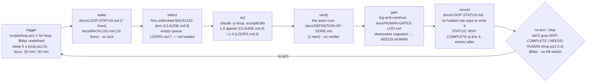

# Loop review — sample-app

`scripts/loop.ps1` runs `claude -p "/loop"` in a for-loop with a 5-second sleep (the docs say 20 or 30 minutes). A tick reads LOOP-STATUS then BACKLOG, takes the first unblocked item, runs its own DoD, logs human gates and continues. It stops when the last five STATUS lines contain MVP-COMPLETE or NEEDS-HUMAN — which they already do.

| role | file | notes |
|---|---|---|
| trigger | `scripts/loop.ps1:1-6` | for-loop; `$Max` never defined; `Start-Sleep 5`; documented 20 min (`CLAUDE.md:4`) and 30 min (`docs/LOOPS.md:3`) |
| driver | `scripts/loop.ps1` | 8 lines; PowerShell only; `pwsh` not installed on this host |
| rules loaded each tick | `CLAUDE.md:2-6` · `.claude/skills/loop/SKILL.md` | `docs/LOOPS.md` is never loaded |
| definition of done | `docs/DEFINITION-OF-DONE.md` | 1 item (migrations); run by the actor that built |
| human gates | `docs/HUMAN-GATES-LOG.md` | log-and-continue; GATE-QG-01 OPEN since 2026-07-01 (69 days) |
| state between ticks | `docs/LOOP-STATUS.md` | lines 7 · Δ not measurable — target has no repository of its own; file untracked in the parent |
| queue | `docs/BACKLOG.md` | lines 10 · 5 open items |
| archive | *none* | |
| kill switch | *none* | Ctrl-C on the pwsh process only |
| purpose document | `intent.md` | 1 line · referenced only by `docs/LOOPS.md:7`, which no tick loads |
| unreferenced | `docs/MANUAL-ACTIONS.md` | no rule reads it; one human action still open (line 9) |

## Score

**Health: stop** · mean 1.6 / 5
**Built vs declared:** Nothing runs today — `$Max` is undefined so `loop.ps1` executes zero ticks, and if it did, the `MVP-COMPLETE` line already inside the tail-5 window ends it after one; the Continue/Standardise loops and the re-plan-from-intent step exist only as headings and a sentence in `docs/LOOPS.md`, a file no tick loads.

| dimension | score | why (one line, cites a file or number) |
|---|---|---|
| correctness | 1 | tripped sentinel `LOOP-STATUS.md:4` (I-1), `$Max` undefined `loop.ps1:1` (I-2), dead ref `CLAUDE.md:6` (I-5), cadence 20/30/5 s (I-3), driver cannot fire on this host (I-11) |
| safety | 1 | nothing stops the actor ticking `HUMAN-GATES-LOG.md:7` (I-7); migration stop-class worded three ways (I-6); no kill switch, no lock, budgets unenforced (K-1, K-2, K-7) |
| reliability | 1 | the actor grades its own DoD (I-10) and every run ends after tick 1 (I-1); no revert, no no-progress stop (K-6, K-10) |
| cost | 2 | 17 lines read at wake; agents cap is two numbers (I-4); no archive rule, no wall-time cap (K-4, K-7); growth NOT MEASURED — no repository |
| maintainability | 1 | three copies of the gate rule (R-1); copies that disagree on cadence, agents, migrations (I-3, I-4, I-6); two empty loops declared in `LOOPS.md:4-5` (I-9) |
| understandability | 2 | the record node had to be inferred — no loaded rule writes `LOOP-STATUS.md` (K-3); `LOOPS.md` declares loops with no body (I-9); resume and history share one file (I-1) |
| observability | 2 | `LOOP-STATUS.md` says `MVP-COMPLETE` two lines above a `blocked` entry (I-1); record cites `H-02`, absent from the queue (I-8); outcome words used but defined nowhere (K-3) |
| purpose | 3 | `intent.md` exists but is named only in unloaded `LOOPS.md:7` (K-8); no steady-state rung, no objective review, items cite no intent clause (K-8, K-9) |

**Sharpness:** stated acceptance 40% (2 of 5) · ambiguous 3 items.

## Findings

### Invalid
| id | what | where | fix |
|---|---|---|---|
| I-1 | Terminal sentinel `STATUS: MVP-COMPLETE` with two entries after it; the driver greps the last 5 lines, so every run stops after its first tick | `docs/LOOP-STATUS.md:4`, `:6` · `scripts/loop.ps1:3-4` | Delete line 4; keep exactly one `STATUS:` line at line 2, rewritten each tick; change `loop.ps1:3` to `$status = Get-Content docs/LOOP-STATUS.md -TotalCount 2` and grep that |
| I-2 | `$Max` is never defined; `1 -le $null` is false, so the for-loop body never executes | `scripts/loop.ps1:1` | Prepend `param([int]$Max = 48)` as line 1 |
| I-3 | Cadence stated three ways: 20 min, 30 min, 5 s | `CLAUDE.md:4` · `docs/LOOPS.md:3` · `scripts/loop.ps1:5` | Set `Start-Sleep -Seconds 1200`; `CLAUDE.md:4` → "Tick every 20 minutes (scripts/loop.ps1 is authoritative)"; delete the sentence at `LOOPS.md:3` |
| I-4 | Agents-per-tick budget is 6 in one file, 4 in another | `CLAUDE.md:4` · `docs/LOOPS.md:3` | Keep one number at `CLAUDE.md:4` (loaded); delete the clause at `LOOPS.md:3` |
| I-5 | Dead reference: `docs/MISSING-FILE.md` "for the router" does not exist | `CLAUDE.md:6` | Delete line 6, or create the router doc it names |
| I-6 | Destructive-migration stop-class worded three ways; only the DoD requires a backup | `CLAUDE.md:5` · `.claude/skills/loop/SKILL.md:5` · `docs/DEFINITION-OF-DONE.md:2` | Keep `DEFINITION-OF-DONE.md:2`; `CLAUDE.md:5` → "Run docs/DEFINITION-OF-DONE.md"; `SKILL.md:5` → "Migrations: see docs/DEFINITION-OF-DONE.md" |
| I-7 | Nothing prevents self-approval: `[x] Backups verified` is ticked with no author or evidence; the actor runs with `acceptEdits` and may tick line 7 | `docs/HUMAN-GATES-LOG.md:6-7` · `scripts/loop.ps1:2` | Add to `CLAUDE.md:3`: "The loop only appends `loop-reading:` lines to docs/HUMAN-GATES-LOG.md; it never edits a checkbox" |
| I-8 | Record cites item `H-02`, which is not in the queue (`BACKLOG.md` holds F-01…F-06) — selection did not come from the ordered source | `docs/LOOP-STATUS.md:6` · `docs/BACKLOG.md:4-9` | Add `- [ ] H-02 … status: blocked` to `BACKLOG.md`, or annotate the record line with its real source |
| I-9 | `## Continue` and `## Standardise` declared with no body and no selector; `CLAUDE.md:2` describes one loop | `docs/LOOPS.md:4-5` · `CLAUDE.md:2` | Delete `LOOPS.md:4-5`, or write both bodies and add "every 3rd tick: Standardise" to `CLAUDE.md` |
| I-10 | "Run the DoD" is executed by the actor that built; that is the only check | `CLAUDE.md:5` · `docs/DEFINITION-OF-DONE.md` | Insert after `loop.ps1:2`: `claude -p "/verify" --permission-mode plan` that writes `gate: green|red` to the record; the actor writes no gate word |
| I-11 | The only driver is PowerShell; `pwsh` is not installed on this host and there is no `.sh` sibling, so the documented trigger cannot fire here | `scripts/loop.ps1` | Add `scripts/loop.sh` with the same body, or state in `CLAUDE.md:2` which host runs the driver |

### Redundant
| id | rule | copies | keep · replace others with |
|---|---|---|---|
| R-1 | "The loop never stops for a human: it logs the fail-closed reading it proceeded with and continues." | `CLAUDE.md:3` · `docs/LOOPS.md:2` · `.claude/skills/loop/SKILL.md:4` | keep `CLAUDE.md:3` (loaded, carries the read-order) · `SKILL.md:4` → "Rules: CLAUDE.md § The loop" · delete `LOOPS.md:2` |

### Risk
| id | what can go wrong unattended | evidence | guard |
|---|---|---|---|
| K-1 | No kill switch; the only stop is killing the pwsh process | `scripts/loop.ps1:1-6` checks no flag | First statement of the loop body: `if (Test-Path docs/HALT) { break }`; document `touch docs/HALT` in `CLAUDE.md` |
| K-2 | Two launches of the driver run interleaved ticks | no lock in `loop.ps1` | Create `docs/.loop.lock` before line 1, exit if present, remove after line 6 |
| K-3 | No loaded rule tells the tick to write `LOOP-STATUS.md`, yet the driver stops only on that file; outcome words (`done`, `blocked`, `gate: green`) are undefined | `CLAUDE.md:3` (read only) · `SKILL.md` (silent) · `loop.ps1:3-4` | Add to `SKILL.md`: "Last act of every tick: append `<utc> \| <item> \| done\|blocked\|refused\|reverted \| <sha> \| gate: green\|red` to docs/LOOP-STATUS.md" |
| K-4 | State file has no archive rule; growth cannot be measured (no repository) | `docs/LOOP-STATUS.md` 7 lines · `growth: null` | "Above 200 lines, move all but the last 20 entries to docs/LOOP-STATUS-archive.md" |
| K-5 | Setup runs after the loop and its failure is hidden; `\|\|` and `/dev/null` are POSIX idioms inside a `.ps1` | `scripts/loop.ps1:7` `pnpm install 2>/dev/null \|\| true` | Move before line 1 as `pnpm install; if ($LASTEXITCODE) { exit 1 }` |
| K-6 | `acceptEdits` with no commit or revert rule — a red tree is handed to the next tick | `scripts/loop.ps1:2` | `SKILL.md`: "one commit per tick; tests red → `git checkout -- .` and record `reverted`" |
| K-7 | Agent budget and wall time have no mechanism | `CLAUDE.md:4` "at most 6 agents" · no timeout in `loop.ps1:2` | Run the claude call as a job with `Wait-Job -Timeout 1200`; state the agents cap as a prompt rule, not a guarantee |
| K-8 | Empty-queue ladder: only rung 2 exists, in a file no tick loads; no steady-state rung, no bounded explore; `intent.md` unnamed in loaded rules | `docs/LOOPS.md:7` · `CLAUDE.md:3` | Move `LOOPS.md:7` to `CLAUDE.md` after the select sentence; prepend "if the current slice is complete, record `steady` and stop early" |
| K-9 | No periodic objective review; open items cite no intent clause | `docs/BACKLOG.md:5-9` · `intent.md` | "Every 12th tick, re-read intent.md against BACKLOG.md and log proposals as a gate"; add `intent:` to each item |
| K-10 | Stuckness invisible: GATE-QG-01 OPEN for 69 days while the state claims `MVP-COMPLETE`; `H-02` blocked since 2026-07-02 with no escalation | `docs/HUMAN-GATES-LOG.md:3-7` · `docs/LOOP-STATUS.md:6` | "Same item `blocked` 3 ticks running → append `NEEDS-HUMAN`"; show gate age in the STATUS line |
| K-11 | `logs/` does not exist, so `Tee-Object` fails on tick 1; one file per tick with no rotation | `scripts/loop.ps1:2` | `New-Item -ItemType Directory -Force logs` before the loop; keep the last 50 |
| K-12 | The DoD has one item; tests are never named, so "done" needs no evidence | `docs/DEFINITION-OF-DONE.md:2` | Add "- Tests green: record the command and exit code in the tick line" |

### Ambiguous items → sharpened
| item | as written | proposed |
|---|---|---|
| F-03 `docs/BACKLOG.md:6` | Improve the onboarding flow | Onboarding reaches the dashboard in ≤ 3 screens with email as the only required field. Accept: `test/onboarding.spec.ts` drives signup → dashboard in ≤ 3 navigations |
| F-04 `docs/BACKLOG.md:7` | Look at dashboard load time | Dashboard p75 LCP ≤ 2.5 s on staging. Accept: Lighthouse run cited in the tick line; `test/perf/dashboard.spec.ts` asserts LCP ≤ 2.5 s |
| F-06 `docs/BACKLOG.md:9` | Clean up old feature flags | Remove every flag 100% on for ≥ 30 days. Accept: removed names listed in the tick line; `grep -r <flag>` returns 0 hits for each; tests green |

## Prescriptions

| pattern | closes | cost |
|---|---|---|
| Sentinel discipline — marker lives in a rewritten line, never in the append-only log | I-1 | move one line; change one grep |
| Thin `CLAUDE.md`, one loaded playbook — `SKILL.md` and `LOOPS.md` become pointers | R-1, I-3, I-4, I-6, I-9 | one refactor |
| Kill switch and steer — a `docs/HALT` flag checked first | K-1 | one check at wake |
| Fresh-context falsifier — a second read-only `claude -p "/verify"` owns `gate:` | I-10 | one extra agent per tick |
| Default-FAIL gate criteria flipped only by cited evidence; loop never edits checkboxes | I-7, K-12 | a gate-file format |
| Closed outcome vocabulary, one record per tick written last | K-3, I-8 | one sentence in `SKILL.md` |
| One commit per tick, green or reverted | K-6 | a revert step in the driver |
| Re-plan from intent as proposals, with steady state as a valid outcome | K-8 | move one sentence; add one permission |
| Periodic objective review — every 12th tick | K-9 | one counter rule |
| Enumerated outcomes with a no-progress stop | K-10 | one rule |
| One state file with an archive sweep | K-4 | a threshold |

## Do next

1. Delete `STATUS: MVP-COMPLETE` at `docs/LOOP-STATUS.md:4` and make line 2 the only STATUS line (I-1) — until then every run ends after tick 1.
2. Add `param([int]$Max = 48)` as `scripts/loop.ps1:1` (I-2) — until then zero ticks run.
3. Choose one cadence and one agent budget; keep them at `CLAUDE.md:4`, match `loop.ps1:5`, delete `docs/LOOPS.md:3` (I-3, I-4).
4. Make `CLAUDE.md § The loop` the single rule copy; `SKILL.md` and `LOOPS.md` become pointers; the migration class lives only in the DoD (R-1, I-6).
5. Add the `docs/HALT` check at the top of the loop body (K-1) before any unattended run.

---
reviewed 2026-09-08 · target is not a git repository of its own (parent `ai-skills` at 82fa608; state files untracked there), so growth is not measured · files read 8 governing in full, 2 state files sampled head and tail, none read whole · `expect.json` not opened · target directory untouched
