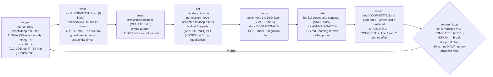

# Loop review — sample-app

A person runs `scripts/loop.ps1`, which calls `claude -p "/loop"` up to `$Max` times with a 5-second sleep (docs say 20 or 30 minutes). Each tick reads LOOP-STATUS then BACKLOG, takes the first unblocked item, runs its own DoD, appends a status line. It stops when the last five status lines contain `MVP-COMPLETE` or `NEEDS-HUMAN` — which they already do.



| role | file | notes |
|---|---|---|
| trigger | `scripts/loop.ps1:1` | manual start; `$Max` never bound; no scheduler entry |
| driver | `scripts/loop.ps1` (7 lines) | PowerShell only; `pwsh` not installed on this host |
| rules loaded each tick | `CLAUDE.md`, `.claude/skills/loop/SKILL.md` | `docs/LOOPS.md` is *not* loaded |
| definition of done | `docs/DEFINITION-OF-DONE.md` (2 lines) | migrations only; run by the actor |
| human gates | `docs/HUMAN-GATES-LOG.md` (7 lines) | GATE-QG-01 OPEN, sponsor sign-off unticked |
| state between ticks | `docs/LOOP-STATUS.md` | lines 6 · Δ NOT MEASURED — fixture has one commit |
| queue | `docs/BACKLOG.md` (9 lines) | 5 open items |
| archive | *none* | |
| kill switch | *none* | only `$Max` or a sentinel in the log |
| purpose document | `intent.md` (1 sentence) | referenced only by `docs/LOOPS.md:7`, which is not loaded |
| manual actions | `docs/MANUAL-ACTIONS.md` | not referenced by any rule the loop loads |

## Score

**Health: stop** · mean 1.8 / 5
**Built vs declared:** Built is a seven-line for-loop that calls `/loop` and greps a log tail; the 20/30-minute cadence, the 4/6-agent budget, the Continue and Standardise loop types and the intent re-plan are declared with no mechanism behind them.

| dimension | score | why (one line, cites a file or number) |
|---|---|---|
| correctness | 1 | I-1 dead ref CLAUDE.md:6 · I-2 sentinel tripped LOOP-STATUS.md:4 · I-3/I-4 cadence and budget disagree · I-5 `$Max` unbound · I-6 `pwsh` absent |
| safety | 1 | I-7 nothing forbids ticking HUMAN-GATES-LOG.md:7 under `acceptEdits` · I-8 migration stop-class worded three ways · K-1 no kill switch |
| reliability | 2 | I-2 breaks the driver on tick 1 · K-2 no no-progress or repeat-failure stop · K-3 no green-or-reverted |
| cost | 2 | wake reads 15 lines today, no archive rule (K-4) · agents cap has no mechanism and disagrees (I-4) |
| maintainability | 1 | R-1 one sentence in three loaded/unloaded files · I-9 CLAUDE.md names one loop, LOOPS.md:4-5 declares two empty ones · I-1 router file missing |
| understandability | 2 | tick is drawable, but LOOPS.md and MANUAL-ACTIONS.md have no role in the loaded rules · I-9 · resume and history share one file (K-5) |
| observability | 2 | closed vocabulary `done | blocked · gate: green | red` with sha per line, good · I-2 puts the state marker inside history · stuckness not derivable (K-2) |
| purpose | 3 | intent.md exists but only unloaded LOOPS.md:7 names it (K-6) · no objective review (K-7) · no goal-level exit criteria, `MVP-COMPLETE` undefined (K-8) |

**Sharpness:** stated acceptance 40 % · ambiguous 3 items.

## Findings

### Invalid
| id | what | where | fix |
|---|---|---|---|
| I-1 | `docs/MISSING-FILE.md` ("the router") does not exist | CLAUDE.md:6 | delete line 6 |
| I-2 | `STATUS: MVP-COMPLETE` has two entries after it; `Get-Content -Tail 5` on a 6-line file sees it, so the driver breaks on tick 1 | docs/LOOP-STATUS.md:4 · scripts/loop.ps1:3-4 | move `STATUS:` to a single rewritten line 2; delete lines 2 and 4 as they stand; driver reads `-TotalCount 2`, not `-Tail 5` |
| I-3 | cadence 20 min vs 30 min vs the driver's 5 s | CLAUDE.md:4 · docs/LOOPS.md:3 · scripts/loop.ps1:5 | state once in SKILL.md; set `Start-Sleep -Seconds 1200`; delete the other two mentions |
| I-4 | budget 6 agents vs 4 agents | CLAUDE.md:4 · docs/LOOPS.md:3 | one number in SKILL.md; delete the other |
| I-5 | `$Max` is never bound: `1 -le $null` is false, loop body runs zero times | scripts/loop.ps1:1 | add `param([int]$Max = 48)` as line 1 |
| I-6 | documented trigger cannot fire here: `.ps1` driver, `pwsh` not installed, no `.sh` sibling | scripts/loop.ps1 | add `scripts/loop.sh` or document the Windows host as the only runner in SKILL.md |
| I-7 | the actor runs with `acceptEdits` and no rule forbids it ticking `[ ] Sponsor sign-off` | scripts/loop.ps1:2 · docs/HUMAN-GATES-LOG.md:7 | add to SKILL.md: "Never edit `docs/HUMAN-GATES-LOG.md` except to append a new gate entry" |
| I-8 | migration stop-class worded three ways; only one requires a backup | SKILL.md:5 · CLAUDE.md:5 · docs/DEFINITION-OF-DONE.md:2 | keep DoD:2 verbatim; SKILL.md:5 → "Migrations: see docs/DEFINITION-OF-DONE.md"; delete CLAUDE.md:5 |
| I-9 | CLAUDE.md names one loop; LOOPS.md declares `Continue` and `Standardise` with empty bodies | CLAUDE.md:2 · docs/LOOPS.md:4-5 | delete lines 4-5 or define both with a counter rule ("every 4th tick Standardise") in SKILL.md |
| I-10 | builder runs its own DoD and that is the only check | CLAUDE.md:5 | add a `verify` step to SKILL.md: fresh `claude -p` read-only, default-FAIL, output `gate: green | red` |

### Redundant
| id | rule | copies | keep · replace others with |
|---|---|---|---|
| R-1 | "The loop never stops for a human: it logs the fail-closed reading it proceeded with and continues." | CLAUDE.md:3 · docs/LOOPS.md:2 · .claude/skills/loop/SKILL.md:4 | keep SKILL.md:4 · CLAUDE.md:3 → "Loop rules: .claude/skills/loop/SKILL.md" · delete LOOPS.md:2 |

### Risk
| id | what can go wrong unattended | evidence | guard |
|---|---|---|---|
| K-1 | no kill switch: stopping means killing the shell or editing a log | scripts/loop.ps1 has no flag check | line 2: `if (Test-Path HALT) { break }` |
| K-2 | same item ticks forever with no signal | no no-progress rule in any file | SKILL.md: "same item 3 ticks without a new sha → record `stopped:no-progress`, move on" |
| K-3 | a red tree is handed to the next tick | no revert rule | SKILL.md: "one commit per tick; if verify is red, `git revert` before recording" |
| K-4 | LOOP-STATUS.md is read every tick and never archived | 6 lines today, no threshold | "above 200 lines move all but the last 20 to docs/LOOP-STATUS-archive.md" |
| K-5 | resume state and history share one file; two `STATUS:` lines already coexist | docs/LOOP-STATUS.md:2,4 | header line 2 is the only `STATUS:`; everything below is append-only |
| K-6 | the empty-queue rule lives in a file the tick never loads | docs/LOOPS.md:7 vs loaded files CLAUDE.md, SKILL.md | move it to SKILL.md (paste-ready rule below) |
| K-7 | no periodic objective review; roadmap drifts from intent | no counter rule anywhere | SKILL.md: "every 12th tick re-read intent.md against docs/BACKLOG.md; propose retirements as a gate" |
| K-8 | `MVP-COMPLETE` is a sentinel with no definition; loop cannot tell finished from empty | docs/LOOP-STATUS.md:4 · docs/BACKLOG.md has no exit criteria | add `## Done when` to BACKLOG.md listing the F-ids that constitute MVP |
| K-9 | `pnpm install 2>/dev/null \|\| true` swallows failure, runs after the loop, and `\|\|` is a parse error on Windows PowerShell 5.1 | scripts/loop.ps1:7 | move before the loop; `pnpm install; if ($LASTEXITCODE) { exit 1 }` |
| K-10 | human-only actions are invisible to the loop; an item needing the LINE secret will be retried | docs/MANUAL-ACTIONS.md:9 unreferenced | SKILL.md: "an item that needs an unticked MANUAL-ACTIONS entry → `blocked:manual`, skip" |

### Ambiguous items → sharpened
| item | as written | proposed |
|---|---|---|
| F-03 | Improve the onboarding flow | New user reaches the dashboard in ≤ 3 screens with no support contact. Accept: `test/onboarding.spec.ts` asserts step count ≤ 3 and passes |
| F-04 | Look at dashboard load time | Dashboard first load ≤ 2.0 s p75 on the seed dataset. Accept: `test/dashboard-load.spec.ts` measures LCP and fails above 2.0 s |
| F-06 | Clean up old feature flags | Remove flags whose default has been on in production ≥ 30 days. Accept: list in `flags/RETIRE.md`; grep for each key returns zero hits; CI green |

## Prescriptions

| pattern | closes | cost |
|---|---|---|
| Sentinel discipline — `STATUS:` in a rewritten header, log below append-only | I-2, K-5 | one edit; driver reads two lines |
| Thin CLAUDE.md, one loaded playbook (SKILL.md) | R-1, I-3, I-4, I-8, I-9, K-6 | one consolidation |
| Fresh-context falsifier with default-FAIL criteria | I-10 | one extra `claude -p` per tick; a rubric |
| Kill switch (`HALT` file checked first) | K-1 | one line |
| Enumerated outcomes with a stop evaluator | K-2, K-3 | four outcome words; a revert step |
| Re-plan from intent as proposals + periodic objective review | K-6, K-7, K-8 | the paste-ready rule; a `## Done when` block |

## Autonomy plan

Today the loop needs a person per run to start it, a person on tick 1 to notice it stopped, and a person to refill and clarify the queue.

| today the human must… | where | replace with |
|---|---|---|
| start `scripts/loop.ps1` by hand | scripts/loop.ps1:1 | a scheduled task (launchd / Task Scheduler) at the one stated cadence; `HALT` file to stop |
| supply `$Max` | scripts/loop.ps1:1 | `param([int]$Max = 48)` plus enumerated stops |
| restart after the false `MVP-COMPLETE` stop | docs/LOOP-STATUS.md:4 · loop.ps1:3 | sentinel in the rewritten header only |
| decide 20 vs 30 minutes, 4 vs 6 agents | CLAUDE.md:4 · docs/LOOPS.md:3 | one-time: pick once, state once in SKILL.md |
| clarify F-03, F-04, F-06 | docs/BACKLOG.md:6,7,9 | acceptance test required to be dispatchable; otherwise the tick sharpens and logs a gate |
| answer GATE-QG-01 sponsor sign-off | docs/HUMAN-GATES-LOG.md:7 | stays human (one-way door); loop proceeds on other items and never edits the entry |
| rotate the LINE channel secret | docs/MANUAL-ACTIONS.md:9 | stays human; dependent items marked `blocked:manual` |
| notice the queue is empty and write more | docs/LOOPS.md:7 (unloaded) | the paste-ready ladder in SKILL.md |
| notice it is stuck | no file | `stopped:no-progress` after 3 ticks on one item |
| decide the roadmap is done | `MVP-COMPLETE` undefined | `## Done when` in docs/BACKLOG.md |

Only the stages that differ from `references/autonomy-blueprint.md`:

| stage | today | target |
|---|---|---|
| trigger | human runs the script; three cadences | scheduler entry; cadence once in SKILL.md; `HALT` checked at wake |
| wake | status + backlog; no archive | header of LOOP-STATUS.md → BACKLOG.md → HUMAN-GATES-LOG.md; archive at 200 lines |
| select | first unblocked item, acceptance optional | first unblocked item **with an Accept:** clause; others go to sharpening |
| act | budget stated twice, enforced nowhere | one number in SKILL.md; attempts per item ≤ 3 |
| verify | actor runs a one-line DoD | separate read-only `claude -p` verify, default-FAIL |
| gate | log-and-continue, but the gate file is writable | two-way: decide and record; one-way (migration, external side effect, money, permission, intent, go-live): append gate, proceed elsewhere; gate file append-only |
| record | history and status in one file | header rewritten last; one append-only line per tick with outcome word |
| re-arm / stop | `$Max`, sentinel grep | goal met (`## Done when`) · budget · repeat-failure · no-progress · `HALT` |

Paste-ready, worded for this project's files (goes in `.claude/skills/loop/SKILL.md`):

```
When no docs/BACKLOG.md item is unblocked:
1. If every item under "## Done when" in docs/BACKLOG.md is [x], write
   `STATUS: steady-state` to line 2 of docs/LOOP-STATUS.md and stop
   re-arming until intent.md or docs/BACKLOG.md changes.
2. Otherwise read intent.md and docs/BACKLOG.md. Draft the next slice:
   3–7 items, each with an `Accept:` clause and the intent.md sentence it
   serves. Append them to docs/BACKLOG.md as `- [ ] P-nn [proposed]`, and
   append one entry `GATE-PLAN-nn — next slice` to docs/HUMAN-GATES-LOG.md
   listing them. Do not edit intent.md.
3. Start the first proposed item that is reversible (no migration, no
   external side effect, no money, no permission change, no entry in
   docs/MANUAL-ACTIONS.md). Leave one-way items `[proposed]` until the
   gate is answered.
4. If nothing in the slice is reversible, run one bounded explore (≤ 1
   tick, output is a finding appended to docs/LOOP-STATUS.md, not a
   change) and write `STATUS: steady-state`.
Every 12th tick, before selecting work: re-read intent.md against
docs/BACKLOG.md. Mark items serving no intent sentence `[proposed-retire]`,
append a gate entry, continue. Never re-prioritise silently.
```

## Do next

1. I-2: make line 2 of `docs/LOOP-STATUS.md` the only `STATUS:` line and read it with `-TotalCount 2` — the driver currently stops on tick 1.
2. I-5 / I-6: add `param([int]$Max = 48)` and a `loop.sh` sibling (or name the Windows host); nothing runs today.
3. I-1, I-3, I-4, I-8, I-9, R-1: consolidate into `.claude/skills/loop/SKILL.md`; reduce `CLAUDE.md` to a pointer.
4. I-7, I-10: forbid edits to `docs/HUMAN-GATES-LOG.md` and add the separate verify step.
5. Paste the empty-queue rule above; add `## Done when` to `docs/BACKLOG.md`.

---
reviewed 2026-09-08 · target is not a git repository of its own (lives in ai-skills at 617d389, fixture unchanged since 5743073) · files read 10 governing + inventory · state files sampled by first screen (each ≤ 9 lines), none read whole · expect.json not opened · target repo untouched
