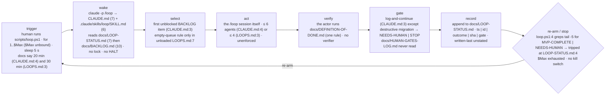

# Loop review — sample-app

A human runs `scripts/loop.ps1`, which calls `claude -p "/loop"` up to `$Max` times with a 5-second sleep. One tick reads `docs/LOOP-STATUS.md`, then `docs/BACKLOG.md`, works the first unblocked item, runs its own DoD, appends a status line. The driver stops when the last five status lines contain `MVP-COMPLETE` or `NEEDS-HUMAN` — which they already do.



| role | file | notes |
|---|---|---|
| trigger | `scripts/loop.ps1:1` | human-started; `$Max` never bound; needs `pwsh`, absent on this machine |
| driver | `scripts/loop.ps1` | 8 lines; `claude -p "/loop" --permission-mode acceptEdits` |
| rules loaded each tick | `CLAUDE.md`, `.claude/skills/loop/SKILL.md` | `docs/LOOPS.md` is loaded by nothing |
| definition of done | `docs/DEFINITION-OF-DONE.md` | one migration rule; run by the actor |
| human gates | `docs/HUMAN-GATES-LOG.md` | GATE-QG-01 open; not in the read order |
| state between ticks | `docs/LOOP-STATUS.md` | lines 7 · Δ unknown (no git history of its own) · two `STATUS:` lines |
| archive | *none* | |
| kill switch | *none* | only writing `NEEDS-HUMAN` into the status tail |
| purpose document | `intent.md` | one sentence · referenced only by unloaded `docs/LOOPS.md:7` |

## Score

**Health: stop** · mean 1.6 / 5
**Built vs declared:** Built is an 8-line driver that, as written, runs zero ticks (`$Max` unbound) and would stop after one (tripped sentinel); the 20/30-minute cadence, the Continue/Standardise loop types and the re-plan-from-intent rung are declared in files the loop never loads.

| dimension | score | why (one line, cites a file or number) |
|---|---|---|
| correctness | 1 | I-1 zero ticks, I-2 sentinel tripped at `LOOP-STATUS.md:4`, I-3 three cadences, I-5 dead ref, I-11 no `pwsh` |
| safety | 1 | I-6 stop-class worded three ways, I-8 nothing forbids the actor ticking `HUMAN-GATES-LOG.md:7`; no kill switch (K-1) |
| reliability | 2 | I-2 ends every run after tick 1; no no-progress stop while `H-02` sits `blocked` (K-3) |
| cost | 2 | 17 lines read at wake, cheap, but the agent cap is 6 or 4 (I-4) and enforced nowhere (K-4); no archive rule (K-6) |
| maintainability | 1 | I-3, I-4, I-6 copies disagree across `CLAUDE.md`, `LOOPS.md`, `SKILL.md`, `DEFINITION-OF-DONE.md`; R-1 restated thrice |
| understandability | 1 | done owned by the actor (I-7), state has two `STATUS:` lines (I-2), block-vs-log differs per file (I-6); `LOOPS.md`, `MANUAL-ACTIONS.md` have no role |
| observability | 3 | closed outcomes + sha + gate colour per line (`LOOP-STATUS.md:3`), but exit code is always 0 (K-11) and `H-01`/`H-02` match no backlog id (K-13) |
| purpose | 2 | `intent.md` exists but the only rule naming it is I-10, in a file the loop never loads; no objective review, no exit criteria (K-8) |

**Sharpness:** stated acceptance 40% (2 of 5) · ambiguous 3 items.

## Findings

### Invalid
| id | what | where | fix |
|---|---|---|---|
| I-1 | `$Max` is never bound; `1 -le $null` is false, so the `for` runs zero ticks | `scripts/loop.ps1:1` | insert line 1: `param([int]$Max = 48)` |
| I-2 | terminal sentinel `STATUS: MVP-COMPLETE` has 2 entries after it and sits inside the driver's `-Tail 5`; every run breaks after tick 1; line 2 says `NOT-STARTED` | `docs/LOOP-STATUS.md:4` · `scripts/loop.ps1:4` | delete line 4; keep line 2 as the single rewritten `STATUS:` line; change `loop.ps1:3` to `$status = Get-Content docs/LOOP-STATUS.md -TotalCount 2` and grep `$status` |
| I-3 | cadence is 5 s in the driver, 20 min and 30 min in the docs | `scripts/loop.ps1:5` · `CLAUDE.md:4` · `docs/LOOPS.md:3` | set `Start-Sleep -Seconds 1200`; delete `docs/LOOPS.md:3`; `CLAUDE.md:4` says "20 minutes — `scripts/loop.ps1:5` is authoritative" |
| I-4 | agents-per-tick is 6 and 4 | `CLAUDE.md:4` · `docs/LOOPS.md:3` | keep 6 in `CLAUDE.md:4`; delete `docs/LOOPS.md:3` |
| I-5 | `docs/MISSING-FILE.md` does not exist | `CLAUDE.md:6` | delete line 6 |
| I-6 | destructive-migration class has three mechanisms: `NEEDS-HUMAN`, `STOP`, backup + `NEEDS-HUMAN` | `CLAUDE.md:5` · `.claude/skills/loop/SKILL.md:5` · `docs/DEFINITION-OF-DONE.md:2` | keep `CLAUDE.md:5` as "destructive migration → write `NEEDS-HUMAN` to LOOP-STATUS.md line 2, log the gate, continue on other items"; replace the other two with "stop-classes: see CLAUDE.md ## The loop" |
| I-7 | "done" is decided by the actor running its own DoD; no verifier exists | `CLAUDE.md:5` | replace "Run the DoD" with "Before recording `done`, spawn a fresh-context read-only verifier that runs the item's Accept test and cites its output; default FAIL" |
| I-8 | nothing forbids the actor flipping a gate checkbox; `Backups verified` is ticked with no evidence | `CLAUDE.md:3` · `docs/HUMAN-GATES-LOG.md:6` | append to `CLAUDE.md:3`: "The loop appends to docs/HUMAN-GATES-LOG.md and never changes a checkbox or Status there." |
| I-9 | `LOOPS.md` declares two loop types with empty bodies and no counter; `CLAUDE.md` describes one | `docs/LOOPS.md:4-5` | delete lines 4–5 (or add the counter rule to `CLAUDE.md` and the bodies here) |
| I-10 | the empty-queue rule lives in a file no tick loads; declared behaviour cannot happen | `docs/LOOPS.md:7` | move the line into `CLAUDE.md` after line 5 (paste-ready block below); leave `LOOPS.md` as a pointer |
| I-11 | driver is PowerShell-only; `pwsh` is not installed on this macOS machine, and `\|\|` on line 7 needs PowerShell 7 | `scripts/loop.ps1:1` | add `scripts/loop.sh` with the same body, or document `brew install powershell` in `docs/MANUAL-ACTIONS.md:9` |

### Redundant
| id | rule | copies | keep · replace others with |
|---|---|---|---|
| R-1 | "The loop never stops for a human: it logs the fail-closed reading it proceeded with and continues." | `CLAUDE.md:3` · `docs/LOOPS.md:2` · `.claude/skills/loop/SKILL.md:4` | keep `CLAUDE.md:3` · others: "Rules: CLAUDE.md ## The loop" |

### Risk
| id | what can go wrong unattended | evidence | guard |
|---|---|---|---|
| K-1 | the only way to stop the loop is to edit a state file the loop also writes | `scripts/loop.ps1:3` (no HALT check) | line 3: `if (Test-Path HALT) { break }` |
| K-2 | human answers in the gate log are never read; MANUAL-ACTIONS items are never consulted | `CLAUDE.md:3` read order | read order: `LOOP-STATUS.md` → `HUMAN-GATES-LOG.md` → `BACKLOG.md` |
| K-3 | `H-02` is `blocked` with `gate: red` and nothing stops it being re-selected forever | `docs/LOOP-STATUS.md:6` | `CLAUDE.md` after line 5: "same item 3 ticks without a new sha → record `stopped:no-progress`, write NEEDS-HUMAN" |
| K-4 | the 6-agent cap has no mechanism | `CLAUDE.md:4` | pass `--max-agents 6` or count spawns in the verifier |
| K-5 | `pnpm install 2>/dev/null \|\| true` hides a broken toolchain and runs *after* the loop | `scripts/loop.ps1:7` | move above line 1, drop the redirection and `\|\| true` |
| K-6 | no archive rule; write-last is unstated | `docs/LOOP-STATUS.md:1` | header: "keep last 200 lines; older → docs/LOOP-STATUS-archive.md; written as the tick's last act" |
| K-7 | two driver invocations overlap | `scripts/loop.ps1:1` | lock file `loop.lock` created at line 1, removed at exit |
| K-8 | `MVP-COMPLETE` has no definition; the loop cannot tell finished from empty | `docs/BACKLOG.md:1` | add `## Exit criteria` under line 1 listing the F-ids that constitute MVP |
| K-9 | intent is read by no loaded rule; no periodic objective review | `CLAUDE.md:5` (last rule) | counter rule below the paste-ready block |
| K-10 | `logs/` does not exist; `Tee-Object` cannot create it | `scripts/loop.ps1:2` | `New-Item -ItemType Directory -Force logs` before line 1 |
| K-11 | driver exits 0 whether complete, needs-human or `$Max` exhausted | `scripts/loop.ps1:4` | `exit 2` on NEEDS-HUMAN, `exit 0` on MVP-COMPLETE, `exit 3` on exhaustion |
| K-12 | gate checkbox ticked by assertion, no evidence | `docs/HUMAN-GATES-LOG.md:6` | require a sha or command output after each `[x]` |
| K-13 | `H-01`/`H-02` appear in status but no backlog item carries them; selection is unauditable | `docs/LOOP-STATUS.md:5-6` | status id must equal a `docs/BACKLOG.md` id |

### Ambiguous items → sharpened
| item | as written | proposed |
|---|---|---|
| F-03 (`docs/BACKLOG.md:6`) | Improve the onboarding flow | Cut onboarding to ≤ 3 screens. Accept: `test/onboarding.spec.ts` completes sign-up in 3 navigations; serves intent "simple ERP UI" |
| F-04 (`docs/BACKLOG.md:7`) | Look at dashboard load time | Dashboard LCP ≤ 2.0 s on the seeded dataset. Accept: `pnpm perf:dashboard` reports p75 LCP ≤ 2000 ms |
| F-06 (`docs/BACKLOG.md:9`) | Clean up old feature flags | Remove flags fully enabled before 2026-06-01. Accept: `grep -r "flag(" src` lists none of them; CI green |

## Prescriptions

| pattern | closes | cost |
|---|---|---|
| Sentinel discipline — `STATUS:` on one rewritten line, never in the append-only log | I-2 | move one line; change one `Get-Content` |
| Thin `CLAUDE.md`, one loaded playbook; `LOOPS.md` and `SKILL.md` become pointers | I-3, I-4, I-6, I-9, I-10, R-1 | one consolidation |
| Fresh-context falsifier + default-FAIL criteria | I-7, K-12 | one agent per tick; a rubric |
| Escalation classes named once + "never flips a gate" clause | I-6, I-8 | one sentence |
| Kill switch (`HALT` file) + lock file | K-1, K-7 | two lines in the driver |
| Enumerated outcomes with a stop evaluator and exit codes | K-3, K-11 | three rules |
| Re-plan from intent as proposals; periodic objective review | I-10, K-9 | the paste-ready block |
| Goal-level exit criteria on the backlog | K-8 | one section |
| One state file, archive sweep, written last | K-6 | a header line |

## Autonomy plan

Today the loop needs a person per run to start it, a person after tick 1 to un-trip the sentinel, and a person per destructive-migration gate.

| today the human must… | where | replace with |
|---|---|---|
| run `loop.ps1` and supply `$Max` | `scripts/loop.ps1:1` | launchd/cron entry every 20 min + `param` default + `HALT` file |
| delete the tripped `MVP-COMPLETE` line to get a second tick | `docs/LOOP-STATUS.md:4` | I-2 fix |
| answer `NEEDS-HUMAN` before anything continues | `CLAUDE.md:5` | log fail-closed reading, continue on other items; one-way class stays logged |
| sign GATE-QG-01 | `docs/HUMAN-GATES-LOG.md:7` | keep (go-live is one-way); the loop reads the log (K-2) and works on non-dependent items |
| clarify F-03, F-04, F-06 | `docs/BACKLOG.md:6,7,9` | acceptance test required to dispatch; sharpened rows above |
| refill the backlog when empty | `CLAUDE.md:5` (end of rules) | paste-ready ladder below |
| notice `H-02` is stuck | `docs/LOOP-STATUS.md:6` | no-progress stop (K-3) |
| decide what `MVP-COMPLETE` means | `docs/BACKLOG.md:1` | exit criteria (K-8) |
| rotate the LINE secret | `docs/MANUAL-ACTIONS.md:9` | stays human; the loop skips items depending on it and logs why |

Only the stages that differ from `references/autonomy-blueprint.md`:

| stage | today | target |
|---|---|---|
| trigger | human + unbound `$Max`, 5 s sleep | scheduler entry, cadence in `CLAUDE.md:4`, `HALT` checked first |
| wake | STATUS → BACKLOG, no lock | STATUS (2-line header) → gate log → BACKLOG, lock file |
| select | first unblocked, no acceptance test needed | first unblocked item **with** `Accept:`; others sent to sharpening |
| verify | actor runs a one-rule DoD | separate verifier, default FAIL |
| gate | log-and-continue in one file, STOP in another, log unread | classified at arising; one-way → gate log entry, continue elsewhere |
| record | sentinel inside the log | `STATUS:` rewritten at line 2, entries appended below, archive at 200 |
| re-arm / stop | grep of a tripped tail | enumerated stops + exit codes + exit criteria |

Paste-ready, worded for this project's files (goes in `CLAUDE.md` after line 5):

```
When no docs/BACKLOG.md item is unblocked:
1. If every item under `## Exit criteria` in docs/BACKLOG.md is `done`, rewrite
   docs/LOOP-STATUS.md line 2 to `STATUS: MVP-COMPLETE` and stop re-arming
   until intent.md or docs/BACKLOG.md changes.
2. Otherwise read intent.md and docs/BACKLOG.md. Draft the next slice: 3–7
   items, each with `Accept:` and the intent clause it serves. Append them to
   docs/BACKLOG.md as `[ ] F-nn [proposed]`, and add one entry to
   docs/HUMAN-GATES-LOG.md listing them. Never edit intent.md.
3. Start the first proposed item that is reversible (no migration, no external
   side effect, no money, no permission change). Leave one-way items
   `[proposed]` until the gate is answered.
4. If nothing in the slice is reversible, run one bounded explore (≤ 1 tick,
   output is a finding appended to docs/LOOP-STATUS.md, not a change) and
   record `steady-state`.

Every 12th tick, before selecting work: re-read intent.md against
docs/BACKLOG.md. Mark items that serve no intent clause `[proposed-retire]`,
add a gate entry, continue. Never re-prioritise silently.
```

## Do next

1. I-1 — `param([int]$Max = 48)` at `scripts/loop.ps1:1`; first because without it zero ticks run, and once bound I-2 stops the run after tick 1.
2. I-2 — delete `docs/LOOP-STATUS.md:4`; driver checks line 2 only.
3. I-3, I-4, I-6, I-9, I-10, R-1 — collapse `docs/LOOPS.md` and `SKILL.md` into pointers; one cadence, one cap, one stop-class in `CLAUDE.md`.
4. I-7, I-8 — verifier clause and "never flips a gate" clause in `CLAUDE.md`.
5. I-11 — install `pwsh` or add `scripts/loop.sh`; then K-1 `HALT` check.

---
reviewed 2026-09-08 · target is not a git repository of its own (no sha; fixture inside ai-skills) · files read 8 governing + inventory · state files (`LOOP-STATUS.md`, `BACKLOG.md`) sampled by header, first and last screen, none read whole · `expect.json` not opened · target directory untouched
