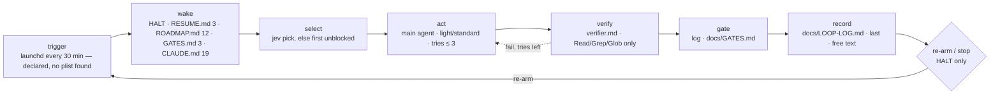

# Loop review — concept-loop (Shop UI)

`scripts/loop.sh` is said to fire every 30 minutes from launchd; no scheduler entry exists on this machine. One tick: check `HALT`, pick a `ROADMAP.md` item (Jev, else first unblocked), up to 3 hypothesis-led tries, fresh verifier, log one line. It stops only on `HALT`.



| role | file | notes |
|---|---|---|
| trigger | CLAUDE.md:5 · scripts/loop.sh:2 | launchd declared; inventory found no plist, cron or workflow |
| driver | scripts/loop.sh:5 | one `claude -p`, no lock, no time cap |
| rules loaded each tick | CLAUDE.md:3-19 | the only loaded file |
| definition of done | ROADMAP.md:7-12 acceptance column · .claude/agents/verifier.md:5 | default FAIL |
| human gates | docs/GATES.md | log-and-continue (CLAUDE.md:16) |
| state between ticks | docs/RESUME.md · docs/LOOP-LOG.md | lines 3 · 3 · Δ not measurable (target has no git of its own) |
| archive | *none* | |
| kill switch | scripts/loop.sh:4 · CLAUDE.md:8 | `HALT` file |
| purpose document | intent.md | referenced by CLAUDE.md:18 |
| roles: picker · clarifier · doer · verifier · planner | Jev/main (CLAUDE.md:9) · *none* · main · verifier.md · main (CLAUDE.md:18) | |
| challenge / bar | CLAUDE.md:14-15 | lenses present; bar *none* |
| caps · levels | CLAUDE.md:17 · CLAUDE.md:10 | caps written, not enforced |
| Jev | CLAUDE.md:9-10 | rules only — not called from driver or hook |

## Score

**Health: treat** · mean 2.9 / 5
**Built vs declared:** only the `HALT` check is code; the cadence, Jev, caps and stops are prose, and the verifier is told to run tests it has no tool to run.

| dimension | score | why (one line, cites a file or number) |
|---|---|---|
| correctness | 1 | I1 verifier can't run tests; I2 launchd trigger declared, not found |
| safety | 2 | I3 nothing stops the loop resolving its own gates; K1 no overlap lock; K5 no notification |
| reliability | 3 | K3 no steady-state rung; K5 no repeat-failure or no-progress stop |
| cost | 3 | wake reads 40 lines; K1 no wall-time cap in loop.sh:5; K6 no archive rule; growth NOT MEASURED — no history |
| maintainability | 4 | one loaded file; R1 cadence restated |
| understandability | 4 | tick readable from 19 lines; K6 nobody writes RESUME.md |
| observability | 3 | K7 free-text log, no outcome word, no cost recorded despite caps |
| purpose | 3 | intent named and read-only (CLAUDE.md:18); K3 proposals ungated and untraced; K4 UI-13 unclear |
| improvement | 3 | inner loop, plateau, fixed bar present; K8 bar unwritten; K9 isolation and `VALIDATE` unstated |
| proportionality | 3 | levels and caps written; K2 Jev prose-only; K10 no share, tiering or spend review |

**Sharpness:** stated acceptance 67% (2/3) · ambiguous 1 item → `requeue`: UI-13, ROADMAP.md:11.

## Findings

### Invalid
| id | what | where | fix |
|---|---|---|---|
| I1 | invalid: verifier must pass "only on test output it ran itself" but has no shell | CLAUDE.md:13 · .claude/agents/verifier.md:3 | verifier.md:3 → `tools: Read, Grep, Glob, Bash`; verifier.md:5 append "Run the item's tests; PASS only on output you ran. Never edit files." |
| I2 | invalid: "every 30 minutes (launchd)" stated in present tense; no plist, cron or workflow found | CLAUDE.md:5 | name the plist path at CLAUDE.md:5, or write "run by hand until the plist is installed" |
| I3 | invalid: nothing stops the loop marking its own gate answered | CLAUDE.md:16 | append to CLAUDE.md:16: "Only the owner writes an answer in docs/GATES.md; the loop never resolves a gate." |

### Redundant
| id | rule | copies | keep · replace others with |
|---|---|---|---|
| R1 | redundant: cadence "every 30 minutes, launchd" | CLAUDE.md:5 · scripts/loop.sh:2 | keep CLAUDE.md:5 · loop.sh:2 → "# Driver: one tick; cadence in CLAUDE.md." |

### Risk
| id | what can go wrong unattended | evidence | guard |
|---|---|---|---|
| K1 | risk: a long tick overlaps the next; no time cap | scripts/loop.sh:4-5 | `mkdir .loop.lock` or exit; `trap` removal; `timeout 25m` on `claude -p` |
| K2 | risk: Jev skipped when forgotten; no fallback for item-check; no outcomes | CLAUDE.md:9-10 · scripts/loop.sh:5 | call pick/item-check from loop.sh with fallback; `jev outcome` after verify |
| K3 | risk: empty roadmap re-plans even when finished; proposals ungated and untraced | CLAUDE.md:18 · ROADMAP.md:5 | steady-state + gated-proposal rules (paste-ready below) |
| K4 | risk: UI-13 dispatched with no acceptance line | ROADMAP.md:11 · CLAUDE.md:9 | clarifier rule; `requeue` UI-13 |
| K5 | risk: same item fails forever; weekly cap hit with no action; owner never told | CLAUDE.md:17 · CLAUDE.md:19 · docs/GATES.md:3 | stops + notification (paste-ready) |
| K6 | risk: RESUME.md read first but never rewritten; no archive for GATES.md | CLAUDE.md:6 · CLAUDE.md:19 | rewrite RESUME.md each tick; archive GATES.md answered entries past 50 lines |
| K7 | risk: stuckness invisible in free text | CLAUDE.md:19 · docs/LOOP-LOG.md:3 | closed outcome word + tokens per line; commit per tick |
| K8 | risk: milestone critique becomes taste; output unstated | CLAUDE.md:14-15 | bar = intent.md → written standards → measurements; uncited critique dropped |
| K9 | risk: tries edit trunk; UX choices settled offline | CLAUDE.md:11 | tries on `loop/<id>-try-N` (as docs/RESUME.md:3 does); `VALIDATE` flag |
| K10 | risk: improvement work crowds out roadmap; strongest model everywhere | CLAUDE.md:17 | 20% share; model per role; weekly `loop-economist` pass |

## Prescriptions

| pattern | closes | cost |
|---|---|---|
| fresh-context falsifier that runs tests | I1 | one tools line |
| log fail-closed, owner-only answers | I3, K5 | one sentence + a notification command |
| kill switch + overlap lock in driver | K1 | three shell lines |
| enumerated stops + closed outcome vocabulary | K5, K7 | one rule block |
| re-plan from intent as proposals | K3 | paste-ready block |
| resume file separate from log | K6 | one rule line |

## Against the loop concept

Today it needs a person to install the trigger, to notice gates and stuck items, and to clarify UI-13; it challenges work, but against no written bar.

| slot | today | where | target |
|---|---|---|---|
| roles: verifier | contradicted | CLAUDE.md:13 · verifier.md:3 | runs evidence itself |
| roles: clarifier | missing | CLAUDE.md:9 | assumption on item |
| Jev points 2-4, 6-7; outcomes | missing | scripts/loop.sh:5 | driver calls, fallbacks, `jev outcome` |
| inner loop: isolation, `VALIDATE` | missing | CLAUDE.md:11 | branch per try |
| bar | missing | CLAUDE.md:15 | intent → standards → measurements |
| caps enforced · share · tiering | missing | CLAUDE.md:17 | a loop config file (JSON) at the repo root |
| doors: two-way decide-and-log · owner-only | missing | CLAUDE.md:16 | stated |
| stops: 3 failures · no progress · steady-state | missing | CLAUDE.md:18-19 | stated |
| escalation channel | missing | docs/GATES.md:3 | notification + `NEEDS-HUMAN` |
| trigger lock | missing | scripts/loop.sh:4 | lock file |
| config | missing | CLAUDE.md:17 | a loop config file (JSON) at the repo root |

| today the human must… | where | replace with |
|---|---|---|
| start it | CLAUDE.md:5 | installed plist, named |
| notice a gate | docs/GATES.md:3 | notification on each new entry |
| clarify UI-13 | ROADMAP.md:11 | clarifier assumption |
| notice it is stuck | CLAUDE.md:19 | outcome words + no-progress stop |
| decide it is done | ROADMAP.md:5 | steady-state rule |

Paste-ready, for CLAUDE.md after line 19 — only what this loop lacks:

```
- An item with no acceptance line in ROADMAP.md goes to the clarifier first:
  write its answer on the item as "assumption: …"; only reversible work
  proceeds on an assumption.
- Each try runs on branch loop/<id>-try-<n>; only the kept try is merged.
  UX choices only real use can settle ship reversibly, flagged VALIDATE.
- Two-way doors: decide, log why in docs/LOOP-LOG.md, continue. Only the
  owner answers an entry in docs/GATES.md; never mark one resolved. Each new
  entry also sends a notification and a NEEDS-HUMAN line.
- Critique cites intent.md, a written standard, or a measurement; uncited
  critique is dropped. Milestone review output: new ROADMAP.md items, each
  with the finding and the clause it cites. At most 20% of weekly tokens go
  to improvement items.
- Stop re-arming when: the same item failed 3 ticks, no commit in 5 ticks,
  or the weekly budget is spent (then light items only until Monday).
- Record last, one line in docs/LOOP-LOG.md:
  <date> <id> <done|blocked|gated|reverted|plateau|steady-state> tokens=<n>;
  rewrite docs/RESUME.md; one commit per tick.

When no roadmap item is unblocked:
1. If the Exit line in ROADMAP.md is met, record steady-state and stop
   re-arming until intent.md or ROADMAP.md changes.
2. Otherwise draft 3–7 items from intent.md, each with an acceptance line and
   the intent.md clause it serves. The next step intent.md already implies is
   added `ready`; a new direction is added `proposed` with one entry in
   docs/GATES.md. Never edit intent.md.
3. Continue with the first `ready` item.
```

## Do next

1. I1 — every PASS today is unbacked; it outranks I2 because a missing trigger runs nothing, while a toolless verifier passes wrong work each tick that does run.
2. I3 — one sentence at CLAUDE.md:16.
3. I2 — install and name the plist, then K1's lock in scripts/loop.sh.
4. Paste the block above into CLAUDE.md (closes K3–K9).
5. `requeue` UI-13.

---
reviewed 2026-09-27 at 86eaf6c (enclosing ai-skills repo; the target has no git of its own, so no loop history to check) · files read 8 (the fixture answer key not read) · state files are 3 lines each, read whole · inventory 0.15 s · target repo untouched
