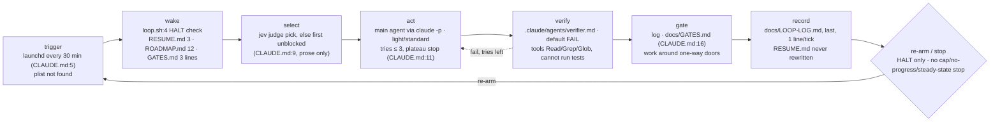

# Loop review — concept-loop (Shop UI)

launchd is meant to fire `scripts/loop.sh` every 30 minutes; the plist was not found. One tick: check `HALT`, read three files, pick an item (Jev or first unblocked), up to 3 hypothesis-led tries, a separate verifier, one line in `docs/LOOP-LOG.md`. It stops only on `HALT`.



| role | file | notes |
|---|---|---|
| trigger | launchd (CLAUDE.md:5, loop.sh:2) | no plist in ~/Library/LaunchAgents, no crontab entry, no workflow schedule |
| driver | scripts/loop.sh | 5 lines; one `claude -p`, no lock, no `--model`, no permission flags |
| rules loaded each tick | CLAUDE.md | 19 lines; loop section lines 3–19 |
| definition of done | acceptance column, ROADMAP.md:7–12 | UI-13 has none |
| human gates | docs/GATES.md | log-and-continue; 1 entry, open 7 days |
| state between ticks | docs/RESUME.md · docs/LOOP-LOG.md | 3 lines · 3 lines; Δ n/a (1 commit touches the fixture) |
| archive | *none* | |
| kill switch | `HALT` in repo root | loop.sh:4 and CLAUDE.md:8 |
| purpose document | intent.md | 5 lines; referenced by loaded rules, CLAUDE.md:18 |
| roles: picker · clarifier · doer · verifier · planner | Jev/main (CLAUDE.md:9) · *none* · main agent · verifier.md · main agent (CLAUDE.md:18) | |
| challenge / bar | one lens per standard item (CLAUDE.md:14); milestone review (CLAUDE.md:15) | no written bar |
| caps · levels | 200k/item, 5M/week (CLAUDE.md:17) · light/standard (CLAUDE.md:10) | caps not enforced or recorded |
| Jev | pick, item-check | only in CLAUDE.md prose; not called from driver or hook; availability not checked (review runs nothing) |

## Score

**Health: treat** · mean 2.9 / 5
**Built vs declared:** built is a 5-line driver that checks `HALT` and runs one `claude -p`; Jev calls, levels, caps and a test-running verifier exist only as CLAUDE.md prose, and the launchd trigger was not found on this machine.

| dimension | score | why (one line: a file:line or a number, then the finding ids) |
|---|---|---|
| correctness | 2 | CLAUDE.md:13 says the verifier passes on tests it ran; verifier.md:3 grants no Bash — I1 |
| safety | 2 | `HALT` at loop.sh:4 works, but nothing at CLAUDE.md:16 stops the loop answering its own gate — I2; K1, K2, K3, K13, K14 |
| reliability | 3 | the only stop is `HALT` (loop.sh:4); no repeat-failure, no-progress or steady-state stop — K5, K7, K9 |
| cost | 3 | 37 lines read at wake (19+3+12+3), no archive rule, no wall-time or agent cap at loop.sh:5 — K6, K12 |
| maintainability | 4 | 19-line rules file, one restated number: 30-minute cadence at CLAUDE.md:5 and loop.sh:2 — R1 |
| understandability | 3 | tick explainable from CLAUDE.md:5–19, but state is read from RESUME.md and written to LOOP-LOG.md — K9, R1 |
| observability | 3 | LOOP-LOG.md:3 is free text with no outcome word, tokens or Jev run id — K10, K6 |
| purpose | 3 | intent.md named at CLAUDE.md:18 and read-only; 1 of 3 intent objectives has no milestone; re-plan has no gate — K8, K11 |
| improvement | 3 | hypothesis, 3 tries, plateau (CLAUDE.md:11), locked acceptance (:12), milestone review (:15); no isolation rule, experiment log or written bar — K15, K17 |
| proportionality | 3 | levels (CLAUDE.md:10) and caps (:17) written, but unenforced, Jev prose-only, one model — K4, K6, K16 |

**Sharpness:** stated acceptance 67% (2 of 3 open) · ambiguous 1 item → `requeue`: UI-13 "Improve forms", ROADMAP.md:11.

## Findings

### Invalid
| id | class | what | where | fix |
|---|---|---|---|---|
| I1 | invalid | the rules say the verifier passes only on test output it ran itself; its tools cannot run anything | CLAUDE.md:13 · .claude/agents/verifier.md:3 | verifier.md:3 → `tools: Read, Grep, Glob, Bash`; add at :5 "Run the item's tests yourself and cite the output; never edit files." |
| I2 | invalid | nothing stops the loop from editing or answering a gate entry itself (self-approval) | CLAUDE.md:16 | append to :16 "Only the owner edits an existing entry in `docs/GATES.md`; the loop only adds entries." |

### Redundant
| id | class | rule | copies | keep · replace others with |
|---|---|---|---|---|
| R1 | redundant | cadence "every 30 minutes" | CLAUDE.md:5 · scripts/loop.sh:2 | keep CLAUDE.md:5 · loop.sh:2 → `# Driver: one tick; cadence in CLAUDE.md:5.` |

### Risk
| id | class | what can go wrong unattended | evidence | guard |
|---|---|---|---|---|
| K1 | risk | the trigger may not exist: no launchd plist, crontab entry or workflow schedule found here | CLAUDE.md:5 · inventory triggers = 0 | name the plist path in CLAUDE.md:5 once it is installed |
| K2 | risk | a manual run can overlap a launchd tick; no lock | scripts/loop.sh:3–5 | insert after :3 `mkdir .loop.lock 2>/dev/null \|\| exit 0; trap 'rmdir .loop.lock' EXIT` |
| K3 | risk | headless `claude -p` with no permission flags and no `.claude/settings.json` may be denied Edit/Bash | scripts/loop.sh:5 | add a repo `.claude/settings.json` allow-list for the tools the tick needs |
| K4 | risk | Jev is prose the agent may skip; `item-check` has no fallback; unreachable Jev has none | CLAUDE.md:9–10 | paste-ready Jev line; later call `jev judge pick` from loop.sh |
| K5 | risk | next item after UI-12 has no acceptance line and no clarifier; verifier cannot pass it | ROADMAP.md:11 | paste-ready "not dispatchable" line; hand UI-13 to `requeue` |
| K6 | risk | caps are written but nothing counts tokens or says what happens at the cap | CLAUDE.md:17 · LOOP-LOG.md:3 | paste-ready record line (tokens) and weekly-cap line |
| K7 | risk | no repeat-failure, no-progress or steady-state stop; loop re-arms forever | CLAUDE.md:8 is the only stop | paste-ready stop lines |
| K8 | risk | empty queue re-plans every tick; proposals are never gated, so they pile up every 30 min and the loop never refills itself | CLAUDE.md:18 | paste-ready empty-roadmap block |
| K9 | risk | RESUME.md is read first but no rule rewrites it; it will say UI-12 forever | CLAUDE.md:6 · CLAUDE.md:19 · RESUME.md:3 | paste-ready record line |
| K10 | risk | free-text outcomes, no commit per tick: stuckness invisible | CLAUDE.md:19 · LOOP-LOG.md:3 | paste-ready outcome vocabulary |
| K11 | risk | intent objective "an accessible catalogue" has no milestone; Exit can be met without it | intent.md:4–5 · ROADMAP.md:5 | paste-ready steady-state check against intent.md |
| K12 | risk | gate log read every tick with no archive rule; LOOP-LOG grows 48 lines/day at this cadence | CLAUDE.md:6 · CLAUDE.md:19 | archive answered gates and log lines over 200 to `docs/*-archive.md` |
| K13 | risk | the only channel is a file the owner has not answered in 7 days; CO-2 has no ROADMAP.md row | docs/GATES.md:3 | append to loop.sh `grep -q NEEDS-HUMAN docs/GATES.md && osascript -e 'display notification "see docs/GATES.md" with title "Shop UI loop: NEEDS-HUMAN"'` |
| K14 | risk | one-way classes omit data deletion and permission changes | CLAUDE.md:16 | paste-ready one-way line |
| K15 | risk | tries branch in practice but no rule isolates them or keeps an experiment log | CLAUDE.md:11 · RESUME.md:3 | paste-ready tries line |
| K16 | risk | one model does every role; no share, no cost review | scripts/loop.sh:5 | `loop.config.json` models + share; weekly `loop-economist` pass |
| K17 | risk | lens and milestone critiques cite no written bar, so they become taste; no `VALIDATE` for UX choices | CLAUDE.md:14–15 | paste-ready milestone-review line |

## Prescriptions

| pattern | closes | cost |
|---|---|---|
| fresh-context verifier that runs what it checks | I1 | one tools line |
| log fail-closed, owner-only answers, `NEEDS-HUMAN` + notification | I2, K13 | one rule, one driver line |
| re-plan from intent as gated proposals; steady state is valid | K7, K8, K11 | paste block |
| written bar; uncited critique dropped | K17 | one paste line |
| resume separate from log; closed outcome vocabulary; commit per tick | K9, K10 | paste block |
| lock at wake | K2 | 2 lines |
| one config file for caps, stops, share, models | K6, K16, c26 | one file, CLAUDE.md:17 becomes a pointer |

## Against the loop concept

Today it needs a person to clarify every unsharp item, to promote every re-planned proposal (so a person to refill the queue), and to notice it is stuck; it has the parts that make work good (lens, milestone review) but no bar to cite.

| slot | today | where | target |
|---|---|---|---|
| c1 verifier can run what it checks | contradicted | CLAUDE.md:13 · verifier.md:3 | I1 |
| c3 stops | missing (HALT only) | CLAUDE.md:8 | goal met · weekly cap · item gap after 3 tries · 5 ticks no `done` · HALT · steady-state |
| c4 gates not answerable by the loop | missing | CLAUDE.md:16 | I2; add data deletion and permissions |
| c7 clarifier | missing | CLAUDE.md:9 | empty acceptance → not dispatchable, NEEDS-HUMAN, `requeue` |
| c10 isolated tries | missing (practice only) | CLAUDE.md:11 · RESUME.md:3 | branch `loop/<id>-try-<n>`; only the kept try merges |
| c11 experiment log | missing | CLAUDE.md:11 | `docs/experiments/<id>.md` read by the next try |
| c12 `VALIDATE` | missing | CLAUDE.md:15 | UX choices ship reversibly, status `VALIDATE` |
| c13 level logged | missing (chosen, not logged) | CLAUDE.md:10 | level on the LOOP-LOG line |
| c14 milestone review output | missing (variants, roadmap rows) | CLAUDE.md:15 | findings become ROADMAP.md rows; variants only on a structural finding |
| c15 written bar | missing | CLAUDE.md:14 | intent.md → standards → measurements; uncited critique dropped |
| c16 improvement share | missing | CLAUDE.md:17 | 20% of weekly tokens, in `loop.config.json` |
| c17 models by role | missing | scripts/loop.sh:5 · verifier.md:1–4 | `model:` in verifier.md; planner strongest |
| c18 cost review | missing | CLAUDE.md:17 | weekly `loop-economist` pass, proposals only |
| c19 Jev 1 dispatch | prose only | CLAUDE.md:9–10 | `jev judge pick` + `item-check` from loop.sh, fallback first unblocked |
| c19 Jev 2 rules-check | missing | CLAUDE.md:13 | `jev rules-check` before the verifier |
| c19 Jev 3 completion | missing | CLAUDE.md:13 | `jev judge completion`; verifier still runs |
| c19 Jev 4 progress | missing | CLAUDE.md:11 | `jev judge progress` after each try; fallback plateau rule |
| c19 Jev 5 tool-guard | missing | `.claude/settings.json` (absent) | `PreToolUse` hook `jev hook pre-tool-use` |
| c19 Jev 6 slice-check | missing | CLAUDE.md:18 | per proposed row; fallback planner labels, gated |
| c19 Jev 7 critique-check | missing | CLAUDE.md:15 | per critique; fallback bar citation |
| c19 Jev 8 injection | not applicable yet | ROADMAP.md:7 | no untrusted input feeds ROADMAP.md; screen when issues do |
| c20 Jev outcomes | missing | CLAUDE.md:19 | run id + verifier verdict on the log line |
| c21 overlap lock · one trigger | missing · not found | scripts/loop.sh:3 · CLAUDE.md:5 | K2, K1 |
| c22 one state file, outcome words | contradicted | CLAUDE.md:6 · CLAUDE.md:19 | RESUME.md rewritten, LOOP-LOG line last, closed words |
| c23 escalation channel | missing (file nobody is told about) | docs/GATES.md:3 | `NEEDS-HUMAN` entry + `osascript` notification (K13) |
| c24 untrusted input | not applicable yet | ROADMAP.md:7 | as Jev 8 |
| c25 empty-roadmap rule | missing (no ready/proposed, no gate, no steady state) | CLAUDE.md:18 | paste block |
| c26 loop config file | missing | repo root `loop.config.json` | block below; then move tries (CLAUDE.md:11), lenses (:14) and the pasted stops into it, leaving pointers |

| today the human must… | where | replace with |
|---|---|---|
| install and keep the scheduler running | CLAUDE.md:5 | owner's choice; record the plist path at :5 |
| notice a gate | docs/GATES.md:3 | NEEDS-HUMAN + notification |
| clarify an item | ROADMAP.md:11 | `requeue`; not-dispatchable rule |
| promote every proposal to refill the queue | CLAUDE.md:18 | implied steps added `open` |
| notice it is stuck | LOOP-LOG.md:3 | outcome words + no-progress stop |
| decide it is done | ROADMAP.md:5 | steady-state rule |

Paste-ready for CLAUDE.md, replacing lines 17–19; checked against lines 5–16 (tries stay 3, acceptance stays locked, `HALT` not restated; I2's sentence goes on line 16, not here):

```
- Caps, the improvement share and the model for each role are in `loop.config.json`; this file does not restate them. When the weekly cap is reached, pick light items only until the week resets.
- If Jev is unreachable, refuses or answers `unverified`, use the same fallback as below its floor; the main agent sets the level; log `jev: fallback`.
- An item with an empty acceptance column is not dispatchable: skip it and add `NEEDS-HUMAN: <id> needs an acceptance line` to `docs/GATES.md`.
- Each try runs on branch `loop/<id>-try-<n>`; only the kept try is merged. Append the try's hypothesis and verdict to `docs/experiments/<id>.md`; the next try reads it and does not repeat a rejected idea.
- When an item's 3 tries end below its acceptance line, keep the best, set its status to `gap`, log the gap, move on. If 5 ticks in a row record no `done`, create `HALT` and add `NEEDS-HUMAN: no progress` to `docs/GATES.md`.
- One-way doors also include data deletion and permission changes. Prefix a `docs/GATES.md` entry that needs an owner's answer with `NEEDS-HUMAN`.
- Milestone review critiques cite `intent.md`, a written standard or a measurement (test output, axe, screenshots); uncited critique is dropped. Each finding becomes a ROADMAP.md row. Variants only on a structural finding: two, the loser logged. A choice only real customers can settle ships reversibly with status `VALIDATE`; never experiment on live customers.
- Record once, last: rewrite `docs/RESUME.md` (item, branch, open decision), then add one line to `docs/LOOP-LOG.md`: date, item, level, outcome (`done | gap | skipped | gated | waiting | steady-state`), tries, tokens, Jev run ids with the verifier's verdict. Then one commit.

When no ROADMAP.md item is unblocked:
1. If the Exit line in ROADMAP.md is met and every objective in `intent.md` has a milestone, record `steady-state` and do nothing further until `intent.md` or ROADMAP.md changes.
2. Otherwise, unless `proposed` rows are already waiting, read `intent.md` and ROADMAP.md and draft 3–7 rows, each with an acceptance line and the `intent.md` objective it serves. A step the current milestones imply is added `open`; a new direction is added `proposed` with one `NEEDS-HUMAN` entry in `docs/GATES.md`. Never edit `intent.md`.
3. Continue with the first `open` item, else record `waiting`.
```

```json
{ "roadmap": "ROADMAP.md", "intent": "intent.md",
  "caps": { "tokens_per_item": 200000, "tokens_per_week": 5000000 },
  "improvement_share": 0.2,
  "models": { "picker": "jev|code", "doer": "main", "verifier": "main", "planner": "strongest" },
  "halt_file": "HALT",
  "escalation": "NEEDS-HUMAN entry in docs/GATES.md + osascript notification from scripts/loop.sh" }
```

## Do next

1. I1 — give the verifier Bash; every tick's "done" depends on it, while I2 bites only when a gate is answered.
2. I2 — owner-only gate entries (one sentence at CLAUDE.md:16).
3. Hand UI-13 (ROADMAP.md:11) to `requeue` before UI-12 finishes — it is next in order (K5).
4. Paste the block into CLAUDE.md:17–19 and add `loop.config.json` (K4–K11, K14, K15, K17).
5. Add the lock and notification lines to scripts/loop.sh (K2, K13).

---
reviewed 2026-09-27 at 13804af · files read 8 · state files read whole, all under 40 lines (3 lines each) · target repo untouched
