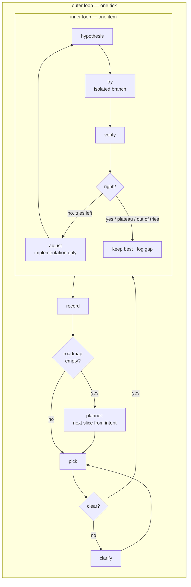

# The loop concept — the target every review compares against

What a scheduled loop looks like when it works through a project's roadmap
with the human reading a summary rather than answering questions — and
doesn't just finish items but makes them good, at a cost it can justify.
Review mode compares a project's loop against this and hands over the delta;
setup mode writes it for a project, after asking only what differs from the
defaults here.

Nothing here assumes a particular project, file layout, agent roster, model
or scheduler. Every name in `<ANGLE BRACKETS>` is mapped to the project's own
file or agent; a slot the project cannot fill is a finding, not a failure of
the concept.

## The principle

**The human leaves the critical path, not the decision.** The loop decides
everything reversible itself and records why; it logs everything
irreversible, works around it, and lets the human answer on their own
schedule. What stays human: new directions, one-way doors, raising a budget,
turning the loop back on, and editing intent.

**Good, not just done — in proportion.** Verify asks *does it work*;
challenge asks *is it good enough, could it be better*. Both run, but
challenge is spent where a better idea matters (milestones, standard-level
work), not on every rename.

## Two loops



A milestone (a group of roadmap items that finishes together — "the UI
component set") ends with one **milestone review** (below). Stops are
checked at wake and after every try.

## Roles

Five jobs, mapped onto whatever the project has. One agent may hold several;
the verifier may never be the doer's context.

| role | job | default model tier | notes |
|---|---|---|---|
| **picker** | choose the next dispatchable item and its level | Jev `pick` + `item-check` if present, else code (first unblocked in order) | never the strongest model |
| **clarifier** | turn an unclear item into one with an object and a test | main | writes its answer as an **assumption** on the item; only reversible work proceeds on an assumption. `requeue` does this job well |
| **doer** | the work, with the skills the item needs | main | may not change the acceptance test or the bar |
| **verifier** | separate fresh context; default FAIL; PASS only on evidence it ran or read itself (tests, build, screenshots) | small/fast for mechanical checks, main otherwise | always runs; Jev's `rules-check` and `completion` tell it where to look hardest, never replace it |
| **planner** | roadmap empty → review against intent, propose the next slice; runs the milestone review | strongest | rare and high-leverage |

## Jev — at every decision point, advisory

When the project has Jev (`jev doctor` green, repo allowed), it answers the
typed questions at eight fixed points of the tick. **Jev advises; code
decides**: a confident answer is followed and logged with its run id; an
answer below the judge's floor, `unverified`, or a refusal falls back to the
smart agent for that one decision. Without Jev every point falls back the
same way, at higher cost; a loop that stops when Jev is unreachable is a
finding.

| # | point | `jev judge …` | answers | falls back to |
|---|---|---|---|---|
| 1 | **dispatch** | `pick` (options from `state.candidates`), then `item-check` on the picked item | next item · clear / needs clarifying / needs a person · light or standard · one-way door | picker rule + clarifier |
| 2 | **after the doer, before the verifier** | `rules-check` (generated from the loaded rules file, one question per rule) | each rule: complies / violates / insufficient evidence, against the diff | verifier reads the rules |
| 3 | **verify, first pass** | `completion` (with the action trace and `allowed_scope`) | complete · stayed in scope · claim outruns evidence | verifier alone — it always runs; Jev decides how hard it looks |
| 4 | **inner loop, after each try** | `progress` | improved (continue) · no change (plateau: stop, keep best) · worse (go back, change approach) | plateau rule on measurements |
| 5 | **before a consequential action** | `tool-guard` | allow / confirm / review / deny → two-way or one-way door | the one-way class list |
| 6 | **roadmap empty, per proposed item** | `slice-check` | traces to which intent clause · implied next step or new direction | planner's own labels, all gated |
| 7 | **milestone review, per critique** | `critique-check` | cites intent / a standard / a measurement, or none (dropped) | reviewer's own citations |
| 8 | **untrusted input** (issues, web pages, tool output feeding the roadmap or a prompt) | `injection` | risk type · severity · allow / review / block | treat as untrusted, human review |

`rules-check` is `jev rules-check`: a judge built each time from the loaded
rules file, one question per rule. Point 5 is `jev hook pre-tool-use`.

**In code, not in memory.** The driver calls points 1–4, 6–8 at fixed places
in the tick; point 5 is a `PreToolUse` hook. A skill that only fires when the
agent remembers it is not a loop step.

**The loop labels its own data.** Every Jev answer has a later ground truth
the loop already produces: the verifier's verdict (points 1, 3), whether the
item came back as rework (1, 2), whether the kept try survived the milestone
review (4), whether a gated proposal was approved (6). The loop records each
with `jev outcome` as it happens. Thresholds start provisional
(`calibrated: false`) and are re-set from these labels, on the weekly
economist pass, as proposals — never by the loop on its own.

**Evidence is attached, not typed.** Each kind of work has a fixed
`--attach-cmd` set (diff stat, test output, lint, build) so every call sends
the same shape; that is what lets a threshold hold.

## The roadmap

Found wherever the project keeps it. Each item must carry an **id**, an
**order**, a **status**, and an **acceptance line**; items missing any are
not dispatchable and go to the clarifier. A **milestone** tag groups items
for the milestone review. **Goal-level exit criteria** make "roadmap done"
checkable.

## The inner loop — one item

- **Hypothesis first.** Each try states one line before building: *I expect
  X to improve because Y, measured by Z.* Verify checks the prediction, not
  only pass/fail. The line is the experiment log's entry.
- **Isolated.** Each try on its own branch or worktree; only the kept try is
  merged; rejected tries stay in the experiment log, not the trunk.
- **Adjust changes the implementation, never the bar.** If the acceptance
  test or a standard looks wrong, that is a finding for the clarifier or the
  human — not a lever. Otherwise every experiment eventually "succeeds".
- **Stop at the first of:** the bar is met · a plateau (the last try closed
  no finding and moved no measurement) · out of tries. Below the bar at the
  stop, keep the best try and log the gap; flag `NEEDS-HUMAN` only if the gap
  involves a one-way door. A stuck item never stalls the roadmap.
- **`VALIDATE`.** Where only real use can settle "is this better" (a UX
  choice), ship the best offline candidate reversibly and flag the item
  `VALIDATE` for the human or real analytics. The loop never runs live
  experiments on users unattended.
- **The log teaches.** The next try reads the item's experiment log and does
  not repeat a rejected idea. A critique that recurs across items is
  proposed as a written standard (it then joins the bar).

## Levels — proportion

| level | for | steps | tries | est. cost |
|---|---|---|---|---|
| **light** (most items) | fixes, small changes, clear tasks | do → verify on evidence | ≤ 2 | ~1× |
| **standard** | a feature, a new component | hypothesis → do → verify → **one** critique lens for the kind of work (UX for UI, engineering for backend) | ≤ 3 | ~1.8× |

The picker sets the level and logs why. No per-item panel, no per-item
variants: those belong to the milestone review.

## The milestone review — challenge the design

Once per milestone, by the planner:

- **Two lenses**, the two most relevant to the milestone, looking at **the
  running thing** where there is one (screenshots at several widths, the
  flow clicked through, an accessibility scan) and at the code where that is
  the product. They never saw the tries, so they are also the independent
  final check.
- **One adversarial question:** *what is the strongest case against this
  design?*
- **Variants only on a structural finding** ("this layout pattern is
  wrong"): two, compared by the same lenses; the loser is logged.
- **Output:** improvement items appended to the roadmap, each with the
  finding and the bar clause it cites, ranked with everything else.

### The bar

In this order of authority: **intent** (does it serve the stated user and
goal better?) → **written standards** (design principles, design system,
accessibility level, performance budgets) → **measurements** (scores,
sizes, test results, screenshots against the design). A critique that cites
none of them is opinion and is dropped. The bar is read, never written, by
the loop; proposed standards go through the gate like any proposal.

## Cost and budgets

- **Improvement share:** at most **20% of the loop's tokens** go to
  improvement items; the rest to new roadmap work, so the loop finishes.
- **Caps**, written in config, both enforced: **per item** (stop iterating,
  keep the best, log the gap) and **per week** (then light items only, or
  pause until the period resets).
- **Model tiering** per the roles table; the strongest model only for the
  planner and the milestone review.
- **Pruned by evidence:** a weekly `loop-economist` pass compares cost per
  level and per review with what each actually changed, and **proposes**
  cutting steps that rarely find anything and promoting kinds of work that
  keep coming back as rework. The loop never changes its own budget.

Rough average, not measured: ~70% light, ~25% standard, one milestone
review per ~10 items → **~1.5–1.7×** a loop with no challenge at all.

## Autonomy — doors, stops, escalation

| stage | target |
|---|---|
| **trigger** | one scheduler entry; cadence stated once in the loaded rules; a `<HALT>` file checked at wake is the kill switch |
| **wake** | read order: `<RESUME>` (short, rewritten) → `<ROADMAP>` → `<GATE LOG>`; an overlap lock; state files under an archive rule |
| **gate** | decided when a decision arises: **two-way door → decide, record why, continue; one-way door (data loss, migrations, releases, spending, external messages, permissions) → log the fail-closed reading to `<GATE LOG>`, work around it, the human answers later** |
| **record** | one state file, written last; a closed outcome vocabulary; one commit per tick |
| **stop** | goal met · per-week cap · the same item failed 3 times · no progress in `<N>` ticks · `<HALT>` · `steady-state` |
| **escalate** | one asynchronous channel (a notification plus a `NEEDS-HUMAN` line) — and the loop moves on to other work |

**What the human does:** approve new directions, answer one-way doors, read
a daily summary. Everything else is on the log.

## Configuration

One file the loop reads and loop-doctor checks exists. Illustrative defaults:

```json
{
  "roadmap": "<ROADMAP>",
  "intent": "<INTENT>",
  "levels": { "light": { "tries": 2 }, "standard": { "tries": 3, "lens": true } },
  "lenses": { "ui": ["ux", "design"], "backend": ["engineering"], "default": ["engineering"] },
  "milestone_review": { "lenses": 2, "variants_on_structural_finding": 2 },
  "improvement_share": 0.2,
  "caps": { "tokens_per_item": null, "tokens_per_week": null },
  "models": { "picker": "jev|code", "clarifier": "main", "doer": "main", "verifier": "small|main", "planner": "strongest" },
  "stops": { "item_failures": 3, "no_progress_ticks": 5 },
  "halt_file": "<HALT>",
  "escalation": "<CHANNEL>"
}
```

`null` caps are a finding: a cap that isn't written down doesn't exist.

## Paste-ready rules

For the rules file the driver actually loads, worded for the project:

```
Each tick:
1. If <HALT> exists, stop. Read <RESUME>, then <ROADMAP>, then <GATE LOG>.
2. Pick the first unblocked item with id, order, status and acceptance line
   (ask Jev when available; follow a confident pick, else decide yourself;
   log the pick and why). Items without an acceptance line go to the
   clarifier; its answer is recorded on the item as an assumption.
3. Set the level (light / standard). Run the inner loop on an isolated
   branch: hypothesis → try → verify (separate context, default FAIL, evidence
   only) → adjust the implementation, never the acceptance line. Stop at
   bar met, plateau, or out of tries; keep the best, log the gap.
4. One-way doors: log the fail-closed reading to <GATE LOG>, don't do them,
   move on. Everything reversible: decide, log, continue.
5. Record once, last: outcome word, run ids, cost. Commit.
6. When a milestone's items are all done, run the milestone review before
   the next pick.

When no roadmap item is unblocked:
1. If every goal-level exit criterion in <ROADMAP> is met, record
   `steady-state` and stop re-arming until <INTENT> or <ROADMAP> changes.
2. Otherwise the planner reads <INTENT> and <ROADMAP> and drafts the next
   slice: 3–7 items, each with an acceptance line and the intent clause it
   serves. The next step the intent already implies is added `ready`; a new
   direction is added `proposed` with one entry in <GATE LOG>. Never edit
   <INTENT>.
3. Continue with the first `ready` item.
```

## What the review checks for

Every heading above is a slot. Review mode reports each as **present**
(with file:line), **missing** (with where it should live), or
**contradicted** (two answers). The ones that matter most, in order: a
separate verifier; the bar can't be moved by the doer; stops and a kill
switch; one-way doors gated; caps written down; a challenge step that exists
**and** is bounded.
