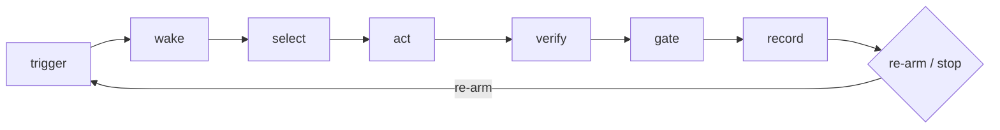

# Review — structure

Diagram first, then numbers, then rows. Prose outside tables, diagrams and
code: **≤ 450 words for the whole review**. A reader who stops after the
first screen has the tick, the score and the first fix.

```markdown
# Loop review — <project>

<≤ 60 words: what fires it, how often, one tick in a sentence, how it stops.>



| role | file | notes |
|---|---|---|
| trigger | | |
| driver | | |
| rules loaded each tick | | |
| definition of done | | |
| human gates | | |
| state between ticks | | lines N · Δ over last K commits |
| archive | | or *none* |
| kill switch | | or *none* |
| purpose document | | or *none* · referenced by loaded rules? |

## Score

**Health: <fit | watch | treat | stop>** · mean <x.x> / 5
**Built vs declared:** <one sentence.>

| dimension | score | why (one line, cites a file or number) |
|---|---|---|
| correctness | n | |
| safety | n | |
| reliability | n | |
| cost | n | |
| maintainability | n | |
| understandability | n | |
| observability | n | |
| purpose | n | |

<If a queue exists:> **Sharpness:** stated acceptance <p>% · ambiguous <n> items.

## Findings

### Invalid
| id | what | where | fix |
|---|---|---|---|
| I-1 | | file:line | exact edit |

### Redundant
| id | rule | copies | keep · replace others with |
|---|---|---|---|
| R-1 | | file:line · file:line | |

### Risk
| id | what can go wrong unattended | evidence | guard |
|---|---|---|---|
| K-1 | | | |

<If a queue exists:>
### Ambiguous items → sharpened
| item | as written | proposed |
|---|---|---|

## Prescriptions

| pattern | closes | cost |
|---|---|---|

## Do next

1. <highest-severity Invalid, or say why not>
2.
3.

---
<footer, one line:> reviewed <date> at <sha> · files read <n> · state files sampled, none read whole · target repo untouched
```

Rules of thumb while filling it in:

- **The three questions** (who owns done · where is state · block or log)
  are answered by the diagram's verify, record and gate nodes. If a node
  needs two labels, that's a Redundant or Invalid row, not a longer label.
- **A finding is one row.** If it needs a paragraph, split it into two
  findings or move the explanation to the `fix` cell as an exact edit.
- **Omit empty classes** and empty optional sections.
- **The footer is the overhead receipt.** It exists so the reader can see
  the review cost the project nothing.
