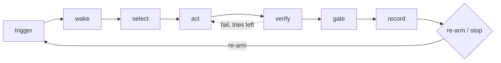

# Review — structure

Diagram first, then numbers, then rows. Prose outside tables, diagrams and
code: **≤ 450 words for the whole review**. A reader who stops after the
first screen has the tick, the score and the first fix.

```markdown
# Loop review — <project>

<≤ 60 words: what fires it, how often, one tick in a sentence, how it stops.>


```mermaid
flowchart LR
  T["trigger<br/><real thing: cron entry / /schedule / human types /loop>"] --> W["wake<br/><files read, with line counts>"]
  W --> S["select<br/><how the item is chosen>"]
  S --> A["act<br/><actor · level · tries ≤ N>"]
  A --> V["verify<br/><who · criteria file>"]
  V -. "fail, tries left" .-> A
  V --> G["gate<br/><block | log · gate file>"]
  G --> R["record<br/><state file · written last?>"]
  R --> X{"re-arm / stop<br/><stop conditions · kill switch>"}
  X -- re-arm --> T
```

| role | file | notes |
|---|---|---|
| trigger | | |
| driver | | |
| rules loaded each tick | | |
| definition of done | | |
| human gates | | |
| state between ticks | | lines N · Δ over last K commits |
| archive | | or *none* |
| kill switch | | or *none* |
| purpose document | | or *none* · referenced by loaded rules? |
| roles: picker · clarifier · doer · verifier · planner | | one cell each, or *none* |
| challenge / bar | | or *none* |
| caps · levels | | or *none* |
| Jev | | or *not used* · called from driver/hook or only a skill? |

## Score

**Health: <fit | watch | treat | stop>** · mean <x.x> / 5
**Built vs declared:** <one sentence.>

| dimension | score | why (one line, cites a file or number) |
|---|---|---|
| correctness | n | |
| safety | n | |
| reliability | n | |
| cost | n | |
| maintainability | n | |
| understandability | n | |
| observability | n | |
| purpose | n | |
| improvement | n | |
| proportionality | n | |

<If a queue exists:> **Sharpness:** stated acceptance <p>% · ambiguous <n> items → `requeue`: <ids, file:line>.

## Findings

### Invalid
| id | class | what | where | fix |
|---|---|---|---|---|
| I1 | invalid | | file:line | exact edit |

### Redundant
| id | class | rule | copies | keep · replace others with |
|---|---|---|---|---|
| R1 | redundant | | file:line · file:line | |

### Risk
| id | class | what can go wrong unattended | evidence | guard |
|---|---|---|---|---|
| K1 | risk | | file:line | |

## Prescriptions

| pattern | closes | cost |
|---|---|---|

## Against the loop concept

<One sentence: how much human input the loop needs today, in the unit
that fits — "a person per tick", "a person per gate", "a person to
refill the queue" — and whether it makes work good or only done.>

Only the slots of `references/loop-concept.md` that are missing or
contradicted (present ones are in the scores):

| slot | today | where | target |
|---|---|---|---|
| | missing / contradicted | file:line | |

| today the human must… | where | replace with |
|---|---|---|
| | file:line | |

Paste-ready, worded for this project's files (goes in <the loaded rules
file>) — only the parts of the concept's rules this loop lacks:

```
When no roadmap item is unblocked:
1. …
```

## Do next

1. <highest-severity Invalid, or say why not>
2.
3.

---
<footer, one line:> reviewed <date> at <sha> · files read <n> · state files sampled, none read whole (or: read whole, all under 40 lines) · target repo untouched
```

Rules of thumb while filling it in:

- **The three questions** (who owns done · where is state · block or log)
  are answered by the diagram's verify, record and gate nodes. If a node
  needs two labels, that's a Redundant or Invalid row, not a longer label.
- **Ids are a letter and a number** — `I1`, `R2`, `K3`, no hyphen — and
  every row repeats its class word, so each row stands on its own when
  quoted.
- **A finding is one row.** If it needs a paragraph, split it into two
  findings or move the explanation to the `fix` cell as an exact edit.
- **An absence still has a location.** When the finding is that a rule,
  guard or stop *doesn't exist*, the `where` cell is the file:line where
  it should live and is missing — the loaded rules file's last line, the
  driver's stop check, the state file's header. "no file" and "nowhere"
  are not locations; the reader needs to know where to type the fix.
  This applies to every table with a `where` column, the human-input
  points included.
- **Ordering is stated, not implied.** When do-next item 1 is not the
  first Invalid row, or two Invalids compete, say in one clause why this
  order ("I-5 makes zero ticks run; once `$Max` is bound, I-2 stops it
  after tick 1").
- **Omit empty classes** and empty optional sections.
- **The footer is the overhead receipt.** It exists so the reader can see
  the review cost the project nothing.
