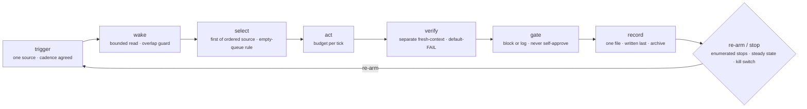

# The canonical tick

Every scheduled autonomous loop, whatever it calls itself, is one pass
through these stages. Map the project's loop onto them; the gaps and the
double answers are the review.

```
trigger ──▶ wake ──▶ select ──▶ act ──▶ verify ──▶ gate ──▶ record ──▶ re-arm / stop
```



| stage | question to answer from the files | typical evidence |
|---|---|---|
| **trigger** | What fires a tick, how often, in which timezone, from which machine? Is there exactly one trigger? | crontab / launchd plist / `schedule:` in a workflow / `/loop 20m` / a driver script's sleep / a cloud routine |
| **wake** | What is read first, in what order, and how big is it? Is there an overlap guard so tick N+1 can't start while N runs? | "read X first" rules, RESUME/STATE/QUEUE files, lock files, `flock`, a `halt` flag |
| **select** | How is the unit of work chosen — deterministically from an ordered source, by a counter, or by the actor's judgement? What happens when the queue is empty — and does that path lead back to the project's intent? | backlog/roadmap ordering rules, tick counters ("every 4th"), "if no unblocked item then …", an Objective/intent review step |
| **act** | Who does the work (main agent, subagent, named builder), with what budget (time, agents, cost, change size)? | builder agent, `≤ N agents per tick`, wall-time caps, change budgets |
| **verify** | Who decides it worked? Is the verifier a separate, fresh-context, read-only agent? Do criteria default to FAIL until evidence flips them? | verifier/falsifier/evaluator agent, DoD checklist, "run it, don't read it" |
| **gate** | When a human's decision is needed, does the loop block, or log a fail-closed reading and continue? Can the actor approve its own gate? | HUMAN-GATES-LOG, "never self-approve", `--stop-on-gate`, B3 escalation classes |
| **record** | What is written at the end of a tick, where, and is that the *only* state the next tick depends on? Is it append-only? Is there an archive rule? | STATUS/QUEUE/LOG lines, commit-per-tick, metrics, outcome enums |
| **re-arm / stop** | Under what conditions does the loop *not* run again: goal met, budget exhausted, N consecutive failures, no-progress, kill switch? How is "steady state" recognised so the loop doesn't manufacture work? | sentinels (`STATUS: COMPLETE`, `NEEDS-HUMAN`), `max` iterations, "recognize steady state", `halt` |

## The empty-queue ladder

When nothing is unblocked, a healthy loop climbs this ladder in order
and stops at the first rung that applies. Skipping straight to the
bottom rung is how busywork happens.

1. **Declare steady state** if the current roadmap slice is genuinely
   complete — record "nothing to do" and re-arm. This is a valid outcome.
2. **Re-plan from intent.** Read the project's purpose document
   (`intent.md`, an Objective section, a charter) and the current
   roadmap; draft the next slice as *proposals* — new roadmap items or
   questions — and log a human gate for them. The loop reads intent; it
   never edits it, and it never promotes its own proposals to accepted
   scope. In a log-and-continue design it may start the safest proposal
   on its fail-closed reading; in a blocking design it stops here.
3. **Bounded explore** — a time-boxed investigation that produces a
   finding, not a change, when even re-planning has nothing to offer.

A loop with no rung 2 has no way to renew itself except a human
noticing the queue is empty. A loop with rung 2 but no gate on it is
writing its own mandate.

## The three questions

Every loop must answer each of these in **exactly one place**. The
surveyed loops that answered one of them in two files were, without
exception, the ones with contradictions.

1. **Who owns "done"?** Never the actor that did the work. A separate
   verifier, a machine-checked gate, or both. If the answer is "the
   loop checks its own DoD", the loop can declare itself done.
2. **Where does state live between ticks?** One file or one table,
   named in one place, read first and written last. Two state files
   with two counters means two loops.
3. **Do human gates block or log?** Either is a valid design. What is
   not valid is one file saying block and another saying log, or
   log-and-continue with no asynchronous channel and no kill switch.

## Cross-cutting properties of an unattended loop

These have no single stage; check them across the whole tick.

- **Idempotence** — if a tick crashes halfway and the next tick starts,
  is the world consistent? (Commit-per-tick and append-only records
  usually give this for free; half-written state files don't.)
- **Bounded context** — the sum of what the wake stage reads must not
  grow without a rule. Line count × ticks-per-day is the bill.
- **Observable stuckness** — from the state file alone, can a person
  tell the loop is stuck (same item N ticks running, no commits, budget
  breaches) without reading transcripts?
- **Kill switch** — one documented action that stops the next tick from
  doing anything, that doesn't require editing the rules.
- **Single source of the cadence** — the interval appears in the
  scheduler *and* in the docs; they must agree, and the doc should say
  which is authoritative.
