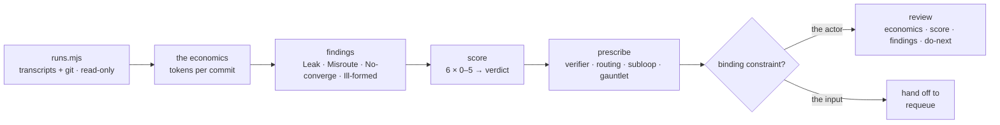

# Loop Economist

`loop-doctor` reads a loop's documents and asks whether the design is
sound. Loop-economist reads what the loop **actually did** — every session
transcript and every commit in a window — and asks a different question:
*what did a unit of shipped change cost, and was it produced by the right
crew?*

A loop can score well on its documents and still spend forty thousand
tokens a tick re-reading a codebase to change one line, or ship and then
un-ship the same file four times. Only the runs show that.



## The guard-rail: no overhead on the project

- **Write nothing into the target repo.** The review goes to the
  scratchpad, or to a published page if that is how they read things.
- **Run nothing of the project's.** No install, build or test run. Only
  `git log` and the collector.
- **Never quote a transcript.** Sessions contain the user's own words and
  their code. Cite a session by id and a metric, never by content.
- **One context, one pass.** No subagents by default — reviewing a
  fan-out problem by fanning out is its own joke.
- **Leave a receipt** in the footer: transcripts read, window, commits,
  repo untouched.

## Workflow

### 1. Collect

```bash
node <skill-dir>/scripts/runs.mjs <repo-path> --since 14d > <scratchpad>/runs.json
```

Sessions (tokens by kind, models, tools, subagents by type, human turns,
interrupts, tool errors, repeated identical calls, files edited), git
(commits, churn, rework commits), the loop's records (open/done/vague
items), and the derived rates. Read all of it — it is evidence, not
conclusions.

Pick the window from the loop's cadence: at least **20 ticks or 14 days**,
whichever is longer. Say the window in the first line of the review; every
rate is meaningless without it.

No transcripts (a loop that runs elsewhere, or a fresh machine) → the
budget half is `NOT MEASURED`. Score effectiveness, plan quality and
convergence from git and the records, and say plainly which four numbers
you could not see. Do not infer tokens from diff sizes.

### 2. Read the economics

`references/metrics.md` — each metric with its band and the cause a
reading out of band implies. Establish **tokens per commit** first; it is
the number the reader will remember. Then the three that explain it:
cache hit rate, subagent share, tool calls per edit.

### 3. Find the findings

One row per finding, classified:

- **Leak** — spend that produced no kept change (a zero-commit session, a
  fan-out whose output was re-derived, state re-read every tick).
- **Misroute** — the wrong actor did the work: `agent-fit.md`.
- **No-converge** — thrash, rework, a file the loop cannot leave alone.
- **Ill-formed** — the item had no acceptance test; no actor could have
  converged.

Each row cites a session id, a file or a metric. "Could be more efficient"
is not a row.

### 4. Score

`references/scorecard.md`. Six dimensions 0–5, one-line reason each citing
a number, mean → verdict (`compounding · productive · expensive ·
spinning`), then the caps: nothing shipped caps at *spinning*; more than
three human turns a run caps at *productive*; rework over 0.4 caps at
*expensive*.

Write the reason before the digit. A reason citing two out-of-band metrics
cannot carry a 3.

### 5. Prescribe

`references/patterns.md`, and only what closes a finding you wrote:
verifier seam, route the reading out, cache discipline, per-tick budget,
persona split, and for the items one pass cannot reach — a **bounded
subloop** (try · verify · adjust, N rounds, each round must change the
approach) or a **gauntlet** (k independent attempts, a bar written first,
a judge that wrote none of them). Give every prescription its cost.

### 6. Name the binding constraint

One sentence, and it decides the handoff:

- **the actor** — wrong model, no verifier, unrouted searching → the
  prescriptions above.
- **the input** — thrash and rework concentrate on items with no
  acceptance test → say *the input, not the actor, is the problem* and
  hand off to **`requeue`**. A stronger model on an unstated target
  converges on nothing, more expensively.
- **the design** — the tick itself is unsound (two drivers, no stop, no
  gate) → hand off to **`loop-doctor`**; that is its question, not this
  one.

### 7. Write the review

`references/report-template.md`, exactly: ≤ 60 words, the economics table,
the crew diagram drawn from the runs (including the edges that should not
exist), the score block, findings, non-converging runs, prescriptions,
do-next (≤ 5), footer receipt. Then a terminal summary of ≤ 8 lines.

### 8. Apply — only when asked

Prescriptions change how the loop behaves. Propose; apply on request, one
commit per prescription, diff shown first.

## Judgement calls

**Tokens per commit is a ratio, and both halves lie alone.** Cheap runs
that ship nothing and expensive runs that ship a migration look the same
in one number. Always report the pair.

**Cache reads are not the bill.** Report them beside the billable total,
never inside it. Overstating spend to make a point is the same failure as
understating it.

**A retry that changes nothing is not persistence.** Three identical calls
in one session is the evidence for a subloop; the subloop's whole content
is the rule that each round must change the approach.

**A context cannot verify itself.** If no separate actor ever checked the
work, agent fit is 0 — not 2 — however good the code turned out.

**Fan-out is a cost, not a virtue.** Subagent share above half with flat
commits is a finding, and the prescription is fewer agents with stated
output shapes, not better prompts.

**One window is a sample.** Quote the session count next to every rate,
and prefer "in this window" to "always".

**Never paste what a session said.** Ids and numbers only.

## Files

- `scripts/runs.mjs` — transcripts + git collector; `--self-test`.
- `references/metrics.md` — every metric, its band, what a bad reading
  means.
- `references/scorecard.md` — six dimensions, anchors, verdict and caps.
- `references/agent-fit.md` — routing table, the four personas, fan-out
  rules.
- `references/patterns.md` — subloop, gauntlet, verifier seam, routing,
  cache, budget, escalate-to-input.
- `references/report-template.md` — the review, exactly.

## Related

`loop-doctor` reads the same loop's documents and judges the design;
`loop-atlas` draws the flow and the crew as they are; `requeue` fixes the input
when the items were never tasks; `sharpen-intent` fixes what the items are
ranked against. Step 6 names which of them the findings actually belong to —
that hand-off is part of the review, not an afterthought.
