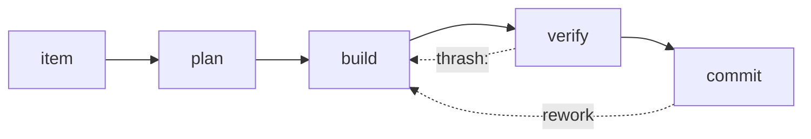

# Run review — structure

Numbers first, then where they came from, then what to change. Prose
outside tables, diagrams and code: **≤ 400 words for the whole review**. A
reader who stops after the first screen has the unit cost, the verdict and
the first fix.

```markdown
# Run review — <project> · <window, e.g. last 14 days>

<≤ 60 words: how many runs, what they produced, what a unit of change
cost, and the one thing that is wrong.>

## The economics

| | |
|---|---|
| runs / commits | N / M |
| **tokens per commit** | **X** (billable; cache reads Y, not billed here) |
| tokens per run | X · range low–high |
| cache hit rate | 0.xx |
| subagent share | 0.xx |
| rework rate | 0.xx (K commits) |
| human turns per run | x.x · interrupts N |
| wall clock | N min over the window |



*The diagram is the crew as the runs actually show it — including the
edges that should not exist.*

## Score

**Verdict: <compounding | productive | expensive | spinning>** · mean <x.x> / 5

| dimension | score | why (one line, cites a metric or a session) |
|---|---|---|
| effectiveness | n | |
| efficiency | n | |
| budget | n | |
| plan quality | n | |
| agent fit | n | |
| convergence | n | |

## Where the budget went

| bucket | tokens | share | what it bought |
|---|---|---|---|
| | | | |

One row per bucket that matters (searching, building, verifying,
subagents, re-reading state). End with the largest line that bought
nothing.

## Findings

| id | class | what | evidence | fix |
|---|---|---|---|---|
| F1 | Leak \| Misroute \| No-converge \| Ill-formed | | session id / file / metric | one action |

- **Leak** — spend that produced no kept change.
- **Misroute** — the wrong actor did the work (`agent-fit.md`).
- **No-converge** — the run could not reach done: thrash, rework, churn.
- **Ill-formed** — the item was not a task; the run never had a target.

## Runs that did not converge

| item / file | sessions | what repeated | prescription |
|---|---|---|---|
| | | | subloop (N=3) \| gauntlet (k=2) \| requeue |

## Prescriptions

| # | change | closes | cost |
|---|---|---|---|
| 1 | | F1, F3 | one ordering change in the driver |

## Do next (≤ 5)

1. …

---
*Read <N> transcripts (<window>) and <M> commits · no state file read whole ·
target repo untouched.*
```

## Terminal summary (≤ 8 lines)

One sentence on what the loop cost per unit of change, the verdict and
mean, findings by class, the single first fix, and — if plan quality is
the binding constraint — the sentence "the input, not the actor, is the
problem" with the `requeue` handoff.
