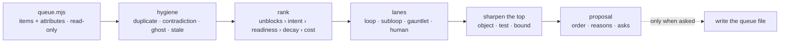

# Requeue

A loop is only as good as what it is fed. Most loops that look broken are
being handed items that were never tasks: no acceptance test, a decision
buried inside, or the same item twice in two files with opposite statuses.
No model fixes that. Requeue fixes the input.



## The guard-rail

- **Propose; do not rewrite.** The repo is untouched unless the person
  names the file and asks. Reordering someone's roadmap unasked is the one
  thing this skill must never do.
- **Rank against a written purpose.** If no intent document exists, say so
  in the first line and rank on unblocking and readiness only — and say
  that the ranking is unanchored.
- **Read bounded.** Queue files fully; everything else by header.
- **No subagents.** One context, one pass.
- **Leave a receipt**: files read, items considered, repo untouched.

## Workflow

### 1. Collect

```bash
node <skill-dir>/scripts/queue.mjs <repo-path> > <scratchpad>/queue.json
```

Every open item with file:line, section, whether it states an acceptance
test, whether it is worded only as judgement, blocked markers, human-only
markers, first-seen date, plus duplicates, contradictions between files,
and the intent documents. Read all of it.

No queue file → say so in three lines and stop. There is nothing to
reprioritise, and inventing a backlog is not the ask.

### 2. Hygiene first

`references/ranking.md`, hygiene section. Duplicates, contradictions,
ghosts, stale items. Resolve *before* ranking: ranking a list that
contains the same item twice produces two ranks for one piece of work.

For a contradiction, decide which is true from the repo — the commit, the
code, the test — not from whichever file was edited last.

### 3. Rank

Five factors in strict precedence: **unblocks › intent › readiness ›
decay › cost**. One line of reason per ranked item, naming the deciding
factor, and naming the loser when two factors disagreed. An item that
traces to no sentence of intent is a deletion candidate, not a low rank.

### 4. Split the lanes

- **loop** — the loop can finish it unattended.
- **loop, subloop** — the approach is uncertain: budget try · verify ·
  adjust rounds with a round cap.
- **loop, gauntlet** — more than one plausible approach and a costly wrong
  choice: the bar gets written before the attempts run.
- **human** — a credential, an account, a decision, a signature. It leaves
  the loop's queue and becomes a gate item with the exact ask.
- **blocked** — the blocker is named; if it is not, *naming it* is the
  item.

Mixing human-only items into the loop's lane is the most common cause of
a loop that stalls while looking busy.

### 5. Sharpen the top

`references/sharpening.md`. Rewrite the top vague items — enough for the
next few ticks, not the whole list — into object · test · bound. Where no
test can be written, choose honestly between a question for a person, a
bounded spike, and deletion. Never pass an untestable item to the loop.

### 6. Write the proposal

`references/report-template.md`, exactly: ≤ 50 words, queue health, the
proposed order with reasons and lanes, what leaves the loop's queue, the
sharpened rewrites, hygiene rows, do-next (≤ 5), footer receipt. Then a
terminal summary of ≤ 8 lines.

### 7. Apply — only when asked

Write the accepted order into the file the loop actually reads, one
commit, diff shown first. Keep the items' wording as sharpened, keep the
file's existing format, and never delete an item in the same commit as a
reorder — deletions are their own decision and their own diff.

## Judgement calls

**Unblocking beats value.** A small thing three items wait on ships more
work this week than the biggest item on the list.

**Readiness is a cap, not a factor.** An unready item cannot sit at rank
1: sharpen it, then rank it. Feeding it up the queue anyway is how a loop
burns a run discovering the item was a wish.

**Old is not the same as dead.** Say the age; let the reader decide.
Propose deletion only when nothing waits on it *and* it traces to no
intent.

**The queue the loop reads is the real one.** When two files disagree,
the file the driver loads wins, and the other becomes a pointer.

**Don't rank what a person must do.** Human items get a lane and an exact
ask, not a position in a queue nobody is working.

**Say when the order barely changes.** "The current order is right; two
items need sharpening" is a good outcome and a cheap one.

## Files

- `scripts/queue.mjs` — item + attribute collector; `--self-test`.
- `references/ranking.md` — the five factors, lanes, hygiene classes.
- `references/sharpening.md` — object · test · bound, and the three
  honest outcomes when no test can be written.
- `references/report-template.md` — the proposal, exactly.

## Related

`loop-economist` measures what the runs cost and hands off here when the
binding constraint is the input. `loop-doctor` reviews the loop's design.
