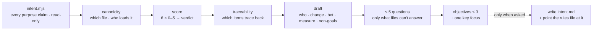

# Sharpen Intent

Every ranking skill, every autonomous loop and every "is this worth doing"
argument bottoms out in one document — and in most projects that document
is three sentences of ambition that nothing loads. `requeue` ranks against
intent; `loop-doctor` checks the loop is anchored to it; both are only as
good as the sentence at the bottom.

This skill makes that sentence carry weight.



## The guard-rail: intent is theirs

- **Never invent a purpose.** Where the files do not answer, the draft
  carries `TO DECIDE — <question>`, visibly, rather than a plausible
  sentence. A fabricated intent is worse than a missing one: the loop
  will obey it.
- **Write nothing into the repo** unless the person names the path and
  asks. The draft lives in the message and the scratchpad.
- **One round of questions, five at most,** each with options, asked once,
  after the draft exists.
- **Read bounded.** Purpose documents fully; everything else by heading.
- **No subagents.** One context, one pass.
- **Leave a receipt**: documents read, repo untouched.

## Workflow

### 1. Collect

```bash
node <skill-dir>/scripts/intent.mjs <repo-path> > <scratchpad>/intent.json
```

Every purpose claim in every candidate document, each statement marked
outcome / output-only / measurable / names-an-audience / hedged;
intent-shaped headings inside rules files; who references each source;
non-goals; last changed; and the traceability pass — which open backlog
items share distinctive language with the primary source and which share
none. Read all of it.

No source at all → say so in three lines, then go straight to the draft
and the questions. That is the whole job in that case, and it is a common
one.

### 2. Decide the canonical file

`references/anatomy.md`. There is exactly one, and it is the one the
actor actually loads — check `referencedBy` for a rules file
(`CLAUDE.md`, `LOOPS.md`, the loop's `SKILL.md`), not for the file with
the best prose. A beautifully written `VISION.md` that nothing points at
scores `canonicity` 0 and caps the verdict.

Where two sources disagree, do not pick a winner silently: name the
disagreement as a finding, and resolve it in the draft or in a question.

### 3. Score

`references/scorecard.md`. Six dimensions 0–5 with a one-line reason
citing a statement or a number, mean → verdict (`steering · usable ·
decorative · absent`), then the caps: nothing loads it → *decorative*;
traceability below 0.4 → *usable*.

Write the reason before the digit.

### 4. Read the untraced list

The items that share no language with the stated purpose are the sharpest
evidence in the review. Each is one of three things and you say which:
off-purpose (→ `requeue`), the intent is out of date (→ the draft needs a
sentence), or wording differs but purpose matches (→ let it go). Never
propose deleting an item on term overlap alone.

### 5. Draft

`references/anatomy.md`, in this order: **for whom · the change · the bet
· the measure and horizon · the falsifier · non-goals**, then at most
**three objectives**, then exactly **one key focus** with what it waits
until. Build every sentence from something in the sources or the code;
mark the rest `TO DECIDE`.

Turn each output-only statement into the outcome it serves — *"ship the
export API"* → *"an analyst answers a new question without asking an
engineer"* — and delete every hedge word by replacing it with the claim
it was standing in for.

### 6. Ask what is left

`references/interview.md`. At most five questions, options given, one
message, after the draft. Do not ask what the repo answers.

### 7. Write the output

`references/report-template.md`, exactly: where purpose is stated, the
canonical call, the score block, the traceability table, the draft in a
code block, the questions with what each blocks, do-next (≤ 5), footer
receipt. Then a terminal summary of ≤ 8 lines.

### 8. Apply — only when asked

Write the draft to the named path, and — the step people forget — add the
one line in the rules file that points at it, so an actor loads it. One
commit, diff shown first. Then offer `requeue`: a new intent means the
queue's order was decided against the old one.

## Judgement calls

**An intent nothing loads is not an intent.** Canonicity outranks prose
quality every time.

**Outputs cannot rank.** If every statement is a thing to build, every
backlog item matches equally — which is why the queue feels arbitrary.
Getting one honest outcome sentence is worth more than the rest of the
document.

**A non-goal that costs nothing is not a non-goal.** "We are not building
a spaceship" excludes nothing. Push for the tempting one — the thing a
reasonable person on the team keeps proposing.

**Three objectives, one focus.** Four objectives means the ranking is
being deferred to whoever reads the list. If the person insists on more,
record it as a finding rather than arguing.

**Ambition is not a defect.** Sharpen how a claim is stated, never how
big it is. The measure and the falsifier are the discipline; the size of
the bet is theirs.

**Say when it is already good.** "This steers; two items don't trace and
one of them is right" is a complete and cheap answer.

## Files

- `scripts/intent.mjs` — purpose-claim collector + traceability;
  `--self-test`.
- `references/anatomy.md` — the six parts, outcome vs output, the
  falsifier, what does not belong.
- `references/scorecard.md` — six dimensions, anchors, verdict, caps.
- `references/interview.md` — the five questions and the rules for asking.
- `references/report-template.md` — the review and the draft, exactly.
- `evals/` — the prompts, and `gauntlet/BAR.md`, the bar this skill's
  drafts are graded against by a blind critic.

## Related

`requeue` ranks the queue against this document — re-run it after the
intent changes. `loop-doctor` checks the loop is anchored to it.
`loop-economist` arrives here when the work is cheap, converging, and
pointed at nothing.
