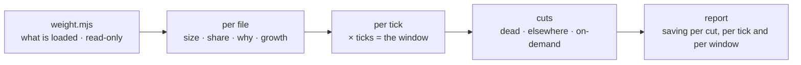

# Wake Weight

Every run of an autonomous loop pays for its preamble before it does anything:
the rules, the imports, the queue, the status log, the map. That cost is
charged again on the next tick, and the next. Nobody notices, because no single
run looks expensive — and the files only ever grow.

`loop-economist` tells you the bill. This tells you what the bill was for
*before the work started*, and what to cut.



## The guard-rail

- **Write nothing into the target repo.** The report goes to the scratchpad or
  a published page.
- **Run nothing of the project's.** Only `git log` and the collector.
- **Estimates are labelled as estimates.** Token figures come from character
  counts, not a bill. Where a measured number exists, use it instead.
- **No subagents.** One context, one pass.
- **Leave a receipt** — files read, and what the collector could not prove.

## Workflow

### 1. Collect

```bash
node <skill-dir>/scripts/weight.mjs <repo-path> --ticks <N> --since 30d > <scratchpad>/weight.json
```

Every file the actor loads at wake, with why it is loaded: handed over without
asking (`CLAUDE.md`, `AGENTS.md`), pulled in by an `@import`, named on a line
with a read verb in a file that is itself loaded, or the loop's own skill and
driver. Each with lines, characters, estimated tokens, class, and growth in the
window.

`--ticks` is how many times the wake was paid. Take it from
`loop-economist`'s `inSessionTicks`, from the cron cadence × window, or from
the loop's own records. Without it, report per-tick only and say the window
total is unknown — do not guess a tick count.

### 2. Read the shape

`references/budget.md`. Three numbers: per tick, across the window, projected
at current growth. Then the class that dominates — queue, record, map, rules,
playbook — because the class decides which cut applies.

If `loop-economist` has run the same window, express the preamble as a **share
of measured billable spend**. That converts an estimate into an argument.

### 3. Name the file, not the category

One row per loaded file, sorted by weight, each saying *why* it is loaded with
the file and line that pulls it in. "Context is too big" is not a finding; "the
design graph is 69k of the 172k, pulled in by `CLAUDE.md:47`" is.

### 4. Prescribe cuts

`references/cuts.md`, in order: **dead** (archive what is finished), **
elsewhere** (tail instead of file, split state from history, duplicate into
pointer), **on-demand** (the map, the playbook). Every cut carries its saving
per tick *and* across the window, its cost, and its risk.

Then the section people skip: **what not to cut**. The definition of done and
the intent are small and load-bearing. Anything whose absence turns into
re-derivation is a false saving — check `toolCallsPerEdit` before cutting a map.

### 5. Write the report

`references/report-template.md`: the three numbers, the loaded-file table, the
cuts with savings, what not to cut, do-next (≤ 3), receipt. Then a terminal
summary of ≤ 6 lines.

### 6. Apply — only when asked

An archive rule and a tail-read rule change what the loop sees. Propose; apply
on request, one commit per cut, diff shown first, and never move a file and
change a rule in the same commit.

## Judgement calls

**Growth is the finding, not size.** A 500-line file that never grows is a
one-time decision. A 500-line file that gained 166 lines this month is a
decision the project keeps re-making, more expensively each time.

**A cut that causes re-derivation is a loss.** The map is the trap: remove it
and the actor may re-read the codebase instead, at more cost than the map. Say
what you expect to happen to tool-calls-per-edit, and check it next window.

**Share beats absolute.** 172k a tick is only alarming next to what the run
costs in total. Get the denominator from `loop-economist` when you can.

**The heuristic has edges.** "Read at wake" is inferred from rules that name a
file on a line with a read verb. A driver that reads something the rules never
mention is invisible here; a file named in a rule that is only *sometimes*
followed is over-counted. Say which rows you are unsure of rather than
presenting all of them as certain.

**Don't prescribe a summary generator lightly.** It saves tokens and adds a
thing that goes out of date. Last resort, with a regeneration trigger.

## Files

- `scripts/weight.mjs` — what-is-loaded collector; `--self-test`.
- `references/budget.md` — the three numbers, the bands, what each class means
  when it dominates.
- `references/cuts.md` — the cuts in order, each with cost and risk, and what
  not to cut.
- `references/report-template.md` — the report, exactly.
- `evals/` — the prompts, and `gauntlet/BAR.md`, the bar this skill's reports
  are graded against by a blind critic.

## Related

`loop-economist` measures the whole bill and hands off here when the preamble
is the leak; `loop-doctor` finds the duplicated rules that make part of this
weight; `requeue` archives the queue this skill says is too heavy to read.
